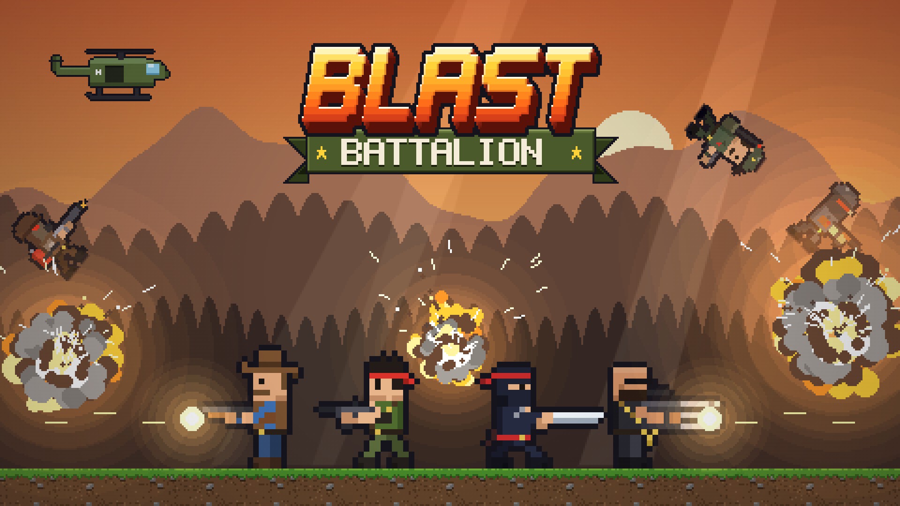
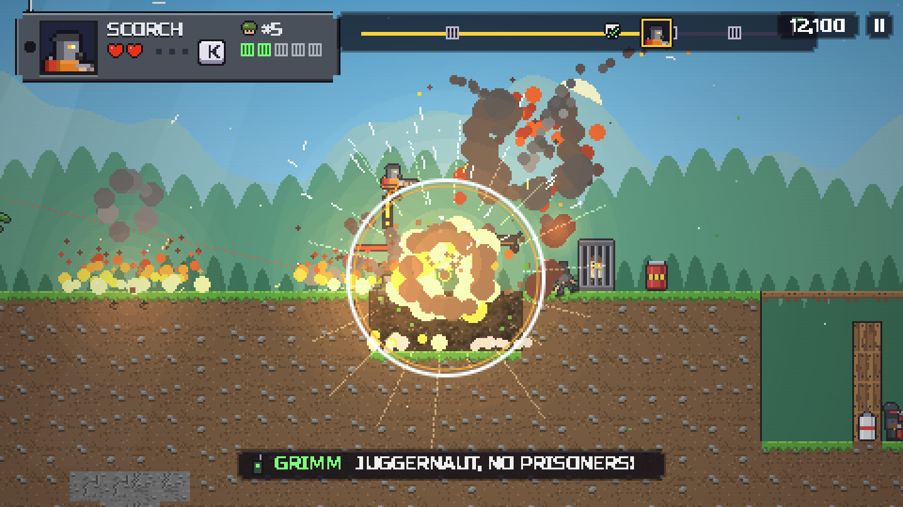
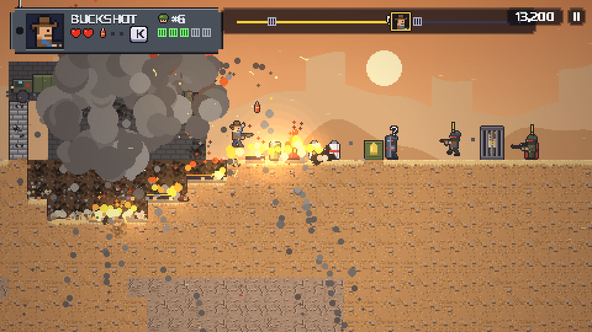
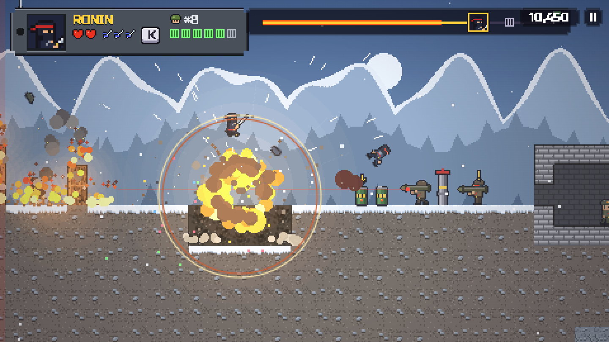

# Blast Battalion



<p align="center">
  
  
  
</p>

A run-and-gun action game for the browser, made for **CrazyGames** and **Poki**. Features:
- destructible terrain;
- the world as a weapon: explosive barrels, fuel barrels and pipes (leaking puddles, fire racing along the trail), rope bridges you can shoot down;
- rescuing prisoners, with each rescue swapping you to a random hero;
- 12 heroes;
- 14 enemy types (including a laser-sighted sniper, a flamethrower and an officer who calls in airstrikes) plus troop trucks; every attack is telegraphed, and the first time you meet an enemy an INTEL card shows its face and how to beat it;
- 3 bosses with weak points;
- lit effects (glow from explosions, fire and muzzle flashes, shockwaves, mushroom clouds, embers), weather in every zone and an FX AUTO / FULL / LITE setting (AUTO drops to LITE on its own on weak hardware);
- 15 missions across 3 zones, with varied objectives: extraction, assassination, sabotage and escaping a detonation;
- an endless Arcade mode played as a run: after each stage you pick 1 of 3 upgrade cards for the rest of the run (including explosive bullets, chain lightning, ricochets, barrel rain and flight for everyone);
- a daily mission (the same level for everyone on a given day) with a crazy rule of the day (e.g. low gravity, every fallen soldier explodes, one-hero day);
- personality: heroes throw out one-liners, soldiers shout and panic, General Grimm taunts you over the radio;
- characters react with their whole body: landing, skidding when turning around, aiming, recoil, reloading, flinching when hit, panicking with hands in the air, getting knocked down by shockwaves, helmets flying off, enemies cheering when a hero dies, prisoners waving from behind bars; boss attacks are telegraphed by the machine itself (a glowing muzzle, a lit-up launcher, a crouch before a jump);
- money ($) for every mission (stars and new medals pay more, a failed mission still pays a little) and an UPGRADES shop with permanent upgrades: FIREPOWER (+15% damage), SUPPLY PACK (+1 special), RESERVES (+1 life), BODY ARMOR (+1 HP);
- a daily supply drop (a panel after the first completed mission of the day and a crate on the title screen): the longer your daily streak, the more money, and the panel shows tomorrow's amount;
- fair deaths: each one shows its cause and (the first two times) a hint on what to do next time; debris and touching a boss cost one hit point instead of killing outright; boss projectiles get a red marker where they will land;
- after a failed mission, the next attempt gets an extra life (up to +2);
- a "NEXT HERO" bar after each mission: how many prisoners are left until the next hero;
- a wardrobe: hats (from a bandana to a crown) and paint jobs for every hero, bought with mission money, with a try-on before buying;
- mini-bosses: THE DOZER (a bulldozer that grinds through terrain and charges after a warning) and JUGGERNAUT (a laser-sighted minigun, weak point on its back) in four missions and in Arcade;
- secrets: every mission hides a vault under cracked ground (jump on the cracks) with a golden crate and a reward;
- vehicles: a walking mech and a tank (auto-aiming cannon, ramming, grinding through walls, running over soldiers);
- cinematics: at the start of each new zone, a helicopter gunship flyover above the enemy base; letterbox bars when a boss enters and dies, and when the base blows up;
- a title screen with a real mission playing underneath (a demo), while a new player jumps straight into mission 1;
- military-style HUD and menus: the hero on a dog tag, a mission route with the hero's face, Grimm shown like film subtitles, control hints as keys above the hero; menus built from metal plates with icons, mission select as zone routes, medals pinned on the results screen; a tutorial made of pictogram signs showing the player's own keys;
- local 2-player co-op;
- 3 difficulty levels;
- 6 languages: English, Spanish, Portuguese (Brazil), German, French and Polish. The game picks the browser's language; change it in OPTIONS → LANGUAGE.

The game is written in plain JavaScript with Canvas, with no dependencies and no image or sound files (everything is generated by code).

Documentation:
- [docs/GDD.md](docs/GDD.md) — the full game design;
- [docs/PLAYTEST.md](docs/PLAYTEST.md) — how to run a playtest with first-time players;
- [docs/RELEASE.md](docs/RELEASE.md) — the release checklist for CrazyGames and Poki, and how the game meets the portals' requirements;
- [docs/METRICS.md](docs/METRICS.md) — a forecast of conversion, session length and D1 retention without portal data (simulated players + a funnel model), and the decisions that follow from it.

## Running the game

The simplest way: open `index.html` in a browser (it works straight from disk).

Development server (no caching, requires Python):

```bash
python tools/devserver.py 8321
```

Then go to http://localhost:8321.

Useful URL parameters:

| Parameter | Effect |
|---|---|
| `?level=5` | start straight in mission 5 |
| `?unlockall=1` | unlocks all missions and heroes |
| `?platform=poki` / `?platform=crazygames` | loads that portal's SDK |
| `?debug=1` | debug mode (Poki SDK in debug mode, `window.__bb` exposes the game state) |

## Controls

| Action | 1 player | Co-op P1 | Co-op P2 | Gamepad |
|---|---|---|---|---|
| Move | WASD / arrows | WASD | arrows | stick / D-pad |
| Jump (hold = Skyhawk's flight) | W / ↑ / Space / Z | W / Space | ↑ / Numpad 0 | A |
| Shoot | J / X | F | K / Numpad 1 | X / RT |
| Special (golden crate first) | K / C | G | L / Numpad 2 | B / LT |
| Knife / kick (barrels, bodies, deflecting grenades) | L / V | H | ; / Numpad 3 | Y |
| Slide under bullets (while running) | S / ↓ | S | ↓ | stick down |
| Grab a soldier (hold knife), throw (knife / shoot) | L / V | H | ; | Y |
| Mech: get in (next to the mech) / get out (hold) | ↑ / ↓ | W / S | ↑ / ↓ | stick |
| Pause | Esc / P | | | Start |

On touch screens a virtual joystick appears along with FIRE, JUMP, SPEC and KNIFE buttons (tap = knife / kick, hold = grab a soldier, tap again = throw). Shooting at point-blank range also works as a knife. To slide, push the joystick down while running. In co-op, the first connected gamepad controls player 2.

Keys (single-player layout) can be rebound in **OPTIONS → KEYBOARD CONTROLS**; the tutorial signs and the keys above the hero show the current bindings.

### Options and accessibility (OPTIONS in the menu and in pause)

| Option | Values | What it does |
|---|---|---|
| SOUND EFFECTS / MUSIC | ON / OFF | sound and music |
| SCREEN SHAKE | OFF / LOW / FULL | camera shake |
| EFFECTS | AUTO / FULL / LITE | effects quality; AUTO drops to LITE on its own when the device can't keep up |
| BLOOD | ON / OFF | blood and gibs; OFF by default in the CrazyGames build (PEGI 12): a hit gives a puff of dust, and an explosion throws the body into the air instead of blowing it apart; ON by default in the web build. The Poki build has no such option and never shows blood (Poki content rules) |
| FLASHING | NORMAL / REDUCED | REDUCED: no full-screen flashes or light rays, smaller yellow explosion flashes instead of white ones, and only a soft red frame when hit |
| AIM ASSIST | OFF / NORMAL / HIGH | how strongly aim is assisted toward enemies above/below (HIGH by default on touch) |
| AUTO FIRE | ON / OFF | the hero fires on their own when an enemy is in the line of fire and within weapon range (ON by default on touch) |
| VIBRATION | ON / OFF | phones only: getting hit, death, a nearby explosion, a destroyed boss |
| KEYBOARD CONTROLS | — | key rebinding: the new key becomes the primary one, the previous one the backup; RESET TO DEFAULT (not shown on phones) |

Menu: a new player never sees the title screen — the game starts straight in mission 1, with the logo over the helicopter drop. A returning player sees the title screen with a real mission playing underneath (a demo with no sound and no saving). The main button (▶ CONTINUE) starts the next unfinished mission; one row below leads to missions, Arcade, the daily mission, heroes, upgrades and co-op. The top-right corner holds the speaker (all sound; effects and music separately in the options), options and the supply drop crate. Each of a mission's three stars has its own condition (completion, all prisoners, no hero lost) and is earned for good, even if the conditions are met across different attempts; the mission card on the select screen and the pause menu show which ones are still missing.

Events last long enough to be readable (rules and numbers: [docs/GDD.md, 5.7](docs/GDD.md)):
- the hero's bullets fly slower than "real" ones, but farther, and leave a glowing trail;
- a hit enemy flashes white for a moment and flies off in an arc; bodies, debris and falling blocks share a gentler, "cinematic" gravity (the hero and soldiers use normal gravity, so the controls don't change);
- an unsupported structure creaks, cracks and sheds dust for a moment before it collapses (you can jump off it), and a bridge sags and creaks before it snaps;
- barrels in a chain reaction get launched into the air and explode one after another;
- when the hero dies, time slows down, the camera stays put, and the cause of death appears above the body (e.g. SHOT BY A SNIPER);
- characters show with their body what they are about to do and what just happened (rules and timings: [docs/GDD.md, 5.14](docs/GDD.md)): a soldier hops at the "!", aims from a stance and reloads after a burst, the grenadier pulls the pin and winds up, the mortar man drops a shell down the tube and covers his ears, the dog crouches before leaping. Hero poses never delay the controls.

Enemies die when you jump on their heads. A jump out of a slide goes farther, and your own explosion underfoot launches the hero upward. The hero has 3 / 2 / 1 hit points on Recruit / Soldier / Veteran. Before every burst an enemy takes aim, shown as a red line.

## Tuning panel (F2)

In the local build, the web build and the artifact, **F2** (or `~`) opens the tuning panel. The Poki and CrazyGames builds don't include it. The panel has 57 sliders in six groups:
- movement: running, jumping, gravity, coyote time, sliding…;
- shooting: range, bullet speed, hitbox size, aim assist, explosions, hit-stop on kills…;
- camera: new / old camera, look-ahead, lag, looking down while falling, shake, recoil…;
- enemies and hits: hero HP, invulnerability, enemy reaction and aiming time…;
- characters: new / old animations, pose length, enemy hop at the "!", grenadier wind-up, mortar shell loading, shockwave knockdown, enemy cheering, idle fidgeting, boss attack warnings;
- game: explosion and smoke duration, terrain creaking before a collapse, object gravity (bodies, debris, blocks), slow motion on hero death, game speed.

Usage:
- changes apply immediately in the running mission and are saved in the browser;
- double-click a slider to restore its default value;
- **Copy** copies the changed values as JSON — paste them into a chat or enter them as `def` in `TUNE_DEFS` (`src/core.js`) to make them permanent in the game;
- **Reset** restores all default values.

## Testing with new players (F3)

In the same builds (local, web and artifact), the game records the session for playtesting: deaths with cause and killer, getting stuck, idle time, the first use of every key and mechanic, mission results and menu clicks.

- **F3** opens the "Playtest report" panel. On a phone: tap the version number on the title screen five times quickly.
- **New tester** archives the current log, wipes game progress (as on a first launch) and sets your save aside.
- **Restore my save** ends testing and brings your progress back.
- **Copy** / **Copy all** copies the report (readable text + JSON data) for pasting into a chat.
- The data stays in the browser; nothing is sent anywhere.

How to run a session, what to watch for and what to ask: [docs/PLAYTEST.md](docs/PLAYTEST.md).

## Building the portal packages

Requires Node.js (minification via `npx terser`, downloaded automatically).

```bash
node tools/build.mjs
```

Output in `dist/`:

| File | Purpose |
|---|---|
| `blast-battalion-crazygames.zip` | upload to the CrazyGames Developer Portal (SDK v3 integrated) |
| `blast-battalion-poki.zip` | upload to Poki for Developers (SDK v2 integrated) |
| `blast-battalion-web.zip`, `web/index.html` | build without an SDK (itch.io, your own site, testing) |
| `artifact/blast-battalion.html` | the whole game in a single HTML file |

Assets for the portals' game pages are in `marketing/`:
- covers at 1920×1080, 800×1200 and 800×800 (title only, per CrazyGames rules);
- an 18 s preview video in landscape (1920×1080) and portrait (1080×1620).

How to regenerate them is described in [docs/RELEASE.md](docs/RELEASE.md).

## Publishing — step by step

The full checklist (regression test, screen review, portal requirements): [docs/RELEASE.md](docs/RELEASE.md). In short:

1. `node tools/build.mjs`
2. **CrazyGames**:
   - go to developer.crazygames.com → new game → HTML5;
   - upload `blast-battalion-crazygames.zip`;
   - add the covers and videos from `marketing/`;
   - turn on the **Progress Save** toggle (without it, cloud saving through the Data module doesn't work);
   - test in the preview, where ads are simulated.

   The game starts in "Basic Launch" and moves to "Full Launch" after good metrics.
3. **Poki**:
   - go to developers.poki.com → submit a game;
   - upload `blast-battalion-poki.zip` and check it in Poki Inspector.

   You can check the SDK integration locally by adding `?debug=1`.
4. Bump `VERSION` in `src/core.js` with every update.

## Where to change what

| I want to change… | File |
|---|---|
| the game's name | `GAME_TITLE` in `src/core.js`, `<title>` in `index.html`, the logo in `Logo` (`src/ui.js`, letters in `LOGO_GLYPHS`) |
| the mission list, objectives (`goal`), difficulty, enemy pools | `LEVELS` in `src/levels.js` |
| Arcade missions | `arcadeDef()` in `src/levels.js` |
| difficulty levels | `DIFFICULTY` in `src/levels.js` |
| structures (ASCII prefabs) | `PREFABS` in `src/levels.js` |
| heroes and unlock thresholds | `HEROES` in `src/heroes.js`, looks in `LOOKS` (`src/sprites.js`) |
| character poses and their timings | poses in `POSES` (`src/sprites.js`); which pose when: `animFrame()` in `src/heroes.js` and `src/enemies.js`; timings in the CHARACTERS group of the F2 panel (`TUNE_DEFS` in `src/core.js`) |
| upgrade prices and effects, money rewards, the daily supply drop | `UPGRADES`, `DAILY_DROP` and `Meta` in `src/meta.js` |
| Arcade upgrade cards and daily rules (and what they do) | `PERKS`, `DAILY_RULES` in `src/mods.js` (effects read through `World.mods`) |
| hero one-liners, soldier shouts, General Grimm's radio | `src/chatter.js` |
| golden crate items | `POCKET_ITEMS` and `usePocket()` in `src/heroes.js` |
| enemy stats | `ENEMY_DEFS` in `src/enemies.js` |
| traps, sirens, fuel depots | `Alarm`, `Mine`, `Spikes`, `Depot` in `src/entities.js` |
| fuel (leaks, puddles, fire) and rope bridges | `src/hazards.js` (constants in `FUEL`) |
| troop trucks, the officer's airstrike, the INTEL card on first enemy encounter | `src/army.js` (`ENEMY_INTRO`) |
| HUD: dog tag, mission route, score, Grimm, TIP, INTEL, keys above the hero | `src/hud.js` |
| menu look: plates, buttons, badges, medals, icons | `src/uikit.js` |
| translations | phrases in `src/lang_*.js` (the key is the English in-game string); sentences with numbers and names: `L10N_RULES` in `src/lang.js` and their patterns in each language's `rules`; after changes run `python tools/check_lang.py` |
| a new language | a new `src/lang_xx.js` file (like `lang_es.js`), an entry in `LANGS` (`src/lang.js`) and in `index.html`; add any missing letters to the font (`ACCENTED` in `src/gfx.js`) |
| tutorial signs (pictograms with keys) | `signParts()` in `src/entities.js` |
| mission objective rules, the detonation wall, the finale | `src/world.js` (`objectiveText`, `updateDoom`, `updateFinale`) |
| bosses | `src/bosses.js` |
| ads / SDK | `src/platform.js` |
| music | `SONGS` in `src/audio.js` (notes written as text) |

## Testing

`tools/harness.js` is a test tool that is not included in the packages. It is injected into a page running with `?debug=1` (the development `index.html` served by the dev server). It provides:
- `TT.start(n)` — start a mission;
- `TT.step(n)` — step the simulation manually;
- `TT.shot(name)` — save a canvas screenshot through the dev server;
- `TT.logical(w, h)` and `await TT.screens(tag)` — screenshots of every menu and overlay at a given viewport size (layout review on unusual screens);
- `AUTO(steps, { god: true })` — a simple bot that plays through a mission and logs events;
- `await REGRESS()` — the regression test: a bot plays through every mission and reports exceptions, NaNs, object count growth and frame time. It must return `PASS` before a release;
- `await HUMANSIM()` and `await HUMANBOSS({ level })` — simulated new players (novice, average, skilled) play the campaign or a single mission; the output (times, failures, causes of death) feeds `python tools/funnel.py`, which turns it into predicted conversion, session length and D1 retention. Details in [docs/METRICS.md](docs/METRICS.md).

Alongside it:
- `tools/posesheet.js` (`await POSESHEET.all()`) — a sheet of every character in every pose;
- `tools/animfilm.js` (`await FILM.scene('grunt')`, after `harness.js`) — a filmstrip of a scene: consecutive frames around one character side by side (soldier, grenadier, mortar man, sniper, dog, panic, shockwave knockdown, enemy cheering, deaths, prisoners, paratrooper, bosses);
- `tools/keyart.js` (`KEYART_ALL()`) — generates the covers;
- `tools/trailer.js` with `tools/mp4mux.js` (`TRAILER.video(...)`) — records the preview video. Recordings are reproducible thanks to a fixed random seed, and the browser encodes the MP4 (WebCodecs).

## Project structure

```
index.html        game page (development build, loads src/*.js)
src/              game code (load order in index.html)
tools/build.mjs   package build + ZIP
tools/devserver.py development server
tools/harness.js  test tools: bot, screen review, REGRESS() regression test, HUMANSIM() simulated players
tools/funnel.py   funnel model: predicted conversion, session length and D1 from HUMANSIM() results
tools/check_lang.py checks translations: letters in the font, the same phrases in every language
tools/posesheet.js, tools/animfilm.js   pose previews and animation filmstrips (not included in the packages)
tools/keyart.js, tools/trailer.js, tools/mp4mux.js   covers and preview video (not included in the packages)
docs/GDD.md       game design document
docs/PLAYTEST.md  guide to running a playtest session with new players
docs/METRICS.md   portal metrics forecast and the decisions drawn from it
docs/RELEASE.md   release checklist and portal requirements
marketing/        covers and preview videos for the portals
```
