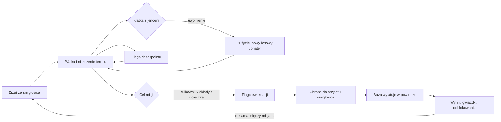

# Blast Battalion — dokument projektowy gry (GDD)

Wersja 1.3 · wrzesień 2026 · platformy docelowe: **CrazyGames**, **Poki** (HTML5, desktop + mobile)

> Zmiany w 1.1–1.2 wynikają z researchu gatunku run-and-gun. Wersja 1.3 to dopracowanie czucia gry po testach: ruch, strzelanie, uczciwość trafień i nazwane zabójstwa zamiast combo.

---

## 1. Gra w skrócie

| | |
|---|---|
| **Gatunek** | run-and-gun / platformówka akcji w pixel-arcie, całkowicie zniszczalny teren |
| **Inspiracja** | klasyczne filmy akcji lat 80. — własna marka, postacie i grafika |
| **Sesja** | misja 2–4 min, kampania 15 misji (~45–60 min), tryb Arcade bez końca |
| **Tryby** | kampania, Arcade, misja dnia, lokalny co-op na 2 graczy, 3 poziomy trudności |
| **Odbiorca** | 10–35 lat, gracze przeglądarkowi szukający szybkiej, „głośnej” akcji bez instalacji |
| **Sterowanie** | klawiatura, pad, dotyk (wirtualny joystick + 3 przyciski) |
| **Rozmiar** | kilkaset KB kodu, zero zewnętrznych assetów (grafika i dźwięk generowane kodem) |

**Pitch:** Oddział komandosów wyzwala jeńców z baz Generała Grimma. Każdy uwolniony jeniec to **+1 życie i natychmiastowa zamiana na losowego bohatera** z innym uzbrojeniem. Wszystko wybucha, wszystko da się zniszczyć, konstrukcje walą się na wrogów.

**Wyróżniki na portalach:** zniszczalny teren i reakcje łańcuchowe (rzadkie w grach przeglądarkowych), losowa zamiana bohatera jako mechanika „wow” w każdej misji, 12 bohaterów do odblokowania (retencja), różne cele misji (zamach, sabotaż, ucieczka przed detonacją), bossowie, co-op na jednej klawiaturze.

---

## 2. Filary designu

1. **Chaos, który się opłaca** — każdy strzał coś niszczy; beczki, ogień i zawalające się wieże zabijają wrogów za gracza.
2. **Zawsze nowa broń** — ratowanie jeńców wymusza granie ciągle innym bohaterem; gracz nie zdąży się znudzić.
3. **Kruche, ale uczciwe** — zwykły wróg pada od jednego trafienia, bohater wytrzymuje 1–3 zależnie od trudności (Veteran = klasyczne jedno trafienie). Każda seria wroga jest zapowiedziana czerwoną linią celownika, a muśnięcie krawędzi sylwetki się nie liczy — śmierć ma wynikać z błędu gracza, nie z zaskoczenia.
4. **Świat jako broń** — „jak zrobię X, stanie się Y”: kopnięta beczka leci i wybucha, kopnięte ciało przewraca kolegów jak kręgle, zrzucony z wieży żołnierz ginie, własny wybuch podrzuca bohatera. Gra nagradza to nazwanymi zabójstwami.
5. **Wejście w 5 sekund** — brak ekranów ładowania, samouczek to tabliczki w pierwszej misji, sterowanie na 4 przyciski.

---

## 3. Pętla rozgrywki

**Pętla meta:** łączna liczba uwolnionych jeńców (zapisywana) odblokowuje kolejnych bohaterów → większa pula losowań → gracz wraca, by „dozbierać” resztę i zdobyć 3 gwiazdki w każdej misji.

---

## 4. Sterowanie

| Akcja | Klawiatura | Pad | Dotyk |
|---|---|---|---|
| Ruch | A/D, ←/→ | lewa gałka / krzyżak | joystick (lewa połowa ekranu) |
| Skok | W, ↑, Spacja, Z | A / LB | JUMP lub joystick w górę |
| Strzał | J, X | X / RT / RB | FIRE (przytrzymanie = ogień ciągły) |
| Specjal / złota skrzynia | K, C | B / LT | SPEC |
| Nóż | L, V (oraz strzał, gdy wróg stoi tuż obok) | Y | KNIFE (albo FIRE przy wrogu) |
| Lot (SKYHAWK) | przytrzymanie skoku po szczycie skoku | przytrzymanie A | przytrzymanie JUMP |
| Ślizg (pod kulami) | ↓ / S w biegu | gałka w dół w biegu | joystick w dół w biegu |
| Deptanie | spadnij wrogowi na głowę (przytrzymany skok = wyższe odbicie) | — | — |
| Kopnięcie beczki / ciała, odbicie granatu | nóż przy obiekcie | Y | FIRE przy beczce |
| Złap żołnierza (żywa tarcza) | przytrzymaj nóż przy wrogu; rzut: nóż lub strzał | przytrzymaj Y | przytrzymaj KNIFE; rzut: KNIFE lub FIRE |
| Wsiądź do mecha / wysiądź | ↑ (albo nóż) przy mechu / przytrzymaj ↓ | gałka w górę / w dół | joystick w górę / w dół |
| Drabina | ↑/↓ na drabinie | gałka góra/dół | joystick góra/dół |
| Zejście z platformy | ↓ | gałka w dół | joystick w dół |
| Pauza | Esc, P | Start | ikona pauzy w rogu |

**Co-op:** P1 — WASD + F (strzał) / G (specjal) / H (nóż) + Spacja; P2 — strzałki + K / L / ; (albo Numpad 0–3). Pierwszy podłączony pad steruje graczem 2.

Sterowanie dotykowe pojawia się automatycznie po pierwszym dotknięciu; w pionie telefonu pokazuje się plansza „obróć urządzenie”. Dźwięk i muzyka są na ekranie tytułowym; wszystko inne w **OPTIONS** (menu i pauza): wstrząs ekranu, jakość efektów, **mniej błysków**, **wspomaganie celowania OFF/NORMAL/HIGH**, **auto-ogień**, **wibracje** (telefony) i **zmiana klawiszy** (1.11). Na dotyku domyślnie: celowanie HIGH i auto-ogień ON — kciuki mają trudniej niż klawiatura.

---

## 5. Mechaniki

### 5.1 Ruch
- Bieg 102 px/s, szybkie przyspieszanie; **zawracanie z podwójną siłą** (z pyłem spod butów), więc zmiana kierunku jest natychmiastowa.
- Skok ~3,6 kafla (58 px, 0,7 s w powietrzu), zmienna wysokość: krótkie stuknięcie daje ~25 px (do 1.25 było 18 px, czyli ledwie jeden kafel), 6 klatek przytrzymania ~39 px, pełny skok 58 px. **Zmienna grawitacja**: normalna w górę, krótkie zawiśnięcie na szczycie przy wciśniętym skoku (×0,55), szybsze opadanie (×1,5) — skok jest „ostry”, nie pływający. **Coyote time 100 ms**, **bufor skoku 150 ms**.
- **Korekta narożników**: gdy skok zahacza o krawędź sufitu (do 5 px), bohater prześlizguje się obok zamiast odbić.
- **Ślizg**: ↓ w biegu → 0,42 s ślizgu z prędkością ~190 px/s; sylwetka obniżona, więc **kule na wysokości klatki piersiowej przelatują nad głową**. Ślizg przewraca i zabija zwykłych żołnierzy (TACKLED). **Skok ze ślizgu** zachowuje prędkość — o ~30% dalej niż zwykły skok z rozbiegu.
- **Deptanie**: spadnięcie wrogowi na głowę zabija go i odbija bohatera w górę (z wciśniętym skokiem wyżej — można skakać po głowach).
- **Skok na wybuchu**: własne eksplozje nie ranią, ale z bliska podrzucają (granat pod nogi, rakieta w ścianę obok → wyższy skok niż normalny).
- **Squash & stretch**: sylwetka rozciąga się przy wybiciu i spłaszcza przy lądowaniu (proporcjonalnie do prędkości).
- **Ściany (1.26)** — zasada: nic nie porusza bohaterem, o co gracz nie prosi, a zwrot działa na ścianie tak samo jak na ziemi.
  - **Skok przy ścianie to zwykły skok** (58 px, z grawitacją). Do 1.25 skok przy ścianie z przytrzymanym kierunkiem wynosił bohatera po ścianie z prędkością skoku i bez grawitacji, na 240 px (4× wyżej niż skok). Nawet samo stuknięcie dawało 200 px. Według gracza „skakanie jest bardzo nieintuicyjne i mylące”.
  - **Złapanie ściany:** gdy w powietrzu opadasz na ścianę (albo jesteś w szczycie skoku) z przytrzymanym kierunkiem do niej, bohater ją łapie i trzyma się jej, także po puszczeniu klawiszy.
  - **Na ścianie bohater patrzy tam, gdzie ostatnio wcisnąłeś:**
    - kierunek do ściany (albo ↑) to spokojna wspinaczka 92 px/s; OGIEŃ kopie wtedy w ścianę;
    - puszczenie klawiszy: bohater wisi i dalej patrzy tam, gdzie patrzył, więc „stop i strzał w przeszkodę” przekopuje ścianę;
    - kierunek od ściany odwraca bohatera na ścianie: stopa oparta o ścianę, broń na zewnątrz (poza `cling`). OGIEŃ, specjal i nóż lecą wtedy od ściany, zgodnie z prośbą gracza („przyklejony do ściany i jednocześnie strzelać”);
    - ↓ zjeżdża (do 130 px/s);
    - SKOK odbija od ściany w górę i w bok. Działa też przez 0,12 s po puszczeniu ściany;
    - odejście od ściany: kierunek od ściany przytrzymany ok. 0,25 s bez strzelania, ↓ albo skok.
  - **W/↑ na ścianie tylko wspina, nie skacze.** Na ziemi W nadal skacze.
  - **Krawędź na wysokości piersi:** automatyczny przeskok na górę, zarówno w skoku, jak i przy wspinaczce. Pełny skok przeskakuje uskok do 4 kafli, samo stuknięcie do 2 kafli (zmierzone).
  - **Uderzenie** (trafienie, wybuch) zrzuca bohatera ze ściany. Kamera trzyma się bohatera na ścianie.
  - **Podpowiedź:** przy dwóch pierwszych złapaniach ściany na żółtym pasku „TIP: WALL: PUSH IN = CLIMB   PUSH AWAY = TURN & SHOOT”. Tabliczka w misji 1 (od 1.27 piktogram, 5.10): „ściana [D] ↑ / [A] TURN + SHOOT”.
  - **Symulacja (A/B, symulowani gracze, ten sam harness):** pierwszy projekt (bohater zawsze plecami do ściany, wspinaczka tylko na ↑) obniżył przejścia misji 2 z 8 do 3 na 9. Gracze stawali przy przeszkodzie i strzelali, a bohater strzelał wtedy do tyłu. Obecny model daje tyle samo co stary ruch: misja 2 8 na 9 (stary 8 na 9), misja 7 4 na 6 (stary 5 na 12). Bot regresji ukończył 8 z 15 misji, czyli w zwykłym zakresie 6–10.
  - Całość jest kluczowa dla poruszania się po zniszczonym terenie.
- Drabiny, platformy jednokierunkowe (mosty, wieże), zeskok przez platformę.

### 5.2 Walka
- Strzały poziome (bez celowania) — idealne pod mobile.
- **Punkty życia bohatera zależą od trudności**: Recruit 3, Soldier 2, Veteran 1 (klasyczne „jedno trafienie”). Obrażenia: kula, ugryzienie, uderzenie tarczą, ogień = 1; wybuch = 2 w centrum, 1 na skraju; zmiażdżenie, kolce, ściana detonacji = śmierć. Po trafieniu: odrzut, 1,2 s nietykalności (miganie), czerwony błysk ekranu, stop-klatka, paski HP na portrecie. Skrzynka z amunicją leczy 1 HP, nowy bohater (jeniec) ma pełne HP.
- **Uczciwe trafienia**: pociski wroga liczą się tylko w rdzeniu sylwetki (2 px od boków, 3 px od góry) — muśnięcie nie zabija. W ślizgu górna granica spada o kolejne 5 px.
- **Zapowiedziane strzały**: przed serią żołnierz celuje — widać **czerwoną linię celownika** (0,45 s, karabin maszynowy 0,6 s, RPG 0,55 s; Recruit ×1,35, Veteran ×0,75), potem seria leci dokładnie tą linią. Od „!” do pierwszej kuli mija ok. 1,3–1,6 s (Soldier). Wieżyczki i pułkownik celują tak samo.
- **Celność rośnie z czasem**: pierwsze serie mają duży rozrzut, im dłużej wróg widzi gracza, tym celniej strzela. Pociski wroga są wolniejsze (175/195 px/s + trudność) i wyraźne (grube, z poświatą).
- **Reakcje wrogów**: trafiony (a nie zabity) wróg przerywa celowanie; kula świszcząca tuż obok płoszy go i czasem psuje mu celowanie (ogień zaporowy).
- **Czucie strzału**: odrzut kamery w kierunku przeciwnym do strzału (siła zależna od broni), błysk trafienia, krótka stop-klatka przy każdym zabójstwie, smugi pocisków.
- **Zasięgi broni** (1.3.1, zmierzone): karabin Max Havoc ~510 px, Chrono ~555, Phantom ~490, Brutus i Skyhawk ~460, snajperka 560 (przebija), strzelba ~200 (śrut z rozrzutem), dyski Ricochet ~250 w jedną stronę, Tesla namierza do 220 px (łańcuch 110), miotacz ognia ~110 px, katana 30 px, nóż 20 px. Kamera wyprzedza bohatera o 14% szerokości ekranu, żeby widać było, do czego się strzela.
- **Spokojna kamera (1.25.1)**, po zgłoszeniu „kamera zbyt agresywnie przeskakuje”:
  - **wyprzedzenie idzie za kierunkiem biegu, nie za zwrotem:** obrót, żeby strzelić do tyłu, nie rusza kamery (wcześniej krótkie stuknięcie przesuwało ją o 39 px);
  - **przy prawdziwej zmianie kierunku** (0,25 s biegu w drugą stronę) wyprzedzenie przesuwa się płynnie w 0,9 s. Wcześniej przeskakiwało ok. 130 px w 0,2 s, nawet 9–10 px na klatkę, teraz najwyżej ok. 4 px, wliczając sam bieg;
  - **w pionie kamera trzyma wysokość ostatniego gruntu:** zwykły skok nie buja obrazem (wcześniej ok. 42 px przy każdym skoku). Kamera podąża za spadkiem poniżej tego gruntu, za wzlotem wyżej niż 64 px (skok na wybuchu, plecak odrzutowy), za wspinaczką i za drabiną;
  - oba parametry są w panelu strojenia F2: „Kamera: przejście przy zmianie kierunku” i „Kamera: pionowy luz w skoku”. Kule gracza mają obszar trafienia ±2,5 px.
- **Płynna kamera (1.30):** sprężyna zamiast wygładzania, bez przerzutów po śmierci i przy arenie bossa, patrzenie w dół przy spadaniu, obraz rysowany między krokami fizyki — zob. 5.12.
- **Lekkie wspomaganie celowania** (1.3.2): jeśli najbliższy widoczny wróg przed bohaterem stoi o poziom wyżej lub niżej (środek sylwetki do 28 px od linii lufy, czyli ok. 1,75 kafla) i poziomy strzał by go ominął, strzał pochyla się w jego stronę, maks. ~18°. Wymaga czystej linii wzroku — nie strzela przez teren; wrogów wyżej niż ~1,75 kafla nadal trzeba „przeskoczyć”. Działa dla karabinów, strzelby (cały snop), miotacza, rakiet Boomera, dysków i snajperki (ukośny promień).
- **Promienie wybuchów gracza** (1.3.1): granat 42, dynamit 56, rakieta 36, nalot 34 na pocisk, minirakiety 24, ground pound 52, wabik 30, koktajl zapalający — pas ognia 80 px.
- Własne eksplozje gracza go nie ranią (tylko odrzut).
- **Łapanie** (1.6): przytrzymanie noża (0,18 s) przy żołnierzu łapie go — krótkie wciśnięcie dalej oznacza dźgnięcie/kopnięcie. Trzymany żołnierz wisi przed bohaterem i **przyjmuje kule z przodu** (4 trafienia, potem ginie jako HUMAN SHIELD). Bohater biega wolniej (×0,85) i nie strzela; nóż albo strzał **rzuca** żołnierzem (THROWN), a lecące ciało przewraca kolejnych (BOWLED OVER). Rzucony bomber leci jak tykająca bomba. Nie da się złapać ciężkich, wieżyczek, bossów ani tarczownika od strony tarczy; po 3,5 s bohater rzuca automatycznie.
- **Czołg** (1.22): zaparkowany w misjach 8 i 12 (w Arcade od 4. etapu, szansa 30%). Wsiada się i wysiada tak jak do mecha (↑ lub nóż, przytrzymane ↓). Pancerz 60; kule ranią go słabo, wybuchy mocno.
  - **Jazda:** 62 px/s; nie skacze, ale wjeżdża na stopnie wysokie na kafel.
  - **Gąsienice:** mielą miękkie ściany (ziemia, piasek, drewno, worki, skrzynie); skała i stal go zatrzymują.
  - **Taranowanie:** żołnierzy rozjeżdża (CRUSHED), ciężkich obija, beczki pcha przed sobą.
  - **Strzał (działo):** pocisk po łuku sam namierza najbliższego żołnierza przed czołgiem (do 340 px), a bez celu leci nisko i płasko. Przeładowanie 0,95 s, wybuch 34 px, odrzut cofa czołg, lufa się unosi i cofa.
  - **Specjal:** seria 12 pocisków z karabinu sprzężonego (co 2,2 s).
  - **Nóż:** taran — 0,55 s pędu 150 px/s, który miażdży i przebija miękkie ściany dwa razy szybciej (co 1,6 s).
  - **Dźwięk:** gąsienice terkoczą przy jeździe.
- **Mech** (1.6): zaparkowany kroczący robot w misjach 7, 11, 13 i 14 (w Arcade od 5. etapu z szansą 40%). ↑ albo nóż przy mechu — wsiadasz; przytrzymanie ↓ przez 0,5 s — wysiadasz (mech zostaje z resztą pancerza). Pancerz 40; kula = 1, wybuch = 5–10, zmiażdżenie = 12, kolce nie szkodzą; pilot nie traci HP. Strzał: ciężki karabin (2 obrażenia, kopie teren), specjal: salwa 3 rakiet (co 2,5 s), nóż: cios niszczący ściany i posyłający ciała w powietrze, twarde lądowanie miażdży wrogów obok. Wchodzi na stopnie wysokie na kafel. Zniszczony wybucha i wyrzuca pilota z 1,5 s nietykalności. Uwolniony jeniec daje pilotowi +1 życie bez zamiany bohatera; przy ewakuacji pilot wysiada sam.
- Specjale: 2–3 ładunki na bohatera; skrzynki z amunicją odnawiają komplet.
- **Złote skrzynie**: jeden przedmiot „w kieszeni” (nalot, spowolnienie czasu, rój rakiet, Roid Rage), odpalany przyciskiem SPECIAL przed specjalem bohatera.
- **Nóż / kopnięcie**: zabija zwykłego żołnierza jednym ciosem i posyła ciało w powietrze — **lecące ciało przewraca i zabija kolejnych żołnierzy (BOWLED OVER, domino)**; rozbija tarcze; krwawe zabójstwo straszy pobliskich wrogów (panika). Kopnięta beczka leci i wybucha przy pierwszym kontakcie (BARREL KICK), kopnięta butla odpala jak rakieta, a nożem można **odbić granat wroga** z powrotem.
- Wrogowie strzelają **tylko gdy są na ekranie** i dopiero po czasie reakcji (ikona „?”, potem „!”) — uczciwość.
- Rakiety i pociski wroga można zestrzelić kulą (+50).

### 5.3 Zniszczalny teren
Świat to siatka kafli 16×16 px, każdy ma HP i odporności.

| Kafel | HP | Uwagi |
|---|---|---|
| Ziemia | 10 | „kotwica” — nie spada; pociski kopią tunele |
| Skała | 30 | odporna na kule (×0,45); podłoga aren bossów |
| Skała macierzysta | ∞ | dno poziomu |
| Drewno | 9 | palne, konstrukcyjne (może się zawalić) |
| Cegła/beton | 24 | bunkry, odporna na kule (×0,55) |
| Stal | 60 | kule ×0,12, eksplozje ×0,55 |
| Worki z piaskiem | 14 | osłony |
| Drabina / platforma | 4–6 | palne, przepuszczają pociski |
| Skrzynia z amunicją | 5 | po zniszczeniu wypada amunicja |
| Blacha dachowa | 10 | krucha przy upadku |
| Kamień (ruiny) | 26 | konstrukcyjny |

- **Zawalanie**: po zniszczeniu kafla sprawdzane jest, czy konstrukcja (drewno, cegła, stal, kamień…) jest połączona z gruntem. Jeśli nie — cała bryła spada jako bloki, które **miażdżą** wrogów i odpalają beczki. Bloki spadające z wysoka rozpadają się, z niska — osiadają. **Bohatera** blok nie zabija od razu (1.19): kosztuje 1 punkt życia, odrzuca spod zawału i rozpada się mu na hełmie (nie osiada na nim). W symulacji nowych graczy gruz był drugą przyczyną zgonów, także w misji 1, a śmierć od klocka, którego nikt nie widział, wygląda na niesprawiedliwą.
- **Ogień**: palne kafle płoną kilka sekund, rozprzestrzeniają ogień, podpalają jednostki. Płonący wrogowie biegają w panice i zapalają innych.
- **Beczki** (eksplodują łańcuchowo, lecą od podmuchu), **butle z gazem** (po trafieniu lecą poziomo jak rakieta, przebijając ziemię i wrogów).
- **Pułapki**: miny (0,25 s na ucieczkę, ranią wszystkich), kolce na dnie wąwozów pod mostami, **syreny alarmowe** — obserwator z radiem biegnie do syreny, która co kilka sekund zrzuca spadochroniarzy, dopóki jej nie zniszczysz.
- **Ślady**: krew zostaje na terenie (warstwa decali znikająca razem z kaflem).
- **Upadek z wysokości** (ponad ~5,5 kafla) zabija wroga (SPLAT) — wystarczy wysadzić podłogę pod wieżą albo zepchnąć go z krawędzi.

### 5.3.1 Paliwo i mosty linowe (1.8) — „świat jako broń”, część 2
- **Zielone beczki z paliwem** i **rury z paliwem** (pionowe odcinki z zaworem przy bazach i składach paliwa) **cieką od kul** — kula robi dziurę, nigdy nie zapala paliwa (do 4 dziur, więcej dziur = szybszy wyciek; kula przechodzi na wylot, więc paliwo tryska w obie strony). Kule wroga też je dziurawią. Czerwone beczki dalej wybuchają od kul — to inne role.
- **Kałuże**: paliwo leży na ziemi (na kaflu), płynie na boki, spływa w dół i przelewa się przez krawędzie (kapie). Grubsza kałuża rozlewa się dalej, cienki ślad zostaje w miejscu. Widać ją jako ciemną, oleistą warstwę z tęczowym połyskiem.
- **Zapłon**: każdy wybuch, płomień (miotacz Scorcha i wroga, koktajl, pas ognia), palące się drewno, **płonący żołnierz, który przebiegnie przez kałużę**, pochodnia z innej beczki. Ogień biegnie po paliwie (~300 px/s, przeskakuje przerwę jednego kafla), pali się 1–6 s zależnie od ilości, podpala drewno i zostawia osmalony grunt.
- **Płonące paliwo** to ogień dla wszystkiego, co sprawdza ogień: wrogowie się zapalają (**FLASH FIRE**), beczki wybuchają, składy paliwa płoną, słupki mostów się przepalają. Ogień podpalony przez gracza nie rani gracza (tak jak jego koktajl); ogień od wroga albo „niczyj” rani (1 HP).
- **Beczka w ogniu**: przebita zamienia się na 1,3 s w pochodnię (płomienie z dziur na boki, ok. 2 kafle), potem wybucha i rozchlapuje resztę paliwa już płonącą. Cała, nieprzebita beczka po 0,6 s grzania wybucha. **Rura** w ogniu pali się jak pochodnia, dopóki ma paliwo (nie wybucha).
- **Kopnięcie** (nóż) toczy beczkę ~1,5 s; przebita zostawia za sobą ślad paliwa — gotowy lont do podpalenia.
- **Mosty linowe** nad głębokimi przepaściami (7–8 kafli, bez kolców): deski wiszą między dwoma słupkami. **Zestrzelenie słupka** (4 kule, wybuch od razu, ogień przepala) albo zniszczenie dowolnej deski (wybuch, ogień, twarde lądowanie mecha) — **cały most spada** razem z żołnierzami na nim (**BRIDGE OUT**; spadające deski miażdżą też tych na dole, ale nigdy bohatera). Bohater nie ma obrażeń od upadku; po drugiej stronie przepaści jest drabina. Kule wroga nie niszczą słupków (ich wybuchy tak). Część dolin zostaje ze starym mostem na podporze (czasem nad kolcami).
- **Nauka**: misja 2 (Mudslide) ma zawsze most linowy z żołnierzami i skład paliwa (2 beczki, rura, strażnicy). Do pierwszego użycia pojawiają się podpowiedzi: „SHOOT THE POST” nad bliższym słupkiem, „SHOOT: LEAK” nad najbliższą beczką/rurą, „FIRE IT UP!” nad cieknącą.
- **Rozmieszczenie**: skład paliwa jako segment (dżungla rzadziej, pustynia najczęściej), pojedyncze beczki na płaskim terenie i przy beczkach wybuchowych, beczka w parterze kwatery (HQ), rura przy każdym składzie paliwa w misjach sabotażowych (przecieknięta i podpalona pali skład).

### 5.4 Jeńcy, życia, bohaterowie
- Start: 3 życia (co-op 5; Recruit +2, Veteran −2). Jeniec w klatce: dotknięcie = **+1 życie (max 9) + zamiana na losowego odblokowanego bohatera** (innego niż obecny). Klatkę można też rozbić z daleka — wtedy jeniec czeka, aż do niego podbiegniesz.
- Jeniec, który odblokowuje nowego bohatera, **od razu go daje** (karta „NEW HERO!”).
- W co-op uwolnienie jeńca najpierw wskrzesza partnera, który czeka bez żyć.
- **Ulubiony bohater**: na ekranie HEROES można wybrać bohatera, którym zaczyna się każda misja; zamiany po jeńcach dalej są losowe.
- Śmierć → nowy losowy bohater zrzucony śmigłowcem na ostatnim checkpoincie.
- **Podpowiedź po śmierci (1.19)**: pasek z żółtą etykietą TIP (od 1.27 na dole ekranu, nad napisem Grimma; 5.10) mówi, co zrobić następnym razem (np. „SHIELDS STOP BULLETS - KNIFE HIM OR HIT HIS BACK”, „MORTAR SHELLS LAND ON THE RED MARK - STEP OFF IT”). Każda przyczyna najwyżej 2 razy na gracza (`Save.tips`); teksty w `DEATH_TIPS` w `src/world.js`.
- Brak żyć → ekran porażki: **Kontynuuj za reklamę (+3 życia, raz na podejście)**, powtórz, menu.
- **Posiłki po porażce (1.19)**: każda przegrana misja kampanii daje w następnej próbie +1 życie (najwyżej +2; licznik `Save.fails` zeruje się po ukończeniu misji). Przycisk mówi to wprost: „RETRY +1 LIFE”, a na starcie misji pojawia się „REINFORCEMENTS: +1 LIFE”. Ściana trudności ma się dać przejść w 2–3 próbach, a nie kończyć sesję.
- **HUD (1.7)**: serca w panelu bohatera to jego punkty życia (utracone szarzeją, ostatnie pulsuje), hełm „×N” to zapas bohaterów (życia), obok licznik uwolnionych jeńców. Wcześniej serce oznaczało życia, a punkty życia były małymi paskami na portrecie, co łatwo było pomylić. Od 1.27 to wszystko jest na nieśmiertelniku (5.10).

### 5.5 Cel misji i ewakuacja
- Checkpointy: flagi wroga podmieniane na własne (nowy punkt odrodzenia).
- Koniec misji: flaga ewakuacji → fala posiłków wroga → śmigłowiec spuszcza drabinkę → dotknięcie zabiera cały oddział → **baza wylatuje w powietrze** (seria eksplozji, kamera zostaje na miejscu) → podsumowanie.
- Misje z bossem: arena zamyka kamerę, po zniszczeniu bossa przylatuje śmigłowiec.
- **Cele specjalne** (flaga ewakuacji działa dopiero po ich wykonaniu; cel widać na trasie misji u góry ekranu — czaszka pułkownika, beczki składów, flaga czerwona, dopóki cel nie jest wykonany (5.10) — a strzałka przy krawędzi ekranu wskazuje kierunek):
  - **Zamach** — pułkownik (6 HP, pistolet) na piętrze kwatery; strzela z dystansu i ucieka, gdy gracz podejdzie. +2500 pkt.
  - **Sabotaż** — 3 składy paliwa (16 HP, kule wroga ich nie ranią) wybuchają kulą ognia. +1500 pkt za każdy.
  - **Ucieczka** — autodestrukcja bazy: ściana detonacji nadciąga od lewej, dogania do ok. ekranu za graczem i zwalnia w ostatnich krokach; po śmierci gracza cofa się za punkt zrzutu. Zatrzymuje się po podniesieniu flagi ewakuacji. Mniej wrogów, brak alarmów.

### 5.6 Punkty i gwiazdki
- Zabójstwa 100–600 pkt (wg typu wroga), jeniec 1000, checkpoint 250, boss 10 000. (Mnożnik combo z 1.0–1.2 usunięty — był niewidoczny i niezrozumiały.)
- **Nazwane zabójstwa** — premia za użycie świata, napis nad wrogiem:

  | Nazwa | Jak | Premia |
  |---|---|---|
  | CHAIN REACTION | beczka, butla, skład paliwa, mina, wieżyczka | +150 |
  | CRUSHED | spadające bloki, skrzynie | +150 |
  | SPLAT | upadek z wysokości | +150 |
  | FRIENDLY FIRE | wybuch wroga (bomber, granat, rakieta, moździerz) zabija innego wroga | +200 |
  | BOWLED OVER | wróg trafiony lecącym ciałem | +200 |
  | BARREL KICK | kopnięta beczka / butla | +200 |
  | RETURN TO SENDER | odbity pocisk lub granat | +250 |
  | STOMPED / TACKLED | deptanie / ślizg | +100 |
  | AIRBORNE | zestrzelenie wroga w powietrzu | +100 |
  | TOASTED | ogień | +50 |
  | FLASH FIRE | wróg zapalony płonącym paliwem albo pochodnią z beczki/rury | +150 |
  | BRIDGE OUT | wróg spadł z zerwanym mostem albo przygniotły go jego deski | +200 |

- **Multi-kill**: kilka zabójstw z jednego zdarzenia (wybuch, przebijający strzał, seria śrutu, domino ciał, łańcuch piorunów) → DOUBLE / TRIPLE / MULTI KILL ×n, premia 50·n·(n−1) (100, 300, 600…).
- Podsumowanie misji pokazuje liczbę nazwanych zabójstw.
- Premie końcowe: czas (vs. tempo odniesienia), komplet jeńców +2000, bez straty bohatera +2000.
- **Gwiazdki**: ★ ukończenie (COMPLETE), ★ wszyscy jeńcy (ALL PRISONERS), ★ bez straty bohatera (NO LOSSES). Od 1.13 każda gwiazdka to osobny medal, który zostaje na stałe: można zdobyć „wszystkich jeńców” w jednym podejściu, a „bez strat” w innym (zapis `Save.data.medals`, maska bitowa 1/2/4). Warunki są pokazane w karcie misji na ekranie wyboru, na żywo w pauzie i przy każdej gwiazdce w podsumowaniu; gwiazdka zdobyta pierwszy raz miga na zielono.

---

### 5.7 Czytelność zdarzeń — język czasu (1.14–1.15)

Każde ważne zdarzenie ma trzy fazy: **zapowiedź** (przyczyna widoczna przed skutkiem), **moment** (klatka trzymana na tyle długo, żeby oko ją złapało) i **skutek** (widoczny przez chwilę, potem trwały). Sterowanie bohaterem zostaje natychmiastowe (reakcja < 100 ms): zwalniamy skutki, nie gracza.

Skąd te liczby:
- zdarzenie krótsze niż ok. 100 ms (6 klatek) łatwo przeoczyć w ferworze gry; czas reakcji człowieka to ok. 250 ms;
- oko płynnie śledzi ruch do ok. 20–30°/s, szybsze obiekty widać tylko jako smugę;
- stop-klatka przy trafieniu w grach akcji trwa 50–200 ms i rośnie z siłą ciosu;
- bohater ma ok. 15 px, więc 1 m to ok. 8,5 px. Grawitacja gry (900 px/s²) to ok. 11 razy więcej niż prawdziwa w tej skali. Dla skoku bohatera to dobrze (tak robi każda platformówka), ale przedmioty spadające tak szybko wyglądają jak zabawki. To ten sam „efekt makiety” co w kinie, gdzie modele kręci się w zwolnionym tempie (czas skaluje się pierwiastkiem ze skali). Dlatego rzeczy — ciała, gruz, klocki, krew, iskry — mają wspólną „filmową” grawitację ×0,6, a żywi (bohater, żołnierze) zwykłą.

| Faza | Cel | W grze |
|---|---|---|
| zapowiedź zagrożenia dla gracza | 0,35–0,7 s (reakcja + ruch) | linia celownika wroga, laser snajpera + 0,35 s namierzania, 0,55 s płomyka miotacza, tykanie kamizelki 1,1 s, dym i znaczniki nalotu |
| zapowiedź zdarzenia w otoczeniu | 0,3–0,5 s | teren bez podparcia trzeszczy 0,45 s (pęknięcia, drżenie, pył); most ugina się 0,3 s |
| moment trafienia | 50–100 ms stop-klatki według siły, najwyżej co 0,2 s | zabójstwo kulą 45 ms, nożem ok. 70 ms, duży wybuch 45–70 ms, trafienie bohatera 80 ms |
| reakcja trafionego | 80–120 ms | biały błysk wroga (0,1 s) i ciała (0,09 s), odrzut |
| lecący pocisk | ≤ ok. 30°/s albo długa smuga; duży, nie „realistyczny” | kula bohatera 480 px/s (×0,8 przy tym samym zasięgu), 2-pikselowy pocisk ze smugą 18 px i poświatą, błysk w miejscu trafienia |
| skutek | 0,4–1 s w powietrzu, potem trwałość | lot ciała 0,65–0,8 s na 50–90 px, ciała leżą 9 s, gruz i krew ×0,6 grawitacji |
| wybuch | błysk 2 klatki, kula ognia 0,5–1 s, dym 2–4 s | ×1,3 dłużej od 1.14; beczki w łańcuchu co 0,22–0,45 s, wylatując w górę |
| zwolnienie czasu | tylko rzadkie wielkie chwile, 0,4–0,8 s | boss, potrójne zabójstwo (co najwyżej co 6 s), śmierć bohatera: 0,8 s z napisem przyczyny i kamerą na miejscu |

Czego nie robimy: nie spowalniamy całej gry, bohatera ani jego broni — gra traci tempo i kontrolę. Nie zwalniamy czasu co chwilę, bo spowolnienie przestaje wtedy działać. Nie przedłużamy nietykalności.

Wszystkie czasy są w panelu F2 (grupa GRA i STRZELANIE): prędkość pocisków, stop-klatka, długość wybuchów, trzeszczenie przed zawaleniem, grawitacja rzeczy, zwolnienie przy śmierci.

### 5.8 Waga strzału i ślady walki (1.21)

Zasada: każdy strzał i każdy wybuch zostawia ślad, a każda broń ma własny ciężar. Po walce widać, co się działo.

- **Ślady:**
  - kule robią dziury w terenie: w ziemi i kamieniu ciemne z cieniem, w stali jasne rysy, w drewnie drzazgi; znikają razem z kaflem;
  - łuski wylatują z broni: mosiądz 2 px z karabinów, 1 px z pistoletów i SMG, większe z minigunu, snajperki i mecha. Czerwona łuska strzelby wypada przy przeładowaniu, 0,3 s po strzale. Łuski brzęczą przy pierwszym dotknięciu ziemi (łuska strzelby głucho) i leżą 3,5–5 s;
  - z lufy unosi się dym;
  - zniszczone kafle sypią się kawałkami 2–3 px, które zostają na ziemi kilka sekund.
- **Rykoszety:** kula, która trafi stal, kamień albo cegłę, w 30% przypadków odbija iskrę ze świstem.
- **Wybuch porządkuje otoczenie:**
  - podrzuca leżące łuski, gruz i odłamki;
  - poza zasięgiem obrażeń (do 1,6× promienia) odrzuca żołnierzy (nie ciężkich), przerywa im celowanie i serię, czasem zrzuca ich z krawędzi;
  - popycha ciała.
- **Ciężar broni** (mnożnik stop-klatki przy zabójstwie):

  | Broń | Mnożnik | Uwagi |
  |---|---|---|
  | minigun | 0,6 | seria nie może się jąkać |
  | karabin, SMG | 1 | |
  | strzelba | 1,2 | z bliska (do 52 px) 1,6, a ciało leci przez pół ekranu (siła 280) |
  | nóż | 1,5 | |
  | snajperka | 1,8 | siła 240 |

- **Żonglerka:** każda kula podbija trafione ciało (stałe podbicie, bez sumowania). Ciało, które trafisz co najmniej 2 razy w powietrzu, daje AIR JUGGLE ×N (50 pkt × N).
- **Świst:** kula wroga, która przeleci tuż obok bohatera, świszcze. Słychać, że jesteś pod ostrzałem.
- **Ruch:**
  - **twarde lądowanie** po spadku z co najmniej 7 kafli (112 px) daje głuche uderzenie, wstrząs, pierścień kurzu i falę uderzeniową o zasięgu 36–62 px (BRUTUS +12). Fala przewraca i ogłusza żołnierzy (na 0,8 s, ciężkich na 0,45 s) i nigdy nie zabija; podrzuca też ciała i beczki. Za każdego żołnierza SHOCKWAVE +50. Tak kończą się skoki na własnym wybuchu, zejścia jetpackiem i zeskoki z dachów;
  - **salto:** odbicie od ściany i skok z wślizgu to pełny obrót (0,3 i 0,36 s);
  - **seria odbić od ścian** podnosi ton skoku i sypie więcej kurzu, od trzeciego odbicia z liniami pędu;
  - **bieg** sypie kurzem spod butów, w arktyce śniegiem.
- **Napisy** (punkty, style, przyczyny śmierci) zawsze mieszczą się w kadrze.

### 5.8.1 Sekrety (1.23)

Każda misja kampanii i każdy etap Arcade ma jeden sekret: ukryty skarbiec tuż pod powierzchnią (`placeSecret` w `src/levels.js`).
- **Budowa:** komora 5×2 kafle obudowana cegłą, a w niej złota skrzynia z przedmiotem specjalnym. Stropem jest pas 5 kafli popękanej ziemi (30% HP, co rysuje się jako mocne pęknięcia). Co kilka sekund z pęknięć unosi się błysk.
- **Ukrycie:** dopóki ktoś się nie przebije, komora i skrzynia rysują się jak lita ziemia, a krawędzie sąsiednich kafli też jej nie zdradzają (`Terrain.mask`). Zniszczenie stropu, ściany albo podłogi odsłania komorę.
- **Jak wejść:** skok na popękaną ziemię (lądowanie szybsze niż 200 px/s, czyli właściwie każdy skok, ale nie zwykłe przejście), wybuch albo kopanie z boku.
- **Nagroda:** „SECRET FOUND!”, +1000 pkt, +50 $ i złota skrzynia. W kampanii znalezisko zapisuje się od razu (`Save.secrets`), nawet jeśli misja potem się nie uda.
- **Gdzie widać znalezione sekrety:** w podsumowaniu misji („¤ SECRET FOUND”), na przycisku misji (złoty kwadrat) i na karcie misji („¤ SECRET”, złote po znalezieniu).
- **Położenie:** 20–92% długości misji, na płaskim, naturalnym gruncie (bez budowli, znaków, flag, klatek, składów i wstawionych kafli), nie przy punkcie kontrolnym. Może leżeć nad zwykłą jaskinią, jeśli dzieli je co najmniej rząd ziemi.

### 5.9 Sceny filmowe (1.22)

- **Przelot z działkiem:** pierwsza misja nowej strefy (misja 6 i misja 11, a w Arcade każdy etap zmieniający strefę) zaczyna się na pokładzie śmigłowca (`src/rail.js`).
  - **Trasa:** śmigłowiec nadlatuje z prawej nad pierwsze ok. 84 kafle bazy (64 px/s, ok. 20 s). W drzwiach siedzi bohater, który potem wyląduje.
  - **Sterowanie:** strzałki lub drążek (albo ruch myszy) przesuwają celownik, strzał to minigun w stronę celownika, specjal to rakieta (5 na przelot). Kule kopią w terenie, rakiety mogą zniszczyć skład paliwa albo wieżę już z powietrza.
  - **Ogień z dołu:** żołnierze na dole strzelają w śmigłowiec, a rakietnicy odpalają rakiety. Trafienia dzwonią o kadłub i trzęsą obrazem („TAKING FIRE!”), ale przelotu nie da się przegrać — to pokaz przed zrzutem.
  - **Pominięcie:** przytrzymany skok (0,6 s) pomija przelot.
  - **Lądowanie:** na końcu ten sam śmigłowiec płynnie schodzi do zwykłego zrzutu i pokazuje „LANDING ZONE: N KILLS”.
  - **Kiedy nie ma przelotu:** przy powtórce po przegranej i w co-op.
- **Pasy kinowe:** czarne pasy u góry i u dołu ekranu (16 px) pojawiają się przy wejściu bossa (razem z 1,1 s zwolnienia do 45%), przy jego zniszczeniu i przy wybuchu bazy na koniec misji. Przez cały przelot widać węższe pasy (10 px).

### 5.10 HUD i samouczek (1.27)

Gracz zgłosił: „HUD wygląda tanio, za dużo tekstu, niejasne ikony, wyskakujące okna przerywają”. HUD przebudowano w kierunku „B — wojskowy”, wybranym z trzech makiet.

- **Osobna warstwa:** HUD rysuje się na własnym płótnie nad grą, w rozdzielczości ekranu (`src/hud.js`).
  - Piksel HUD to ok. 2/3 piksela gry, więc napisy są drobniejsze i ostrzejsze niż świat.
  - Warstwa nie przyjmuje kliknięć, jest czyszczona co klatkę i pusta w menu i pod pauzą.
- **Nieśmiertelnik** (lewy górny róg, w co-op drugi po prawej): stalowa blaszka na łańcuszku.
  - Na blaszce: portret we wgłębieniu, wybite imię, serca, specjale z klawiszem, który je rzuca (np. [K]; pad: B; na dotyku bez klawisza), złota skrzynka z przedmiotem.
  - Na blaszce P1 także hełm ׿ycia i jeńcy jako klatki (uwolnieni na zielono).
  - Nowy bohater: blaszka podskakuje, imię błyska złotem, a pod nią na 2 s pojawia się pasek z bronią i specjalem („DEPLOYED / SHOTGUN + DYNAMITE”), nigdy szerszy niż blaszka. Zastępuje dużą kartę bohatera na dole ekranu.
  - W pojeździe zamiast serc: nazwa pojazdu i pasek pancerza.
- **Trasa misji** (u góry na środku) zamiast paska postępu: twarz bohatera jedzie po trasie do flagi.
  - Na trasie są klatki jeńców, składy paliwa, czaszka pułkownika (✓ po likwidacji) i ściana detonacji w ucieczce.
  - Flaga jest czerwona, dopóki cel misji nie jest wykonany.
- **Wynik i pauza:** mała szklana tabliczka i ikona w prawym górnym rogu.
- **Grimm jak napisy w filmie:** ikona radia, „GRIMM” i kwestia pisana na bieżąco, jedna linia (najwyżej dwie) na dole ekranu. Zastępuje zielony ekran z twarzą.
- **TIP po śmierci:** szklany pasek z żółtą etykietą TIP nad napisem Grimma.
- **INTEL przy pierwszym spotkaniu wroga (7):** karta pod trasą z twarzą wroga w czerwonej ramce, nazwą i sposobem na niego („SNIPER / MOVE WHEN THE LASER TURNS WHITE”).
  - Pokazuje się jedna karta naraz i nie w trakcie dużych napisów; następna czeka na swoją kolej.
  - Wcześniej trzy takie zdania potrafiły wyskoczyć naraz na środku ekranu.
- **Klawisze nad bohaterem:** podpowiedzi sterowania to klawisze, a nie zdania.
  - W misji 1: [D] ▶, [J] ▶, [SPACE] ↑. W pojeździe: HOLD [S] ▶ EXIT. Z plecakiem odrzutowym: HOLD [SPACE] ▶ FLY.
  - Klawisze unoszą się nad dymkiem bohatera i czekają, jeśli zasłoniłyby duży napis.
  - Pokazują przypisania gracza; w co-op klawisze P2 (druga kolumna przypisań).
- **Układ:** paski układają się w stosy i nie nachodzą na siebie.
  - Pod trasą, w kolumnie między nieśmiertelnikami: wynik w co-op, pasek bossa, INTEL.
  - U dołu: Grimm i nad nim TIP. Na dotyku oba idą na górę, z dala od przycisków.
  - Gdy między blaszkami jest za ciasno (co-op na małym ekranie), paski idą pod blaszki, a pasek z bronią nowego bohatera się nie pokazuje.
  - Duże napisy („MISSION 1”, „CHECKPOINT!”) zostają w pikselach gry i zaczynają się pod stosem pasków.
  - W scenach z pasami kinowymi HUD przygasa do 35%.
- **Tabliczki samouczka to piktogramy z klawiszami** zamiast zdań:
  - „◀ [A][D] ▶”, „[W][SPACE] ↑”, „[J] ▶ beczka beczka”, „RUN + [S] ▶ SLIDE”, „klatka ▶ hełm +1”;
  - „ściana [D] ↑ / [A] TURN + SHOOT”, „[K] ▶ granat / [L] ▶ beczka”, „[L] ▶ nóż / HOLD [L] = GRAB”;
  - „[W] ↑ drabina”, „[SPACE] ▶ ↓ głowa”, „flaga = CHECKPOINT”, „flaga ▶ śmigłowiec”.
  - Na dotyku i padzie klawisze zmieniają się w przyciski (DRAG, FIRE, A, X…). Dymki bohaterów omijają tabliczki.
- **Koszt:** ok. 0,8 ms na klatkę przy ekranie 1353×894.
- **Menu, pauza i wyniki (1.28)** w tym samym stylu, po makietach. Gracz wybrał grubszy tekst w pikselach gry zamiast drobnego jak w HUD, bo w menu ważniejsza jest czytelność, także na telefonie.
  - **Wspólny zestaw elementów** (`src/uikit.js`): stalowe płyty z fazą i nitami, żółta płyta w pasy ostrzegawcze dla jednej głównej akcji na ekranie, mosiądz dla bieżącego wyboru, szkło, klawisze, medale i ikony 7×7 zamiast części słów. Rysuje się na warstwie HUD, a układ zostaje w pikselach gry (tam są sprawdzane kliknięcia).
  - **Tytuł (do 1.30; od 1.31 zob. 5.13):** przyciski z ikonami (flaga, skrzyżowane miecze, kalendarz, hełm, belki, dwa hełmy), postęp jako plakietki (★ 27/45, hełm 12/12, $), sterowanie na dole jako klawisze z obrazkami. Logo i hasło zostają w swoich dużych literach.
  - **Wybór misji:** trzy trasy stref (dżungla, pustynia, arktyka) z misjami na linii. Linia jest złota tam, gdzie już walczono, szara do następnej misji i przerywana dalej. Przy następnej misji widać twarz bohatera. Pod trasami teczka misji: nazwa, HP i życia jako obrazki, cel z ikoną, medale, trudność.
  - **Pauza:** RESUME jako główna akcja, dźwięk i muzyka jako przełączniki z ikonami, u góry misja i cel, u dołu medale na żywo (w Arcade karty biegu).
  - **Wyniki:** medale przypinane po kolei (lądują duże i osiadają), liczby na tablicy z ikonami, gotówka nalicza się na oczach, paczka zaopatrzenia jako skrzynia.
  - **Pozostałe ekrany:** bohaterowie, garderoba, ulepszenia, opcje, porażka, karty Arcade i zwycięstwo mają te same płyty i ramkę zaznaczenia.
  - **Przyciski dotykowe:** obrazek nad słowem. Słowo zostaje, bo takie same napisy są na tabliczkach samouczka.

### 5.11 Języki (1.29)

Gra mówi po angielsku, hiszpańsku, portugalsku (Brazylia), niemiecku, francusku i polsku. To największe rynki portali poza angielskim.
- **Wybór języka:** przy pierwszym uruchomieniu według języka przeglądarki, potem według zapisu. Zmiana w OPTIONS → LANGUAGE (także w pauzie).
- **Jak to działa:** kod gry dalej pisze po angielsku, a tłumaczenie dzieje się przy rysowaniu. Każdy napis przechodzi przez `Font` (`src/gfx.js`), który pyta `L10N.tr` (`src/lang.js`):
  - najpierw całe zdanie w tabeli języka (`src/lang_*.js`, ok. 520 zwrotów w każdym);
  - potem reguły dla zdań z liczbami i nazwami (`L10N_RULES`), np. „SHOT BY A SNIPER” → „STRZAŁ: SNAJPER”, „LANDING ZONE: 5 KILLS” → „LĄDOWISKO: 5 ZABÓJSTW” (polska liczba mnoga w trzech formach);
  - wyniki są zapamiętywane, więc koszt jest niezauważalny (czas rysowania taki sam jak po angielsku).
- **Czego nie tłumaczymy:** imion bohaterów, bossów, nazw klawiszy i losowych nazw operacji w Arcade. Modyfikator RICOCHET ma w nazwie niewidoczny miękki dywiz, żeby nie tłumaczył się bohater RICOCHET.
- **Czcionka:** doszły wielkie litery z akcentami (ĄĆĘŁŃÓŚŹŻ, ÁÉÍÑÓÚÜ, ÀÂÇÈÊËÎÏÔÙÛŸ, ÃÕ, ÄÖ) oraz ¡ i ¿. Akcent siedzi nad literą, a sama litera zostaje tam, gdzie była. ß jest pisane jako SS.
- **Długie słowa:** tłumaczenia są dłuższe od angielskiego (niemiecki o ok. 30%).
  - Długie słowa łamią się z dywizem w miejscu miękkiego dywizu z tabeli (`\u00AD`, np. FLAMMEN-WERFER). Nigdy między dowolnymi literami, jeśli da się inaczej.
  - Napis, który się nie mieści, dostaje drobniejsze litery (o krok pikseli ekranu) zamiast wyjść poza płytę. Tekst na żółtym przycisku zostaje między pasami.
  - Na kartach bohaterów na najmniejszym ekranie (384×216) odstępy są węższe, żeby w linii zmieściło się 9 liter.
  - Wynik: na 384×216 żaden ekran w żadnym języku nie musi zmniejszać liter.
- **Sprawdzanie:** `python tools/check_lang.py` sprawdza, czy każda litera tłumaczeń jest w czcionce i czy wszystkie języki mają te same zwroty. Ekrany w każdym języku były oglądane przy 384×216, 342×256, 427×240, 451×298 i 500×280.

### 5.12 Kamera (1.30)

Po pytaniu „jak upłynnić pracę kamery?”. Najpierw pomiar: symulowany gracz przeszedł misje 1–6, a każda klatka kamery trafiła do zapisu (`tools/camprobe.js`). Dopiero potem zmiany, każda sprawdzona tym samym pomiarem. Nowa kamera jest w `src/camera.js`. Stara (1.29) zostaje w panelu F2 do porównania: „Kamera: nowa (1) / stara (0)”. Wszystkie ustawienia są w grupie KAMERA.
- **Bez przerzutów:**
  - **Po śmierci** kamera nie goni już śmigłowca przez pół poziomu (było 1440–2340 px/s, z miejsca w jednej klatce). Jeśli nowy bohater ląduje najwyżej 1 ekran dalej, kamera tam płynnie jedzie (rozpędza się i hamuje, najwyżej ok. 600 px/s). Dalej jest krótkie ściemnienie (0,2 s) i cięcie. Śmigłowiec wlatuje w kadr docelowy, gdy kamera już tam jest. Nowy bohater pojawia się po takim samym czasie jak wcześniej (ok. 3,5 s od śmierci).
  - **Arena bossa:** kamera wjeżdża w kadr areny pod paskami kinowymi (najwyżej 3,6 px na klatkę), zamiast przeskoczyć o 129 px w jednej klatce.
  - **Pominięcie przelotu** (przytrzymany skok) to ściemnienie zamiast przerzutu o ok. 1300 px.
- **Sprężyna zamiast wygładzania:** kamera podąża za bohaterem jak krytycznie tłumiona sprężyna, więc rusza i hamuje miękko. Nagłe zmiany prędkości kamery (ponad 1 px/klatkę w jednej klatce): w poziomie 0–5 na minutę zamiast 0–31. Opóźnienie za bohaterem: 0,2 s w poziomie, 0,28 s w pionie.
- **Spokój w pionie:** nierówności do 20 px (ponad kafel) nie ruszają kamery. Zmienia wysokość dopiero, gdy bohater stanie na innym poziomie. Gdy bohater jest na ziemi, kamera jedzie w pionie w 7–12% klatek zamiast 10–33%.
- **Bohater stoi w kadrze:** gdy kamera jedzie razem z bohaterem, zaokrągla się do pikseli razem z nim. Bohater nie drga już o piksel 12–14 razy na sekundę (teraz 0–0,4).
- **Patrzenie w dół przy spadaniu:** kamera przewiduje z toru lotu, gdzie bohater wyląduje. Trzyma go wyżej w kadrze, a potem czeka na niego przy lądowisku, więc hamuje przed lądowaniem, a nie po nim. Zaczyna na szczycie skoku, gdy pod bohaterem jest już przepaść. Podskok przy krawędzi dziury i przeskok nad szczeliną nie ruszają obrazu.
  - Spadki symulowanego gracza w misjach 2–6: lądowisko widać 0,3 s przed dotknięciem ziemi w 16 z 16 spadków (było 9 z 14). Bohater schodzi najniżej do 66% wysokości ekranu (mediana; było 82%).
  - Szyby 3–16 kafli: bohater najniżej na 59–62% ekranu (było 63–99%), bez odbicia. Kamera uspokaja się po 0,2–0,4 s (było 0,9–1,5 s).
  - Twarda granica: stopy bohatera nigdy niżej niż 80% ekranu, głowa co najmniej 36 px pod górną krawędzią (pod HUD) i ciało 36 px od boków. W arenie bossa granica nie wypycha kamery za ścianę areny.
- **Kadrowanie bossa:** przy bossie i przy obudzonym mini-bossie kamera przesuwa się w stronę punktu między nim a bohaterem („Kadrowanie bossa” 0,5; przy mini-bossie o 40% słabiej).
- **Wstrząsy:** płynne drżenie (dwie fale na oś) zamiast nowego losowego położenia w każdej klatce. Słabe wstrząsy są delikatne, duże wybuchy dalej mocne (najwyżej 7 px). W misjach 1–6 najwyżej 3–6 px zamiast 8–10.
- **Odrzut broni:** miękkie pchnięcie (sprężyna) o tej samej sile, zamiast skoku o całą wartość naraz.
- **Płynność na każdym monitorze:** fizyka dalej liczy się 60 razy na sekundę, ale obraz jest rysowany pomiędzy dwoma ostatnimi krokami (bohaterowie, wrogowie, pociski, ciała, śmigłowce, cząsteczki, napisy, pogoda, kamera).
  - Na monitorach 75–240 Hz obraz już nie powtarza się w nierównym rytmie (na 144 Hz 58% klatek było kopią poprzedniej).
  - Na 60 i 120 Hz pętla dopasowuje się do odświeżania, więc wahania zegara nie dają już klatki z dwoma krokami obok klatki bez kroku.
  - Testy i nagrania się nie zmieniają (ten sam krok 60 Hz). W pauzie obraz stoi. Po rysowaniu wszystkie pozycje wracają co do bitu, a koszt jest niezauważalny.
- **Pomiar:** `tools/camprobe.js`:
  - `CAMPROBE()`: symulowany gracz i zapis kamery;
  - `CAMTEST()`: kontrolowane scenariusze na każdą kamerę (`TUNE.camNew` 0/1): zatrzymanie, zwrot, spadki w wykopane szyby, podskok przy krawędzi, przeskok szczeliny, respawn z 150–1500 px, arena.

### 5.13 Ekran startowy (1.31)

Gracz: „nie jestem przekonany co do ekranu startowego”. Zaznaczył wszystkie cztery problemy: za dużo naraz, wygląda tanio i płasko, nie sprzedaje gry, a nowemu graczowi ekran w ogóle nie jest potrzebny. Z trzech makiet narysowanych w grze (żywa scena z gry, plakat filmu akcji, obóz wojskowy; `tools/titlemock.js`) wybrał żywą scenę.
- **Pierwsze uruchomienie bez menu:** nowy gracz od razu jest w misji 1. Nowy to taki, który nie zaczął żadnej misji, nic nie ukończył, nie uwolnił jeńca i nie ma wyniku w Arcade ani w misji dnia.
  - Logo i hasło wjeżdżają na ok. 3 s nad zrzut ze śmigłowca, jak tytuł na początku filmu, zamiast napisów „MISSION 1 / OPERATION…”. Potem logo odjeżdża w górę, a HUD (nieśmiertelnik, trasa, Grimm, klawisze nad bohaterem) pojawia się dopiero wtedy.
  - Menu zobaczy przy następnej wizycie (`Save.data.played`). Nowy tester z panelu F3 też zaczyna od misji 1.
- **Za menu gra prawdziwa misja** (`src/attract.js`). Pilot demo prowadzi losowego odblokowanego bohatera według reguł bota testowego: biegnie w prawo, strzela w to, co przed nim, wspina się i przekopuje, wsiada do pojazdów, co 2,5 s rzuca specjal.
  - Cztery klipy po 16–17 s, cięte przez czerń: nalot w dżungli (TIGER CLAW), czołg w śniegu (AVALANCHE), składy paliwa na pustyni (SANDSTORM), mech w śniegu (DEEP FREEZE). Każda wizyta na ekranie zaczyna od kolejnego klipu.
  - Zrzut ze śmigłowca, a w klipach z pojazdem także pierwsze 8–9 s misji, przewijają się bez obrazu (kilka kroków na klatkę), więc pojazd pojawia się po paru sekundach klipu.
  - Klip kończy się wcześniej, gdy bohater przez 4,5 s nie posunie się o 40 px.
  - Wybrane pomiarem 11 misji (3 przejazdy po 20 s): najwięcej akcji, bohater zawsze w kadrze, zero utknięć. Kadry, w których widać prawie samą skałę: 0–14%.
  - Kamera demo trzyma bohatera w pasie między logo a menu, w 100% próbek na 384×216 i 451×298.
- **Demo niczego nie zmienia** (`World.demo`):
  - gra bez dźwięku (słychać muzykę tytułową), a bohater nie może zginąć;
  - nic nie trafia do zapisu: jeńcy, gotówka, jednorazowe podpowiedzi i karty INTEL zostają dla gracza;
  - bez zdarzeń playtestu, sygnałów rozgrywki dla portalu (`gameplayStart`, `happyTime`) i wibracji;
  - bez napisów w świecie: punktów, dymków, Grimma, strzałki celu, „MECH / ↑ ENTER”, nazw mini-bossów i podpowiedzi przy beczkach i moście.
  - Sprawdzone: po 210 s ekranu tytułowego zapis, localStorage i dziennik playtestu są bez zmian, a wywołań `gameplayStart`, `haptic`, `Music.play` i `Save.save` jest 0.
- **Na ekranie jest tylko:**
  - nowe logo z połyskiem co 5,5 s;
  - jeden duży przycisk: KONTYNUUJ i następna misja;
  - jeden rząd: MISJE, ARCADE, DZIENNA, POSTACIE, ULEPSZENIA oraz CO-OP poza dotykiem, z lampką, gdy coś czeka;
  - w prawym rogu głośnik (cały dźwięk; efekty i muzyka osobno w OPCJACH), ustawienia i skrzynia dostawy;
  - wersja w lewym górnym rogu (5 stuknięć otwiera panel testów).
  - Zniknęły plakietki postępu, linia reguły dnia, klawisze na dole, rząd postaci i hasło. Gwiazdki są w MISJACH, klawiszy uczy samouczek.
  - Na wąskim ekranie przyciski rzędu się zwężają, a zestaw UI najpierw usuwa obrazki. Sprawdzone w EN/DE/FR przy 384×216, 342×256, 427×240, 451×298 i 500×280: nic na siebie nie nachodzi.
- **Nowe logo** (`Logo` w `src/ui.js`):
  - BLAST ręcznie rysowanymi literami (kreska 2 px na siatce 7×10), pochylonymi do przodu, od bladozłotego do czerwieni, z głębią i obrysem;
  - BATTALION na oliwkowej wstędze z wciętymi końcami i dwiema gwiazdami;
  - rozmiar liter 2 na telefonie, 3 na typowym ekranie i 4 na wysokim.
- **Koszt:** jak zwykła misja, bo to ten sam świat. Aktualizacja średnio 1 ms na krok (razem z tworzeniem świata i przewijaniem), rysowanie ok. 5,8 ms przy 1353×894 w ukrytej karcie.

### 5.14 Animacja i reakcje postaci (1.32)

Prośba gracza: „dopracować zachowania, animacje, czas i reakcje postaci przy konkretnych zdarzeniach, we wszystkich postaciach”. Wcześniej postać miała kilka klatek (stanie, bieg, skok, spadanie, rzut) i reagowała głównie ikoną („!”, „?”) albo białym błyskiem. Teraz reaguje całym ciałem, według tej samej zasady co zdarzenia w 5.7: **zapowiedź → moment → skutek**.

**Zasada dla bohatera:** żadna poza nie opóźnia sterowania. Poza pokazuje się tylko wtedy, gdy bohater nie robi niczego, co wymaga innej (strzał, bieg, skok od razu ją przerywają). Zmieniamy wygląd, nie ruch; fizyka bohatera jest taka sama jak w 1.31.

**Pozy (`src/sprites.js`):** 27 nowych póz dla wszystkich 27 wyglądów postaci. Poza ma nowe parametry: pochylenie tułowia (stopy zostają w miejscu), przesunięcie głowy, broni i tarczy oraz wariant bez czapki. Pozy rysują się przy pierwszym użyciu, a resztę gra dorysowuje w tle (ok. 1 ms na klatkę, najpierw obsada bieżącej misji).

**Bieg wszystkich postaci:** klatki nóg idą za przebytą drogą (krok ok. 24 px w marszu, 34 px w biegu), więc stopy nie ślizgają się po ziemi. Wcześniej nogi przebierały w stałym tempie (12 lub 7 klatek na sekundę) bez względu na prędkość.

**Bohaterowie:**

| Zdarzenie | Co widać | Czas |
|---|---|---|
| zrzut ze śmigłowca | lądowanie na jedno kolano i kurz | 0,45 s |
| lądowanie | ugięte kolana; po spadku z 7+ kafli przyklęk | 0,11 s / 0,3 s |
| zawracanie w biegu | poślizg: odchylenie, noga zaparta z przodu | póki hamuje (2–3 klatki) |
| szczyt skoku | podkulone nogi | póki \|vy\| < 55 |
| strzał w miejscu | postawa strzelecka, broń cofa się po każdym strzale; rozkręcany minigun – celowanie | 0,09 s po strzale |
| trafienie | odrzut: głowa i tułów do tyłu, broń w górę, noga w powietrzu (jeśli nie strzela) | 0,24 s |
| nóż | pchnięcie z wyciągniętą ręką i ostrzem | 0,16 s |
| złapany żołnierz | obie ręce na nim | póki go trzyma |
| rzut (granat, dysk, specjal) | zamach, potem dokończenie ruchu ręką w dół | 0,08 s + reszta |
| burza Volta, spowolnienie Chrono, przedmioty z kieszeni | ręce w górze | 0,45 s |
| railgun Deadeye'a / ground pound Brutusa | ładowanie na kolanie / pięści w górze, potem w dół | cały specjal |
| uwolnienie jeńca, punkt kontrolny, potrójne zabójstwo, sekret, mini-boss, boss | pięść w górze | 1,1 / 0,9 / 1 / 1,2 / 1,4 / 1,8 s |
| bezczynność | po 3,5 s co 5,2 s rozgląda się (ręka nad oczami) albo sprawdza broń; na ostatnim punkcie życia oddycha szybciej | 1,1 s |
| ewakuacja | macha na pożegnanie z drabinki odlatującego śmigłowca | do końca |
| śmierć | ciało najpierw drga, potem leci bezwładnie; kapelusz, hełm czy korona spada osobno | – |

**Żołnierze:**

| Zdarzenie | Co widać | Czas |
|---|---|---|
| „!” (zauważył) | drgnięcie (odchylenie, broń w górę) i podskok ok. 5 px; pies szczeka | 0,24 s, czas reakcji bez zmian |
| „?” (hałas) | ręka nad oczami, patrzy w stronę hałasu | póki szuka |
| celowanie (czerwona linia) | broń do oka, ugięte kolana; snajper w półprzysiadzie, laser zaczyna się przy lufie | cała linia celownika |
| strzał | odrzut broni; ciężki strzelec trzęsie się przy serii, miotacz przy strumieniu | 0,07 s |
| po serii | przeładowanie: broń opuszczona, ręka przy magazynku, co drugą serię wypada magazynek z brzękiem; ciężkiemu dymią lufy; snajper przeładowuje zamek (duża łuska, „klik-klik”) | 0,55 s / 0,9 s / 0,55 s |
| granatnik | wyciąga zawleczkę (brzęk, zawleczka leci) i unosi rękę z granatem, potem rzut z dokończeniem ruchu; trafiony w trakcie zamachu zawsze upuszcza odbezpieczony granat | **0,35 s zamachu (nowe)** |
| moździerzysta | wkłada pocisk do lufy, strzał (dym, lufa drga), zatyka uszy | **0,3 s (nowe)** + 0,75 s |
| oficer | słuchawka przy uchu, druga ręka wskazuje cel przez całe wezwanie nalotu | 1,3 s |
| tarczownik | odciąga tarczę przed uderzeniem, potem wypycha ją 3 px do przodu | 0,35 s + 0,2 s |
| pies | przysiad przed skokiem (zad w górze, uszy po sobie); szczeka przy „!”; węszy i macha ogonem w patrolu | 0,22 s |
| zamachowiec | szarżuje z rękami w górze; lampka kamizelki mruga i pikanie przyspiesza, im bliżej jest (co 0,3 → 0,1 s) | – |
| zwiadowca biegnący do syreny, pułkownik uciekający przed bohaterem, panika, płonący | bieg z rękami w górze | – |
| trafienie (nie zabity) / podmuch wybuchu zza zasięgu | drgnięcie / zatoczenie się | 0,2 s / 0,15–0,35 s |
| fala twardego lądowania bohatera | leży na plecach, wstaje przez przyklęk (ogłuszenie trwa tyle co wcześniej) | 0,55 s + 0,25 s |
| długi upadek (ponad 3,5 kafla) | wymachuje rękami i krzyczy, zanim uderzy (SPLAT) | – |
| spadochroniarz | trzyma się linek; ląduje w przysiadzie i dopiero potem strzela; czasza opada na niego, zsuwa się na bok i znika | **0,35 s (nowe)**; czasza 1,25 s |
| złapany przez bohatera | wierzga rękami i nogami | – |
| nieświadomy (straż, patrol) | co 6,5 s: rozgląda się, przeciąga, sprawdza broń; oficer rozmawia przez radio, pułkownik podnosi pięść | ok. 1,1 s |
| śmierć | w chwili trafienia drgnięcie, potem bezwładne ciało; hełm lub czapka spada (przy kuli w 75% przypadków, przy wybuchu, nożu i zmiażdżeniu zawsze), odbija się do 2 razy (metalowy brzęczy) i leży 7 s | 0,14 s + lot |
| upadek ostatniego bohatera | pięść w górze, podskoki i jeden okrzyk („GOT HIM!”, „HA HA!”, „TOO EASY!”); w tym czasie nie strzelają. W co-op, gdy drugi bohater walczy, nikt się nie cieszy | ok. 1,2 s po 0,25–0,6 s |

**Jeńcy:**
- **w klatce:** siedzi zgarbiony i co jakiś czas wygląda; macha, gdy bohater jest bliżej niż ok. 14 kafli; podskakuje, gdy jest bliżej niż ok. 6; zatyka uszy przez 1,1 s po wybuchu w pobliżu. Klatka ma ciemne wnętrze, na nim jeńca i kraty na wierzchu;
- **uwolniony z daleka:** wyskakuje z rękami w górze, biegnie do bohatera (do ok. 15 kafli, gdy droga jest wolna, więc nie trzeba po niego wracać), a czekając skacze z radości.

**Bossowie:** każdy atak ma zapowiedź w samej maszynie, nie tylko znacznik na ziemi:
- **IRON HOG:** przed strzałem z działa lufa staje, a jej wylot żarzy się coraz jaśniej (0,35 s). Strzał cofa czołg, lufa wraca na miejsce, spod gąsienic leci kurz. Przed serią z karabinu przy ziemi port KM miga na czerwono (0,45 s).
- **SKYREAPER:** pochyla się nosem w stronę lotu. Wyrzutnia świeci 0,3 s przed rakietą, luk otwiera się 0,25 s przed bombą.
- **GRIMM WALKER:** przysiada przed skokiem (do 5 px), osiada przy lądowaniu, chwieje się z otwartym kokpitem. Miotacz parska i świeci 0,4 s przed strumieniem, działo szarpie korpusem.
- **JUGGERNAUT:** odchyla się przed pchnięciem barkiem.

**Dźwięki:** brzęk zawleczki, „klik-klik” przeładowania i zamka, krzyk spadającego żołnierza.

**Panel F2, grupa POSTACIE:**
- „Animacje postaci: nowe (1) / stare (0)” – do porównania z 1.31;
- „Długość póz ×” (lądowanie, drgnięcie, radość, przeładowanie);
- „Podskok wroga na „!”” (95 px/s);
- „Granatnik: zamach przed rzutem” (0,35 s);
- „Moździerzysta: pocisk do lufy” (0,3 s);
- „Fala uderzeniowa: żołnierz leży” (0,55 s);
- „Wrogowie cieszą się ze śmierci bohatera” (1,2 s);
- „Wiercenie się w bezruchu po” (3,5 s);
- „Zapowiedzi ataków bossów ×” (0 = jak w 1.31).

**Wydajność:** obrys sprite'a liczy się teraz w jednym przebiegu po pikselach, a odbicie lustrzane i biały błysk powstają przy pierwszym użyciu. Obraz jest taki sam co do piksela (sprawdzone sumą kontrolną wszystkich sprite'ów). Budowanie grafiki przy starcie gry trwa 0,35 s zamiast 2,7 s, a nowa poza ok. 0,7 ms.

**Sprawdzenie:**
- `tools/posesheet.js`: arkusz wszystkich postaci we wszystkich pozach;
- `tools/animfilm.js`: taśmy filmowe scen (klatki obok siebie), np. żołnierz od „!” do przeładowania, granatnik, moździerz, snajper, psy, panika, przewrócenie falą, radość wrogów, śmierci, jeńcy, spadochroniarz i bossowie;
- `REGRESS()`: PASS, 0 błędów, bot ukończył 6 z 15 misji (zwykle 5–10).
- Symulowani gracze (`HUMANBOSS`), test A/B nowe / stare animacje, przebiegi na zmianę, 15 par na bossa: ukończenia IRON HOG 13/15 vs 15/15, SKYREAPER 6/15 vs 3/15, GRIMM WALKER 8/15 vs 6/15. Różnice idą w obie strony i mieszczą się w szumie (bot czasem przekopuje się w skałę, raz w jednej, raz w drugiej wersji), więc trudność się nie zmieniła. Zapowiedzi nie spowalniają ataków: przerwa przed kolejnym strzałem z działa i przed miotaczem mecha jest krótsza o czas zapowiedzi, a rakiety, bomby i serie KM mają to samo tempo co w 1.31. Pierwsza wersja zapowiedzi wydłużała cykl działa czołgu o 0,35 s.

### 5.15 Tekst w grze (1.33)

Uwaga gracza: czcionka była nieczytelna, a w akcji pojawiało się tyle napisów naraz, że nie było wiadomo, na czym się skupić („start gry i 50 napisów jeden na drugim”; „jak mam je przeczytać i jednocześnie grać?”). Komentarze postaci są fajne, ale nie mogą grać głównej roli. Zmierzone przed zmianą: bot w misjach 1, 4 i 7 miał na ekranie do 10 napisów naraz. Po zmianie: nigdy więcej niż 1.

**Zasada: w trakcie akcji nie ma tekstu do czytania.** Co się dzieje, pokazują obraz, dźwięk i piktogramy. Zostały tylko:
- **jedno hasło naraz**, gdy trzeba coś zrobić: „UCIEKAJ!” (samozniszczenie bazy), „NA DRABINKĘ!”, zamknięta flaga („NAJPIERW ZLIKWIDUJ PUŁKOWNIKA!”), w co-opie „UWOLNIJ JEŃCA, BY OŻYWIĆ P2!” i sterowanie w locie śmigłowcem. Nowe hasło zastępuje poprzednie (`World.announce`);
- **co cię zabiło**, nad ciałem, gdy kamera trzyma się śmierci (sprawiedliwe śmierci, 5.7). Nikt wtedy nic nie mówi;
- **komentarze** (bohater, żołnierze, jeńcy „POMOCY!”, Grimm w radiu): jeden naraz, 1,5 s przerwy między dwoma, żaden w czasie hasła ani napisu o śmierci. Kwestia Grimma czeka na ciszę do 6 s, potem przepada (`World.quiet`, `say`, `radioSay`);
- piktogramy: klawisze nad bohaterem, tabliczki, „!” i „?” nad wrogami, strzałki (paliwo i słupy mostów mają teraz strzałkę zamiast „STRZEL: WYCIEK” / „STRZEL W SŁUP”), „↑ WSIADAJ” przy pojeździe.

**Usunięte:** punkty nad wrogami (+100, +250…), nazwy stylowych zabójstw i serii (wynik dalej rośnie, dźwięk zostaje), KOP!, ZŁAPANY!, ODBITE!, NALOT!, WABIK!, FALA UDERZENIOWA!, BRAK AMMO, AU!/OSTATNIE TRAFIENIE!, +1 ŻYCIE, +1 HP, AMUNICJA!, SŁABY PUNKT!, PANCERZ ROZBITY!, ODEPCHNIĘTY!; tytuły na starcie misji (numer, operacja, cel, posiłki, reguła dnia: są na ekranach przed misją, a cel na trasie u góry); CEL ZLIKWIDOWANY, SKŁADY, CHECKPOINT, EWAKUACJA, SEKRET ZNALEZIONY + nagrody, NOWY BOHATER (jest na ekranie wyników), SPECJAL GOTOWY, ALARM, CIĘŻARÓWKA, NALOT NADCHODZI, CZAS SPOWOLNIONY, SZAŁ, pojazdy online/stracone, zapowiedzi bossów i minibossów (nazwa jest na pasku zdrowia), nazwy nad minibossami i pojazdami; karty „intel” przy pierwszym wrogu danego typu, porady po śmierci i porada o ścianie; pasek broni nowego bohatera pod nieśmiertelnikiem.

**Krój: Russo One** (wybrany z czterech krojów pokazanych w grze; licencja SIL OFL, `src/fonts/OFL.txt`). Pliki woff2 (łacina + łacina rozszerzona, razem 12 KB) są w `src/fonts/`, a build wpisuje je do kodu (`tools/build.mjs`), więc każda paczka działa bez internetu.
- Wszystko, co napisane, jest na warstwie HUD w rozdzielczości ekranu (`Font` w `src/gfx.js`, płótno z `hiRes`): menu, HUD, a teraz też dymki, hasło, napis o śmierci, P1/P2, etykieta celu za krawędzią i napisy lotu. Wielkie litery mają 7 jednostek, jak w bitmapie, więc układ ekranów się nie zmienił.
- Obrazki między literami (← → ↑ ↓ ★ ♥ • ▶ ◀ ✓ ♪ ⚙ ¤) zostają z bitmapy: Russo One nie ma ich wszystkich, a zastępcza czcionka rysowałaby je po swojemu.
- Russo One jest ok. 13% szersza od bitmapy. Tekst, który się nie mieści, zmniejsza się co ¼ zamiast od razu o połowę (`Font.step`).
- Bitmapa 5×7 zostaje dla płótna gry (klawisze na tabliczkach, znaki nad głowami) i jako zapas, zanim krój się wczyta (start czeka na niego do 2 s).
- Sprawdzone: przegląd ekranów po polsku przy 480×270 i 342×256 oraz po niemiecku przy 384×216. Nic nie wychodzi poza ramki, `tools/check_lang.py` ok.

## 6. Bohaterowie

Postacie są autorskimi archetypami kina akcji lat 80 (bez nazw i wizerunków istniejących postaci).

| Bohater | Broń główna | Specjal (ładunki) | Odblokowanie | Rola |
|---|---|---|---|---|
| **Max Havoc** | karabin szturmowy (ogień ciągły) | granaty odłamkowe (3) | start | uniwersalny |
| **Buckshot** | strzelba (6 śrucin, odrzut) | dynamit (3, duży wybuch) | start | bliski dystans, kopanie |
| **Scorch** | miotacz ognia, **ognioodporny** | koktajl zapalający (3) | 2 jeńców | podpalanie budowli |
| **Ronin** | katana — **odbija pociski** | shadow dash (3), nietykalny | 5 | ryzyko/nagroda |
| **Chrono** | karabin serią (3 strzały) | **Time Warp** — wrogowie i ich pociski ×0,28 przez 5 s (2) | 8 | kontrola tempa |
| **Boomer** | wyrzutnia rakiet | nalot 5 rakiet (2) | 11 | niszczenie terenu |
| **Skyhawk** | podwójne pistolety; **plecak odrzutowy** (przytrzymaj skok = lot) | **Missile Swarm** — 6 samonaprowadzających rakiet (3) | 15 | mobilność |
| **Brutus** | minigun (rozkręcanie, spowolnienie) | ground pound (3) | 19 | ściana ognia |
| **Ricochet** | tnące dyski — przebijają, odbijają się od ścian, **wracają** (max 2) | **Blade Storm** — 8 dysków dookoła (3) | 24 | pozycjonowanie |
| **Deadeye** | snajperka — przebija 5 wrogów i 3 kafle | railgun przez cały ekran (2) | 29 | precyzja |
| **Phantom** | wyciszony pistolet maszynowy (minimalny hałas) | **Decoy + Cloak** — wybuchający hologram ściąga ogień, 3 s niewidzialności (3) | 35 | skradanie |
| **Volt** | działo Tesli — łańcuch na 4 cele | burza piorunów na cały ekran (2) | 42 | kontrola tłumu |

Pierwsze odblokowania przychodzą szybko (już w misji 1–2); cała dwunastka po ok. 10 misjach (4–6 jeńców na misję). Kampania ma 72 jeńców.

---

## 7. Wrogowie (armia Generała Grimma)

| Wróg | HP | Zachowanie | Od misji |
|---|---|---|---|
| **Grunt** | 1 | patrol, serie po 3 strzały, podchodzi/odsuwa się | 1 |
| **Bomber** | 1 | biegnie i wybucha; zabity też wybucha | 2 |
| **Pies** | 1 | szybki, skacze do gardła | 3 |
| **Grenadier** | 1 | rzuca granaty po paraboli wycelowanej w gracza | 4 |
| **RPG** | 1 | rakiety niszczące teren | 6 |
| **Heavy** | 14 | minigun, serie po 10, odporny na odrzut | 8 |
| **Wieżyczka** | 9 | stała, obraca się z opóźnieniem | 7 |
| **Tarczownik** | 2 | tarcza zatrzymuje kule od przodu, uderza z bliska; nóż / wybuch / ogień / railgun rozbijają tarczę | 4 |
| **Obserwator** | 1 | nieuzbrojony, z radiem; biegnie do syreny alarmowej i po drodze alarmuje innych | 2 |
| **Spadochroniarz** | 1 | dowolny żołnierz zrzucony przez syrenę; w locie bezbronny | 2 |
| **Pułkownik** | 6 | cel zamachu: pistolet, cofa się przed graczem, broni się w narożniku | 4 |
| **Moździerzysta** | 1 | stoi w miejscu; pocisk spada pionowo z nieba ~1,25 s po pojawieniu się **czerwonego znacznika „X”** (i linii z góry) pod graczem — dach nad głową chroni, pocisk można zestrzelić | 7 |
| **Miotacz ognia** (1.9) | 3 | ognioodporny; podchodzi na ~70 px, **dysza rozbłyskuje przez 0,55 s** (ostrzeżenie, „!”), potem 1,1 s strumienia ognia (~70 px, 1 HP, podpala paliwo i drewno). Trafienie przerywa rozbłysk. Po śmierci **zbiornik syczy 0,9 s** i wybucha z płonącą plamą (od wybuchu — od razu); rani też jego kolegów (FRIENDLY FIRE) | 4 |
| **Snajper** (1.9) | 1 | stoi (najchętniej na **wieżyczce snajperskiej** — otwarta platforma na palach z drabiną); widzi daleko (400 px) i pod kątem do ±60°. **Czerwony laser śledzi bohatera** ~1,25 s z ograniczoną prędkością obrotu, potem **robi się biały i staje na 0,35 s** — strzał (640 px/s, 1 HP) leci dokładnie po zatrzymanej linii. Ucieczka z linii, zasłona albo ślizg pod linią = unik. Trafienie albo świst kuli obok (przed zablokowaniem) psuje mu celowanie | 6 |
| **Oficer z radiem** (1.9) | 2 | trzyma dystans (cofa się, gdy podchodzisz), z bliska strzela z pistoletu. Co 8–10 s **wzywa nalot**: 1,3 s przez radio (fale nad anteną, „!”) — trafienie przerywa wezwanie; potem **czerwona raca** pod graczem i **5 znaczników** w pasie ~100 px, po ~1,5 s przelatuje odrzutowiec i spadają bomby (rani gracza i wrogów) | 8 |
| **Ciężarówka z desantem** (1.9) | 22 | raz na misję w części misji od 6 (i w Arcade od 6. etapu): po minięciu połowy mapy nadjeżdża z przodu, staje ~130 px przed bohaterem i wypuszcza 3–5 żołnierzy (hełmy widać nad burtą). **Wysadzona wcześniej zabija wszystkich w środku** (CHAIN REACTION + multi-kill). Potem stoi jako osłona. Kule wroga jej nie niszczą | 6 |

**Pierwsze spotkanie** (1.9): gdy dany typ wroga (i ciężarówka) pierwszy raz pojawi się na ekranie, pod trasą misji pojawia się jednorazowa karta INTEL: twarz wroga, nazwa i sposób na niego, np. „SNIPER / MOVE WHEN THE LASER TURNS WHITE”, „RIOT SHIELD / KNIFE HIM OR SHOOT HIS BACK”. Jedna karta naraz i nie w trakcie dużych napisów (1.27, 5.10; wcześniej zdanie na środku ekranu) (zapis w `Save.data.tips`; lista w `ENEMY_INTRO`, `src/army.js`).

Stany AI: patrol → **„?”** (hałas, strzały, wybuchy w pobliżu) → **„!”** (zobaczył gracza: zasięg, kierunek, linia wzroku) → atak → zgubienie celu. Alarm rozchodzi się na pobliskich żołnierzy. Wróg przeskakuje przeszkody o wysokości 1 kafla, nie spada z urwisk w patrolu. **Panika**: ogień, żywe ładunki wybuchowe w pobliżu i krwawe zabójstwa nożem sprawiają, że żołnierze uciekają. Zabity kulą bomber zostawia tykającą kamizelkę; grenadier często upuszcza odbezpieczony granat.

---

## 8. Bossowie

| Misja | Boss | Ataki | Słabości / taktyka |
|---|---|---|---|
| 5 | **IRON HOG** (czołg) | pocisk balistyczny wycelowany w gracza, seria z KM przy ziemi, desant piechoty z włazu, taran | skacz nad serią, eksplozje ×1,6 obrażeń; **słaby punkt: beczki z paliwem na tyle** (×2,5 — trzeba zajść od tyłu albo rzucić granat za czołg); wybuch w otwartym włazie podczas desantu ×3 |
| 10 | **SKYREAPER** (śmigłowiec) | rakiety w punkt przy graczu (1.19: jedna na salwę, w drugiej fazie dwie; miejsce trafienia oznaczone czerwonym krzyżykiem), bomby (też ze znacznikiem), nalot koszący nisko przez całą arenę | wspinaj się na filary, strzelaj gdy schodzi nisko; **słaby punkt: ogon** (×2,2, miga światło przekładni) |
| 15 | **GRIMM WALKER** (mech z generałem) | salwa rakiet z oznaczeniem celu, skok z falą uderzeniową, miotacz ognia, działko | uciekaj ze znaczników; **słaby punkt: kokpit, gdy jest otwarty** (×3) — po każdym lądowaniu mech chwieje się 1,4 s z uniesioną osłoną, kokpit jest też otwarty, gdy zieje ogniem |

**Słabe punkty** (1.9): trafienie w nie pokazuje „WEAK SPOT!” i daje metaliczny dźwięk; na starcie walki pod nazwą bossa pojawia się podpowiedź, gdzie celować. Kule i wybuchy niosą punkt trafienia (wybuch liczy się ze środka).

**Uczciwe trafienia (1.19)**: zderzenie z bossem kosztuje 1 punkt życia i odrzuca bohatera (wcześniej natychmiastowa śmierć — w symulacji graczy częsty zgon przy czołgu). Pociski z działa IRON HOG-a oraz rakiety i bomby SKYREAPER-a zostawiają na ziemi czerwony znacznik miejsca upadku, taki sam jak pocisk moździerza: „czerwony krzyżyk = zejdź” znaczy w całej grze to samo. SKYREAPER strzela mniej rakiet naraz (1 zamiast 2, w drugiej fazie 2 zamiast 3) — w symulacji był największą ścianą kampanii (ok. 5,6 utraconego bohatera na próbę, 1 wygrana na 18; po zmianie 4,1 i 5 na 18). Śmierć od bossa daje podpowiedź dla tego bossa (np. „CLIMB THE PILLARS - SHOOT IT WHEN IT FLIES LOW”).

Wspólne: druga faza poniżej ~45% HP (szybsze ataki), taranowanie przeszkód, wrak zostaje na polu bitwy. Arena ma skalną podłogę, żeby walka nie zapadała się w dół.

### 8.1 Mini-bossowie (1.24)

W środku zwykłej misji stoi ciężki przeciwnik z nazwą i paskiem pancerza. Ma jeden sposób, który działa dużo lepiej od reszty (`src/miniboss.js`).

| Mini-boss | Gdzie | Zachowanie | Jak go pokonać |
|---|---|---|---|
| **THE DOZER** (buldożer) | misje 7 i 14, Arcade | Jedzie na gracza i mieli teren przed sobą (poza skałą macierzystą). Wjeżdża na stopnie, pcha przed sobą beczki i ciała, rozjeżdża żołnierzy. Co 4,5–6,5 s rozgrzewa silnik przez 0,8 s: czerwone światło, dym, drgania, „!” i czerwone kreski na ziemi wzdłuż toru szarży. Potem szarżuje z prędkością 132 px/s przez 1,1 s. Poniżej 40% HP jest szybszy i płonie. | Lemiesz zatrzymuje kule lecące z przodu. **Kabina ×3** (strzelaj w skoku), **silnik z tyłu ×2**, wybuchy ×1,6. Beczki pchane przez lemiesz najlepiej zestrzelić, gdy są tuż przy nim. |
| **JUGGERNAUT** (strzelec w kombinezonie saperskim) | misje 4 i 11, Arcade | Podchodzi powoli na ok. 120 px i obraca się z opóźnieniem 0,9 s. Minigun rozkręca się przez 0,9 s (czerwony laser pokazuje linię serii, narasta świst, pojawia się „!”). Potem strzela serię 13 pocisków (w szale 18) i powoli prowadzi ją za graczem. Stojącego tuż przed nim bohatera odpycha barkiem (zapowiedź 0,3 s, bez obrażeń), żeby zrobić miejsce na serię. | Przód ×0,4 (iskry), a przy 50% HP odpada płyta pancerza („ARMOR BROKEN!”) i przód traci osłonę (×1). **Zasobnik z amunicją na plecach ×2,5**, więc trzeba go przeskoczyć albo zajść od tyłu. Wybuchy ×1,6. |

- **Przebudzenie:** śpi, dopóki bohater nie podejdzie (ok. 230 px, w kadrze) albo go nie trafi. Wtedy pojawia się „MINI-BOSS!”, nazwa i podpowiedź, na 2,2 s wchodzą pasy kinowe z krótkim zwolnieniem, a Grimm odzywa się przez radio.
- **Zasady:** liczy się jak boss, czyli nie działają na niego natychmiastowe zabójstwa (deptanie, łapanie, zgniecenie). Nie ma jednak areny ani blokady kamery. Nie odchodzi dalej niż ok. 300 px od swojego miejsca.
- **Uczciwe trafienia:**
  - szarża buldożera kosztuje 1 HP z odrzutem, a powolne pchnięcie tylko odpycha;
  - seria JUGGERNAUTA trwa ok. 1 s, czyli krócej niż nietykalność po trafieniu (1,2 s), więc jedna seria trafia najwyżej raz (w szale może dwa razy);
  - śmierć od mini-bossa daje jego własną podpowiedź („RED LIGHT = THE DOZER CHARGES - JUMP OVER IT”, „RED LASER = A LONG BURST - TAKE COVER OR GET BEHIND HIM”).
- **Wytrzymałość i nagroda:** HP = 60 (buldożer) lub 55 (JUGGERNAUT) × (1 + 0,6 × trudność misji), w co-op ×1,4. Za zniszczenie jest 3000 pkt (× mnożnik poziomu trudności), +40 $ i złota skrzynia.
- **Rozmieszczenie:** płaski odcinek o szerokości co najmniej 10 kafli, od 55% długości misji (najpóźniej wymuszony na 68%). Nie ma tam innych wrogów ani min. Przy każdym stoją dwie beczki: przed lemieszem buldożera i tuż obok JUGGERNAUTA (jeden strzał, dwa wybuchy). W Arcade mini-boss pojawia się od 3. etapu z szansą 35%, z pominięciem etapów z bossem i ucieczką.
- **Iskry zamiast krwi:** trafienia w maszyny (bossowie, buldożer) sypią iskrami.
- **Symulacja:** `HUMANBOSS`, 3 profile × 3 próby na misję.
  - DRY BONES z buldożerem: 7 z 9 prób ukończonych, buldożer zniszczony w 5 z 9 (walka 13–26 s), 0,2 utraconego bohatera na próbę z jego powodu.
  - COLD FEET z JUGGERNAUTEM: ukończeń tyle samo co w wariancie bez mini-bossa (5 z 9), 0,56 utraconego bohatera na próbę z jego powodu (przed strojeniem 0,9).
  - Pierwsza wersja uderzenia barkiem zabierała HP i boty stojące przy nim ginęły seriami, dlatego odepchnięcie jest bez obrażeń.
  - Pękanie pancerza skróciło walkę od samego przodu z ok. 50 s do ok. 10 s ciągłego ognia.

---

## 9. Kampania i poziomy

| # | Operacja | Strefa | Cel | Nowość |
|---|---|---|---|---|
| 1 | Wake-Up Call | Dżungla | ewakuacja | samouczek (tabliczki, od 1.27 piktogramy z klawiszami: ruch, skok, strzał, ślizg, jeńcy, wspinaczka, specjal, nóż i łapanie przy strażniku odwróconym tyłem, flaga, deptanie, drabina) |
| 2 | Mudslide | Dżungla | ewakuacja | bombowce, pierwsze syreny |
| 3 | Hot Pursuit | Dżungla | **ucieczka** | psy |
| 4 | Tiger Claw | Dżungla | **zamach** | granatnicy, tarczownicy, miny, mini-boss **Juggernaut** |
| 5 | Steel Rain | Dżungla | boss | **Iron Hog** |
| 6 | Sandstorm | Pustynia | **sabotaż** | RPG |
| 7 | Dry Bones | Pustynia | ewakuacja | wieżyczki, mini-boss **The Dozer** |
| 8 | Scorpion Nest | Pustynia | **zamach** | heavy |
| 9 | Mirage | Pustynia | **ucieczka** | mieszanka |
| 10 | Dust Devil | Pustynia | boss | **Skyreaper** |
| 11 | Cold Feet | Arktyka | **sabotaż** | rosnąca trudność, mini-boss **Juggernaut** |
| 12 | Avalanche | Arktyka | **ucieczka** | |
| 13 | Whiteout | Arktyka | **zamach** | |
| 14 | Deep Freeze | Arktyka | ewakuacja | najdłuższa misja, mini-boss **The Dozer** |
| 15 | Last Stand | Arktyka | boss | **Grimm Walker** |

**Generator** (deterministyczny seed na misję — każdy gra ten sam poziom): poziom składa się z segmentów (płasko, pagórki, klify w górę/dół, wąwozy z mostami — czasem z kolcami na dnie, kopce z tunelem, jaskinie z ukrytym jeńcem lub złotą skrzynią) i **prefabrykatów** (wieża strażnicza, stalowa wieża, chata, bunkier z wieżyczką, ruiny świątyni, gniazdo z workami, **kwatera pułkownika**). Przed częścią budowli stoi **posterunek z syreną** i obserwatorem (maks. 2–3 na misję). Cele specjalne mają własne segmenty: skład paliwa z workami i strażą (ok. 26/51/76% długości) oraz kwatera od ok. 58% długości. Wagi segmentów zależą od strefy, gęstość wrogów od trudności misji i poziomu trudności; co ~50 kolumn checkpoint, klatki rozłożone równomiernie. Dodanie misji = jeden wiersz w `LEVELS` (`src/levels.js`, pole `goal`: `extract` / `target` / `depots` / `escape`).

**Arcade:** generowane misje (`arcadeDef`) — strefa zmienia się co 3 etapy, boss co 5, pula wrogów rośnie, cel losowany (ewakuacja, zamach, sabotaż, od 3. etapu ucieczka); życia i punkty przechodzą między etapami.

**Karty ulepszeń w Arcade (1.20)** — Arcade jako „rajd”: po każdym ukończonym etapie gracz wybiera 1 z 3 kart, która działa do końca biegu (`PERKS` w `src/mods.js`, ekran `PerkOverlay` w `src/ui.js`). Karty łączą się z losową zmianą bohatera, więc każdy bieg jest inny — motyw „jeszcze jedna runda”.

| Karta | Poziomy | Działanie |
|---|---|---|
| EXPLOSIVE ROUNDS | 3 | co 6. / 4. / 3. kula bohatera wybucha przy trafieniu (mały wybuch, bohatera nie rani) |
| BIG BOOM | 3 | wybuchy bohatera +30% promienia na poziom |
| CHAIN LIGHTNING | 3 | zabójstwo razi piorunem 1–3 najbliższych żołnierzy (2 obrażenia, w linii wzroku) |
| RICOCHET | 2 | kule odbijają się od ścian (1–2 razy), obtłukując je |
| HEAVY METAL | 1 | polegli żołnierze wybuchają po 0,35 s (błysk + sygnał), łańcuchy przez całe grupy |
| SUPPLY PACK | 3 | +1 specjal na poziom każdemu bohaterowi |
| BODY ARMOR | 2 | +1 punkt życia na poziom |
| REINFORCEMENTS | bez limitu | +2 życia od razu (od 3. etapu) |
| ROCKET BOOTS | 1 | każdy bohater lata (przytrzymany skok), jak SKYHAWK |
| BARREL RAIN | 1 | co 3–5 s beczka spada z nieba na żołnierza w kadrze (nigdy nad bohaterem); zgniata go albo czeka na strzał |
| VAMPIRE | 2 | co 8. / 5. zabójstwo leczy 1 punkt życia |
| FAST HANDS | 3 | strzelanie +20% szybciej na poziom |
| FLEET FOOT | 2 | bieg +12% na poziom |
| BOUNTY | 2 | +50% pieniędzy za etap na poziom |

Wybór jest powtarzalny (ziarno biegu + etap), więc powtórzenie etapu nie losuje kart od nowa. Karty biegu widać w pauzie (dolny pasek) i na ekranie końca biegu; gdy specjali jest więcej, niż mieści nieśmiertelnik, HUD pokazuje ikonę i licznik.

**Misja dnia (DAILY):** jedna generowana misja na dobę (seed = data RRRRMMDD, trudność jak etapy Arcade 4–9, bez bossa) — wszyscy gracze dostają tego dnia ten sam poziom; zapisywany jest najlepszy wynik dnia (pokazany na ekranie tytułowym). Powód do codziennego powrotu (retencja D1/D7).

**Reguła dnia (1.20)** — misja dnia ma szalony warunek, ten sam dla wszystkich; reguły idą w stałej kolejce, więc każda wraca dokładnie co 9 dni (`DAILY_RULES` w `src/mods.js`): BARREL RAIN, LOW GRAVITY (grawitacja ×0,55), EXPLOSIVE ROUNDS (co 3. kula), HERO DAY (każdy bohater tego dnia to jeden z 12, także zablokowany — darmowa próba; w kolejnym takim dniu inny), HEAVY METAL, ROCKET BOOTS, RICOCHET, DOUBLE TIME (cała gra 25% szybciej), BIG BOOM (wybuchy bohatera +90%). Tytuł pokazuje „DAILY: <reguła>” (z najlepszym wynikiem dnia), a przycisk DAILY ma kropkę, dopóki misja dnia nie jest ukończona — każdego dnia jest nowy powód, żeby wrócić. Reguły i karty Arcade to te same efekty (`World.mods`).

---

### 9.1 Charakter i humor (1.20)

Obsada mówi — krótkie, własne teksty (żadnych cytatów z filmów), w dymkach nad postacią (`src/chatter.js`):
- **bohaterowie** rzucają kwestię przy zrzucie i po uwolnieniu (SCORCH: „WHO ORDERED BARBECUE?”, BRUTUS: „MEET BERTHA!”) i czasem przechwalają się po potrójnym zabójstwie („TOO EASY!”, najwyżej raz na 8 s);
- **żołnierze** krzyczą, gdy cię zauważą („INTRUDER!”), panikują („MEDIC!”, „NOPE!”), rzucają granat („FIRE IN THE HOLE!”) albo szarżują jako zamachowcy („FOR GRIMM!”) — okrzyki przy granatach i szarżach są przy okazji zapowiedzią ataku; najwyżej jeden okrzyk na 2,6–4,2 s;
- **Generał Grimm** odzywa się przez radio (od 1.27 jak napisy w filmie: ikona radia i kwestia pisana na bieżąco na dole ekranu, 5.10): osobna kwestia na start każdej z 15 misji kampanii („WHO KEEPS BLOWING UP MY BRIDGES?!”), pule dla Arcade i misji dnia według celu, zapowiedź każdego bossa i żal po jego zniszczeniu („THAT WAS A RENTAL!”), reakcje na likwidację pułkownika i zniszczenie składów.

## 10. Progresja i retencja

**Interfejs (1.13)** — zasady, według których zbudowane są menu:
- **Jeden główny przycisk na ekran**, pomarańczowy (także na dotyku, gdzie nie rysujemy fokusu): ▶ PLAY / ▶ CONTINUE na tytule, NEXT po misji, RETRY po porażce. Fokus klawiatury, pada i myszy jest żółty.
- **Tytuł**: główny przycisk zawsze gra — nowy gracz startuje misję 1 (samouczek), powracający następną nieukończoną misję (podpis „MISSION 7 - DRY BONES”); jedno kliknięcie do rozgrywki. Pod nim MISSIONS / ARCADE / DAILY, HEROES i PLAYERS (co-op; na dotyku ukryte). Dźwięk, muzyka i opcje to ikony w rogu. Linia postępu: gwiazdki, bohaterowie, rekord Arcade.
- **Wybór misji**: karta wybranej misji — nazwa, cel („ELIMINATE THE COLONEL, THEN EXTRACT”), najlepszy wynik, trzy medale ze stanem, HP i życia; trudność jako trzy segmenty RECRUIT / SOLDIER / VETERAN w tym samym miejscu, w którym wybiera się misję. Małe ekrany pomijają linię celu.
- **Pauza**: pasek u góry z misją i celem, pasek u dołu z trzema medalami na żywo (jeńcy 2/5, czerwona gwiazdka po stracie bohatera).
- **Podsumowanie**: podpis pod każdą gwiazdką; nowe medale migają.

- Odblokowywanie misji po kolei, gwiazdki (45 łącznie), rekordy punktowe per misja, rekord Arcade (etap + punkty), najlepszy wynik misji dnia.
- 12 bohaterów odblokowywanych jeńcami (także przy powtarzaniu misji i w Arcade); wybór ulubionego bohatera startowego; po każdej misji pasek „NEXT HERO” pokazuje, ilu jeńców brakuje.
- **Pieniądze i ulepszenia (1.17)** — powód, żeby grać dłużej i wracać (średni czas sesji, D1):
  - za misję: 40 $ + 20 $ za każdą gwiazdkę + 30 $ za każdy medal zdobyty pierwszy raz + 5 $ za jeńca; Arcade: 20 $ + 10 $ × etap; misja dnia: 60 $ + gwiazdki; porażka: 10 $ + 3 $ za jeńca;
  - sklep UPGRADES: FIREPOWER +15% obrażeń (3 poziomy: 120/280/500), SUPPLY PACK +1 specjal każdemu bohaterowi (150/350), RESERVES +1 życie na misję (200/450), BODY ARMOR +1 HP (400); razem ok. 2450 $, czyli mniej więcej kampania z powtórkami; pierwszy zakup możliwy już po misji 1;
  - codzienna dostawa: 50–150 $ rosnąco za kolejne dni z rzędu (przerwa zeruje serię); pojawia się dopiero po pierwszej ukończonej misji, żeby nowy gracz od razu grał;
  - przycisk UPGRADES i skrzynia mają migający znacznik, gdy coś czeka;
  - **dostawa po pierwszej misji dnia (1.19)**: gdy dostawa czeka, po podsumowaniu pierwszej ukończonej misji danego dnia wyskakuje panel „SUPPLY DROP +$50 — DAY 1 — TOMORROW +$60” z przyciskiem CLAIM. Wcześniej skrzynia była tylko na ekranie tytułowym, a gracz przechodzący misje przyciskiem NEXT mógł jej w pierwszej sesji w ogóle nie zobaczyć — i nie dowiedzieć się, że jutro czeka większa nagroda (to główny powód powrotu następnego dnia, D1).
- **Garderoba (1.25)** — cel na długo, gdy ulepszenia są już kupione (ok. 2450 $, czyli mniej więcej kampania z powtórkami). Kosmetyka zmienia tylko wygląd, nigdy siłę (`src/wardrobe.js`, ekran `WardrobeScene` w `src/ui.js`).
  - **Czapki (9):** BANDANA 200 $, GREEN BERET 250 $, BOONIE HAT 250 $, STEEL POT 300 $, STETSON 350 $, PARTY HAT 400 $, TOP HAT 500 $, VIKING HELM 700 $ (z rogami i brodą w kolorze włosów), CROWN 1200 $.
  - **Malowania (7):** DESERT 150 $, ARCTIC 150 $, URBAN 200 $, NIGHT OPS 250 $, CRIMSON 300 $, NEON 400 $, GOLD PLATED 900 $. Zmieniają kolory koszuli, spodni i butów, a cechy bohatera (kamizelka, broń, plecak) zostają.
  - Razem 6500 $, czyli ponad dwa razy więcej niż ulepszenia. Przedmiot kupuje się raz i może go nosić każdy bohater. Każdy bohater ma własny strój i zawsze może wrócić do swojego (karta z jego twarzą, pierwsza w rzędzie).
  - **Jak to działa:** wygląd bohatera to dane (`LOOKS` w `src/sprites.js`), więc strój to nadpisanie tych danych i przebudowany zestaw klatek (`Wardrobe.apply`). Strój widać w misji, na portrecie na nieśmiertelniku i na trasie misji, w przelocie i na ekranie bohaterów. Wysokie czapki dostają dodatkowe wiersze nad głową, bo klatki są zakotwiczone w stopach.
  - **Ekran WARDROBE** (przycisk w prawym górnym rogu ekranu HEROES):
    - po lewej bohater na podeście (strzałki zmieniają bohatera);
    - po prawej karty HATS / PAINT, każda z twarzą bieżącego bohatera już w danym przedmiocie;
    - najechanie lub pierwsze kliknięcie **przymierza** przedmiot na dużej postaci, a drugie kliknięcie kupuje (także na dotyku nie da się nic kupić przypadkiem);
    - przedmiot, który już masz, zakłada się od razu, a ponowne kliknięcie go zdejmuje;
    - po założeniu bohater macha.
  - **Znacznik** na HEROES i WARDROBE miga, gdy stać cię na coś nowego (`Wardrobe.hasNew`); gaśnie po zajrzeniu do garderoby.
- Zapis: `localStorage`; na CrazyGames dodatkowo moduł `data` SDK (zapis w chmurze dla zalogowanych).
- Ekran bohaterów pokazuje sylwetki zablokowanych z licznikiem „FREE N PRISONERS” — jasny cel.

---

## 11. Monetyzacja (reklamy platform)

| Moment | Typ | Uwagi |
|---|---|---|
| „Next” po ukończeniu misji | midgame / commercialBreak | naturalna przerwa |
| „Retry”, „Restart”, „Replay” | midgame / commercialBreak | SDK sam ogranicza częstotliwość |
| „Continue +3 lives” po porażce | **rewarded** | tylko raz na podejście; odmowa/błąd reklamy = czytelny komunikat |

Podczas reklamy: gra wstrzymana, dźwięk wyciszony (AudioContext zawieszony), `gameplayStop()` przed reklamą, `gameplayStart()` po powrocie. Brak reklam w trakcie akcji. Brak własnych reklam i linków zewnętrznych.

---

## 12. Wymagania portali — jak spełnione

| Wymóg | Realizacja |
|---|---|
| SDK: init, loading, gameplay start/stop | `src/platform.js` — adapter Poki v2 / CrazyGames v3 / lokalny |
| Reklamy midgame + rewarded, wyciszenie | j.w., `Sound.setAdMuted()` |
| Happy time (CrazyGames) | ukończenie misji, pokonanie bossa |
| Brak przewijania strony strzałkami/spacją | `preventDefault` w obsłudze klawiatury |
| Pauza przy utracie fokusu / ukryciu karty | `blur` + `visibilitychange` → menu pauzy, wyciszenie |
| Mobile | dotyk, skalowanie do każdej proporcji, plansza „obróć urządzenie” |
| Rozmiar i czas ładowania | 60 KB ZIP, start < 1 s |
| Zapisy | localStorage + CrazyGames `data` |
| Brak linków zewnętrznych / cudzego brandingu | tak |
| Treść | kreskówkowa przemoc (piksele, bez realistycznej krwi), bez realnych symboli i postaci |

**Uwaga:** Poki przyjmuje gry przez zgłoszenie w **Poki for Developers** (selekcja + testy), CrazyGames przez **Developer Portal** (Basic Launch → Full Launch po dobrych metrykach). Przed wysyłką przetestuj paczki w narzędziach testowych portali (Poki Inspector, podgląd/QA w CrazyGames Developer Portal).

---

## 13. Architektura techniczna

- Czysty JavaScript + Canvas 2D, **bez silnika i bez zależności**. Skrypty klasyczne (działa też z `file://`).
- Stały krok symulacji 60 Hz, render co klatkę, rysowany pomiędzy dwoma ostatnimi krokami (1.30, płynny obraz na monitorach 75–240 Hz); niska rozdzielczość wewnętrzna (~270 px wysokości) skalowana całkowitą wielokrotnością → ostre piksele na każdym ekranie.
- Teren w jednym canvasie-buforze, przerysowywane są tylko zmienione kafle.
- Cząsteczki w pulach (struct-of-arrays, 3500 szt.), cache sprite'ów okręgów i tekstów.
- Dźwięk: syntezowane efekty i sekwencer chiptune na WebAudio (0 plików audio).
- Grafika: proceduralny pixel-art — postacie składane z części (głowa/nakrycie/tors/broń) z automatycznym konturem.

| Plik | Odpowiedzialność |
|---|---|
| `core.js` | stałe, matematyka, RNG z seedem, wejście (klawiatura/pad) |
| `gfx.js` | skalowanie canvasu, font bitmapowy (z literami z akcentami, łamanie długich słów), pomocnicze funkcje sprite'ów |
| `lang.js` | języki: wybór, tłumaczenie napisów przy rysowaniu, reguły dla zdań z liczbami (5.11) |
| `lang_*.js` | tabele zwrotów: `es`, `pt` (Brazylia), `de`, `fr`, `pl` |
| `sprites.js` | generowanie całej grafiki (postacie z pozami rysowanymi przy pierwszym użyciu, kafle, tła, rekwizyty) |
| `audio.js` | efekty dźwiękowe i muzyka |
| `terrain.js` | teren: obrażenia, ogień, zawalanie, render |
| `fx.js` | cząsteczki i efekty |
| `entities.js` | fizyka, pociski, beczki, klatki, flagi, śmigłowiec |
| `heroes.js` / `enemies.js` / `bosses.js` | bohaterowie, wrogowie z AI, bossowie |
| `miniboss.js` | mini-bossowie THE DOZER i JUGGERNAUT (8.1) |
| `wardrobe.js` | garderoba: czapki i malowania bohaterów za pieniądze (10) |
| `rail.js` | przelot z działkiem śmigłowca na starcie nowej strefy (5.9) |
| `levels.js` | definicja kampanii i generator poziomów |
| `world.js` | zasady misji, eksplozje, duże napisy, stara kamera z 1.29 (do porównania) |
| `camera.js` | kamera (5.12): sprężyna, przejazd lub ściemnienie po śmierci, arena, patrzenie w dół przy spadaniu, kadrowanie bossa, wstrząsy, rysowanie między krokami fizyki |
| `hud.js` | HUD na własnej warstwie w rozdzielczości ekranu: nieśmiertelnik, trasa misji, Grimm, TIP, INTEL, klawisze nad bohaterem (5.10) |
| `uikit.js` | zestaw elementów menu na warstwie HUD: płyty, przyciski, plakietki, medale, ikony (5.10) |
| `mech.js` | mech do przejęcia (zaparkowany i sterowany) |
| `hazards.js` | paliwo (beczki, rury, kałuże, ogień) i mosty linowe |
| `army.js` | ciężarówki z desantem, nalot oficera, karta INTEL przy pierwszym spotkaniu wroga |
| `atmos.js` | pogoda stref, winieta, zbieranie świateł świata, automatyczne przejście na FX LITE |
| `settings.js` | ekran OPTIONS, dostępność (mniej błysków, celowanie, auto-ogień, wibracje), zmiana klawiszy |
| `platform.js` | SDK portali, reklamy, zapis |
| `meta.js` | pieniądze, sklep UPGRADES, codzienna dostawa, pasek do następnego bohatera |
| `mods.js` | karty ulepszeń Arcade i reguły dnia — wspólne efekty (`World.mods`) |
| `chatter.js` | kwestie bohaterów, okrzyki żołnierzy, radio Generała Grimma |
| `ui.js` / `main.js` | sceny, menu, sterowanie dotykowe, pętla gry |
| `tune.js` | panel strojenia F2 (tylko wersje lokalna, webowa i artefakt) |
| `playtest.js` | zapis sesji testowej i raport F3 (tylko wersje lokalna, webowa i artefakt) |

---

## 14. Kierunek artystyczny i audio

- **Pixel-art 16 px**, grube kontury, nasycone kolory; każdy bohater ma unikalną sylwetkę (bandana, kowbojski kapelusz, maska gazowa, kaptur ninja…), wrogowie — ciemne mundury i **czerwone wizjery** (czytelność „swój/obcy” w ułamku sekundy).
- 3 strefy z własną paletą i paralaksą: dżungla (zieleń, palmy), pustynia (piaski, mesy, kaktusy), arktyka (śnieg, sosny, góry).
- Soczystość: screen shake, błysk trafienia, gibsy, łuski, dym, iskry, białe błyski dużych eksplozji, łańcuchy wybuchów.
- **Efekty 1.10 („piękne i epickie”)**:
  - **Światło**: wybuchy, ogień (kafle i paliwo), błyski luf, rakiety, lasery snajperów, pioruny, railgun, płonący żołnierze i pochodnie z beczek rozświetlają otoczenie — pasmowa poświata (7 pasm, w duchu pixel-artu) dodawana addytywnie.
  - **Wybuch**: białe jądro, podwójna fala uderzeniowa (jasny pierścień + gorący za nim), kula ognia, słup ognia przy paliwie i beczkach, gęsty dym podświetlony ogniem, który szarzeje, wznosząc się, żarzące się odłamki ze smugami (odbijają się od ziemi), płonące kawałki ciągnące dym, fala pyłu wzdłuż ziemi; przy dużych (promień ≥ 44) promienie światła i **grzyb** z czapą i ognistym sercem.
  - **Wielkie momenty**: triple kill i więcej — promienie, „wyskakujący” napis i 0,45 s spowolnienia (najwyżej raz na 6 s); śmierć bossa — trzy fale uderzeniowe jedna po drugiej, promienie na pół nieba, grzyb; wysadzenie bazy kończy się jednym wielkim wybuchem.
  - **Broń**: błysk lufy w kształcie gwiazdy z językiem ognia i poświatą, iskry ze smugami i błyskiem przy trafieniach, duchy (after-images) przy szarży Ronina, linie prędkości przy ślizgu, railgun rozświetla całą linię.
  - **Atmosfera stref**: dżungla — ukośne smugi światła przez korony drzew, migoczący pyłek, spadające liście; pustynia — piasek niesiony wiatrem z porywami; Arktyka — śnieg w dwóch głębiach z paralaksą; do tego lekka winieta. Z każdego ognia unoszą się żarzące iskry.
  - **Ustawienie FX** (menu i pauza): AUTO (pełne, a gdy urządzenie przez 4 s nie utrzymuje ~40 FPS w misji — samo przechodzi na LITE), FULL, LITE (bez świateł i promieni, mniej cząsteczek i pogody).
- Muzyka: 3 pętle (menu, akcja transponowana per strefa, boss), heroiczne molowe chiptune lat 80.
- **Dźwięk przestrzenny** (1.5): efekty mają panoramę lewo–prawo według miejsca na ekranie, a poza ekranem są ciszej i głucho (filtr dolnoprzepustowy). Dźwięki bohatera zostają na środku.
- **Każda broń brzmi inaczej**: karabin (trzask + uderzenie), seria Chrono (sci-fi), pistolety Skyhawka, tłumik Phantoma, minigun z basem, strzelba z przeładowaniem „chk-chk”, snajperka z echem; strzały wroga są głuchsze, żeby odróżnić je od własnych.
- **Trafienia zależne od materiału**: ziemia, kamień/cegła, drewno, metal i ciało wroga mają osobne dźwięki. Wybuchy mają cztery warstwy: trzask, opadający szum, niski „sub” i grzechot odłamków. Kroki przy bieganiu; krótki sygnał przy nazwanym zabójstwie.
- **Muzyka reaguje na walkę**: „temperatura walki” rośnie, gdy wrogowie na ekranie atakują lub celują i przy wybuchach, a opada w spokoju. Przy niskiej temperaturze melodia jest cichsza i bez hi-hatów; przy wysokiej dochodzą arpeggio i dodatkowa stopa. Przy dużym wybuchu, trafieniu bohatera i jego śmierci muzyka na chwilę przycicha (ducking), żeby akcent był mocniejszy.

---

## 15. Kwestie prawne — inspiracja, nie kopia

- Mechaniki gier nie podlegają prawu autorskiemu; **nazwy, postacie, grafika, dźwięk i znaki towarowe — tak**. Dlatego: własna nazwa, własny świat (Generał Grimm), autorskie postacie, cała grafika i audio generowane od zera.
- Nie używać nazw innych gier, przedrostka „Bro-” w nazwach, parodii konkretnych aktorów/filmów ani cytatów filmowych w grze i opisach.
- Na stronie gry można pisać „inspired by classic 80s action movies” zamiast odwołań do konkretnych tytułów.

---

## 16. Roadmapa

| Wersja | Zawartość | Status |
|---|---|---|
| **1.1** | lokalny co-op na 2 graczy, tryb Arcade, poziomy trudności, nóż, ślady krwi | ✅ gotowe |
| **1.2** | research gatunku: tarczownicy, obserwatorzy + syreny + spadochroniarze, moździerzyści ze znacznikiem celu, miny, kolce, cele misji (zamach / sabotaż / ucieczka), finał z wysadzeniem bazy, +4 bohaterów (12), złote skrzynie, ulubiony bohater, misja dnia, ustawienie wstrząsu | ✅ gotowe |
| **1.3** | czucie gry: zmienna grawitacja, ślizg, deptanie, korekta narożników, squash & stretch, odrzut kamery; HP bohatera wg trudności, zapowiedziane strzały (linia celownika), węższy obrys trafień, rosnąca celność wrogów; kopanie beczek/ciał, efekt kręgli, upadki z wysokości, skoki na wybuchu; nazwane zabójstwa i multi-kille zamiast combo | ✅ gotowe |
| **1.3.1–1.3.2** | dłuższy zasięg broni i wybuchów; lekkie wspomaganie celowania do wrogów poziom wyżej lub niżej | ✅ gotowe |
| **1.4** | panel strojenia na żywo (F2): 33 parametry ruchu, strzelania i wrogów (dziś 38), kopiowanie zmian jako JSON | ✅ gotowe |
| **1.5** | warstwa dźwięku: panorama i wyciszanie za ekranem, osobne dźwięki broni i materiałów, warstwowe wybuchy, muzyka reagująca na walkę | ✅ gotowe |
| **1.6** | łapanie i rzucanie żołnierzy (żywa tarcza, efekt kręgli), mech do przejęcia w 4 misjach i w Arcade | ✅ gotowe |
| **1.7** | narzędzia playtestu: zapis sesji, raport F3, tryb „nowy tester”, instrukcja [PLAYTEST.md](PLAYTEST.md) | ✅ gotowe |
| **1.8** | świat jako broń, cz. 2: beczki i rury z paliwem, kałuże, ogień biegnący po śladzie, mosty linowe do zestrzelenia (FLASH FIRE, BRIDGE OUT) | ✅ gotowe |
| **1.9** | wrogowie i bossowie: snajper z laserem, miotacz ognia, oficer wzywający nalot, ciężarówka z desantem, słabe punkty bossów, wskazówka przy pierwszym spotkaniu każdego wroga | ✅ gotowe |
| **1.10** | efekty: światło, nowe wybuchy (fala, promienie, grzyb, żar, dym), atmosfera stref (smugi światła, pyłek, piasek, śnieg), winieta, błyski luf, wielkie momenty, ustawienie FX AUTO/FULL/LITE | ✅ gotowe |
| **1.11** | telefony i dostępność: przycisk KNIFE na dotyku (łapanie działa na telefonie), ekran OPTIONS (menu i pauza), mniej błysków, wspomaganie celowania OFF/NORMAL/HIGH, auto-ogień, wibracje, zmiana klawiszy z podpowiedziami w samouczku | ✅ gotowe |
| **1.12** | przygotowanie do wydania: układ ekranów na bardzo niskich ekranach (opcje w dwóch kolumnach i większe przyciski na dotyku, mniejsze logo, karty bohaterów), skalowanie ułamkowe dla ramek bez dobrej skali całkowitej (np. Poki 640×360) i pasy przy wąskim oknie, zgodność z zasadami reklam portali (RETRY nad CONTINUE, ikona filmu, bez zieleni), napisy punktowe układane w stos, test regresji `REGRESS()`, nowe okładki z efektami 1.10, wideo podglądu 16:9 i 2:3, lista [RELEASE.md](RELEASE.md) | ✅ gotowe |
| **1.13** | UI/UX: jeden główny przycisk na ekran (pomarańczowy, widoczny też na dotyku), PLAY/CONTINUE prosto do następnej misji, karta misji z celem, medalami i trudnością, cel i medale w pauzie, podpisane gwiazdki w podsumowaniu, gwiazdki jako medale zbierane w różnych podejściach, ikony dźwięku/muzyki/opcji, co-op ukryty na telefonach | ✅ gotowe |
| **1.14** | czytelność zdarzeń: pociski bohatera ×0,8 prędkości przy tym samym zasięgu, dłuższe świecące smugi i ślad trafienia; moment trafienia (biały błysk ciała, stop-klatka 45 ms co najwyżej co 0,2 s) i dłuższy lot ciał (grawitacja ciał ×0,75, wolniejsze obroty); teren bez podparcia trzeszczy 0,45 s przed upadkiem (pęknięcia, drżenie, pył, dźwięk); łańcuch beczek z opóźnieniem 0,22–0,45 s na ogniwo; wybuchy i dym ×1,3 dłużej; śmierć bohatera: zwolnienie 0,8 s, kamera zostaje na miejscu, napis z przyczyną („SHOT BY A SNIPER”); wszystko w panelu F2 | ✅ gotowe |
| **1.15** | czytelność zdarzeń, część 2 (analiza w 5.7): wspólna „filmowa” grawitacja rzeczy ×0,6 (ciała, gruz, klocki, krew, iskry) z zawiśnięciem ciał na szczycie łuku; lot ciała skrócony do 50–90 px; większe pociski (2 px) z błyskiem w miejscu trafienia; mocniejsza stop-klatka przy zabójstwie nożem; most ugina się i trzeszczy 0,3 s przed zerwaniem | ✅ gotowe |
| **1.16** | tryb bez krwi (domyślny w paczkach portalowych, PEGI 12): trafienia dają pył, wybuchy wyrzucają ciała zamiast je rozrywać, bez plam krwi; przełącznik BLOOD w opcjach; wideo podglądu nagrane bez krwi | ✅ gotowe |
| **1.17** | pętla postępu: pieniądze za misje, sklep UPGRADES (4 stałe ulepszenia), codzienna dostawa z serią dni, pasek do następnego bohatera, nagroda za próbę po porażce; ciała bez krwi znikają po kilku trafieniach (nie pochłaniają kul) | ✅ gotowe |
| **1.33** | tekst w grze (5.15): w akcji nie ma tekstu do czytania; najwyżej jedno hasło, gdy trzeba działać, i napis, co zabiło bohatera; komentarze postaci jeden naraz i z przerwami; usunięte punkty nad wrogami, nazwy stylowych zabójstw, tytuły na starcie, zapowiedzi, karty intel i porady; nowy krój Russo One w rozdzielczości ekranu dla menu, HUD i dymków | ✅ gotowe |
| **1.32** | animacja i reakcje postaci (5.14): 27 nowych póz dla wszystkich postaci (lądowanie, poślizg, celowanie, odrzut, trafienie, przeładowanie, panika, radość, śmierć i inne); bieg w tempie przebytej drogi; zapowiedzi w ciele wroga (podskok przy „!”, zamach granatnika z zawleczką, pocisk do lufy moździerza, przysiad psa, radio oficera), przewracanie falą uderzeniową, spadające hełmy, radość wrogów po śmierci bohatera; jeńcy z nastrojami, uwolniony jeniec biegnie do bohatera; zapowiedzi ataków bossów; start gry szybszy o ok. 2 s | ✅ gotowe |
| **1.31** | ekran startowy (5.13), kierunek „żywa scena” wybrany z trzech makiet: nowy gracz od razu w misji 1 z logo nad zrzutem; za menu gra prawdziwa misja (pilot demo, 4 klipy: dżungla, czołg, składy paliwa, mech; bez dźwięku, zapisu i napisów); nowe logo; na ekranie tylko logo, KONTYNUUJ, jeden rząd przycisków i róg z głośnikiem. Poprawka: od 1.20 komentarz w środku linii wyłączał odliczanie noża, cięcia i odrzutu (nóż działał raz na życie) | ✅ gotowe |
| **1.30** | płynna kamera (5.12), zmierzona symulowanym graczem przed i po: sprężyna zamiast wygładzania (bez szarpnięć przy ruszaniu i hamowaniu); po śmierci płynny przejazd albo ściemnienie zamiast pościgu za śmigłowcem; płynny wjazd w arenę bossa; spokój w pionie (nierówności do 20 px); bohater bez drgania o piksel; patrzenie w dół przy spadaniu (przewidywane lądowisko); kadrowanie bossa; płynne wstrząsy i odrzut; obraz rysowany między krokami fizyki (płynność na 75–240 Hz); stara kamera w F2 do porównania | ✅ gotowe |
| **1.29** | języki (5.11): hiszpański, portugalski (Brazylia), niemiecki, francuski i polski obok angielskiego; wybór według przeglądarki i w OPTIONS → LANGUAGE; tłumaczenie przy rysowaniu (tabele zwrotów i reguły dla zdań z liczbami, polska liczba mnoga); litery z akcentami w czcionce; napisy mieszczą się na płytach (łamanie długich słów z dywizem, drobniejsze litery tylko w ostateczności); imiona bohaterów zostają po angielsku | ✅ gotowe |
| **1.28** | menu, pauza i wyniki w stylu HUD (5.10), po makietach, z grubszym tekstem: zestaw elementów `src/uikit.js` (płyty z nitami, żółty przycisk główny w pasy, mosiądz, szkło, medale, ikony); wybór misji jako trasy stref z teczką misji; medale przypinane na wynikach; ikony na przyciskach i na przyciskach dotykowych; wszystkie ekrany: tytuł, misje, bohaterowie, garderoba, ulepszenia, opcje, pauza, wyniki, porażka, karty Arcade, zwycięstwo | ✅ gotowe |
| **1.27** | HUD i UI (5.10), kierunek „B — wojskowy” wybrany z makiet: HUD na osobnej warstwie w rozdzielczości ekranu; nieśmiertelnik zamiast panelu bohatera (klawisz specjala, jeńcy jako klatki, nowy bohater: podskok i pasek z bronią zamiast dużej karty na dole); trasa misji z twarzą bohatera zamiast paska postępu; Grimm jak napisy w filmie; karta INTEL zamiast zdań o wrogach na środku ekranu (jedna naraz); podpowiedzi sterowania jako klawisze nad bohaterem (misja 1, wyjście z pojazdu, lot); tabliczki samouczka jako piktogramy z klawiszami; paski w stosach, bez nachodzenia na siebie (także co-op, mały ekran, dotyk) | ✅ gotowe |
| **1.26** | skok i ściany (5.1): skok przy ścianie to zwykły skok (było 240 px lotu po ścianie bez grawitacji); złapanie ściany i trzymanie się jej; na ścianie zwrot jak na ziemi: do ściany = wspinaczka 92 px/s (strzał kopie), od ściany = obrót i strzał od ściany, bez klawiszy = wiszenie; ↓ zjazd, skok = odbicie; krótki skok 25 px zamiast 18; podpowiedź i nowa tabliczka w samouczku; sprawdzone testem A/B na symulowanych graczach | ✅ gotowe |
| **1.25.1** | poprawki z gry: spokojna kamera (wyprzedzenie za kierunkiem biegu, płynne przejście 0,9 s przy zmianie kierunku zamiast przeskoku, w pionie wysokość ostatniego gruntu, więc skok nie buja obrazem) i strzał podczas wspinaczki (skoki na uskoki nie blokują już broni) | ✅ gotowe |
| **1.25** | kosmetyka (10, „Garderoba”): 9 czapek (w tym nowe PARTY HAT, TOP HAT, VIKING HELM, CROWN) i 7 malowań za $ (razem 6500 $), kupowane raz dla wszystkich bohaterów, strój osobno dla każdego; ekran WARDROBE z przymierzaniem przed zakupem (dwa kliknięcia), znacznik, gdy stać cię na coś nowego; strój widać w misji, w HUD i na karcie DEPLOYED | ✅ gotowe |
| **1.24** | mini-bossowie (8.1): THE DOZER (buldożer mielący teren, pchający beczki, szarża po 0,8 s zapowiedzi z czerwonym torem na ziemi; słabe punkty: kabina i silnik) i JUGGERNAUT (minigun z laserem i świstem przed serią, wolny obrót, odepchnięcie barkiem; słaby punkt: zasobnik na plecach) w misjach 4, 7, 11 i 14 oraz w Arcade; +3000 pkt, +40 $ i złota skrzynia; iskry zamiast krwi przy trafieniach w maszyny | ✅ gotowe |
| **1.23** | sekrety (5.8.1): w każdej misji i każdym etapie Arcade ukryty skarbiec pod popękaną ziemią (zakryty, dopóki się nie przebijesz, z błyskiem jako wskazówką), wejście skokiem, wybuchem albo kopaniem; +1000 pkt, +50 $ i złota skrzynia; znalezione sekrety w podsumowaniu, na przyciskach i karcie misji | ✅ gotowe |
| **1.22** | pojazdy i sceny filmowe (5.9): czołg do prowadzenia (działo z automatycznym celowaniem po łuku, karabin sprzężony, taran, mielenie miękkich ścian, rozjeżdżanie; misje 8 i 12, Arcade), przelot z działkiem śmigłowca na starcie nowej strefy (misje 6 i 11, Arcade), pasy kinowe i zwolnienie przy wejściu bossa, przy jego zniszczeniu i przy wybuchu bazy | ✅ gotowe |
| **1.21** | waga strzału i ślady walki (5.8): dziury po kulach, łuski z brzękiem leżące na ziemi (czerwona łuska strzelby przy przeładowaniu), dym z lufy, rykoszety, kawałki gruzu zostające na ziemi, wybuch rozrzucający łuski i gruz oraz odpychający żołnierzy za strefą rażenia, ciężar każdej broni przy zabójstwie, strzelba z bliska wyrzuca ciało, żonglerka ciałem (AIR JUGGLE), świst mijającej kuli; twarde lądowanie z falą uderzeniową (SHOCKWAVE), salta przy odbiciu od ściany i skoku z wślizgu, kurz spod butów | ✅ gotowe |
| **1.20** | więcej zabawy na dłużej: Arcade jako rajd z kartami ulepszeń (1 z 3 po każdym etapie, 14 kart), reguła dnia w misji dnia (9 reguł w stałej kolejce: BARREL RAIN, LOW GRAVITY, HERO DAY…), charakter: kwestie bohaterów, okrzyki żołnierzy (także jako zapowiedź granatu i szarży), Generał Grimm przez radio | ✅ gotowe |
| **1.19** | uczciwe śmierci i powroty (na podstawie symulacji graczy i modelu metryk, [METRICS.md](METRICS.md)): spadający gruz i zderzenie z bossem kosztują 1 HP z odrzutem zamiast natychmiastowej śmierci; znacznik miejsca upadku pocisku czołgu; podpowiedź „TIP:” po śmierci (2× na przyczynę, od bossa — jak pokonać tego bossa); +1 życie w kolejnej próbie po porażce (max +2, „RETRY +1 LIFE”); SKYREAPER: znaczniki rakiet i bomb, mniej rakiet w salwie; codzienna dostawa po pierwszej misji dnia; napis przyczyny śmierci zawsze w kadrze | ✅ gotowe |
| **1.18** | pierwsze sekundy: w misji 1 zaraz przy lądowaniu trzy beczki (wybuchają od jednego trafienia) i dwóch strażników odwróconych plecami — pierwszy strzał to łańcuch wybuchów i DOUBLE KILL po ok. 3 s gry (wcześniej pierwszy wybuch po ok. 12 s); podpowiedzi przy bohaterze w chwili potrzeby (ruch, strzał gdy cel w zasięgu, skok przy stopniu), znikające po wykonaniu | ✅ gotowe |
| równolegle | lista poprawek z sesji z 2–3 nowymi graczami (najpierw P1: utknięcia, niezrozumiałe zgony) | czeka na sesję |
| plan | AI z osłonami i drabinami, pociąg pancerny (boss nowej strefy) | plan |
| plan | tabela wyników misji dnia (leaderboard portalu), wyzwania z jednym życiem odblokowujące złote skrzynie; nowa strefa (miasto nocą) | plan |
| plan | lokalizacje (PL, DE, ES, PT-BR, FR) — wymaga dodania znaków diakrytycznych do fontu bitmapowego (`src/gfx.js`) | plan |

---

## 17. KPI i plan testów

- **Cele (CrazyGames/Poki)**: conversion to play > 90%, średni czas gry > 10 min, D1 retention > 12%.
- Metryki do obserwacji: % ukończenia misji 1 (samouczek), miejsce śmierci na misję (poziom trudności), użycie „Continue”.
- **Playtest przed wydaniem** (1.7): 2–3 osoby grające pierwszy raz, według [PLAYTEST.md](PLAYTEST.md). Raport F3 podaje zgony z przyczyną i sprawcą, utknięcia, bezczynność i czas odkrycia każdej mechaniki. Z raportów powstaje lista poprawek P1–P3.
- **Prognoza metryk bez danych** (1.19): symulowani nowi gracze (`HUMANSIM()` w `tools/harness.js`) i model lejka (`tools/funnel.py`) — opis, założenia i wyniki w [METRICS.md](METRICS.md). Służy do porównywania wersji i szukania ścian trudności; prawdziwe liczby da dopiero Basic Launch na CrazyGames.
- **Test regresji** (1.12): `REGRESS()` w `tools/harness.js` — bot z nieśmiertelnością przechodzi każdą misję i zgłasza wyjątki, NaN, rozrost liczby obiektów i czas klatki; przed każdym wydaniem musi dać PASS. Pełna lista kroków wydania: [RELEASE.md](RELEASE.md).
- Przed wydaniem: test na słabym Androidzie (60 FPS przy wielu eksplozjach), Safari iOS (audio po pierwszym dotyku), iframe o zmiennym rozmiarze, blokada reklam (gra musi działać bez SDK).
