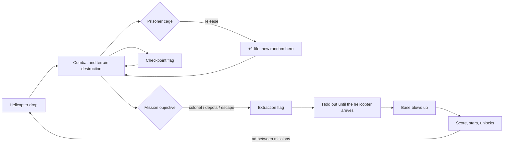

# Blast Battalion — Game Design Document (GDD)

Version 1.3 · September 2026 · target platforms: **CrazyGames**, **Poki** (HTML5, desktop + mobile)

> Changes in 1.1–1.2 come from research into the run-and-gun genre. Version 1.3 polishes game feel after testing: movement, shooting, hit fairness, and named kills instead of combos.

---

## 1. Game at a glance

| | |
|---|---|
| **Genre** | run-and-gun / pixel-art action platformer with fully destructible terrain |
| **Inspiration** | classic 80s action movies — original brand, characters and art |
| **Session** | 2–4 min per mission, 15-mission campaign (~45–60 min), endless Arcade mode |
| **Modes** | campaign, Arcade, daily mission, local 2-player co-op, 3 difficulty levels |
| **Audience** | ages 10–35, browser players looking for fast, "loud" action with no install |
| **Controls** | keyboard, gamepad, touch (virtual joystick + 3 buttons) |
| **Size** | a few hundred KB of code, zero external assets (art and sound generated in code) |

**Pitch:** A commando squad frees prisoners from General Grimm's bases. Every freed prisoner is **+1 life and an instant swap to a random hero** with different weapons. Everything explodes, everything can be destroyed, and structures collapse onto enemies.

**Selling points on portals:** destructible terrain and chain reactions (rare in browser games), random hero swap as a "wow" mechanic in every mission, 12 unlockable heroes (retention), varied mission objectives (assassination, sabotage, escaping a detonation), bosses, co-op on a single keyboard.

---

## 2. Design pillars

1. **Chaos that pays off** — every shot destroys something; barrels, fire and collapsing towers kill enemies for the player.
2. **Always a new weapon** — rescuing prisoners forces the player to keep switching heroes; there is no time to get bored.
3. **Fragile but fair** — a regular enemy dies from one hit, the hero takes 1–3 depending on difficulty (Veteran = classic one hit). Every enemy burst is telegraphed by a red aiming line, and grazing the edge of the silhouette does not count — death should come from the player's mistake, not from surprise.
4. **The world as a weapon** — "if I do X, Y will happen": a kicked barrel flies and explodes, a kicked body knocks over comrades like bowling pins, a soldier knocked off a tower dies, the hero's own explosion launches him up. The game rewards this with named kills.
5. **In within 5 seconds** — no loading screens, the tutorial is signs in the first mission, controls use 4 buttons.

---

## 3. Gameplay loop

**Meta loop:** the total number of freed prisoners (saved) unlocks more heroes → a bigger pool of random swaps → the player comes back to "collect" the rest and earn 3 stars in every mission.

---

## 4. Controls

| Action | Keyboard | Gamepad | Touch |
|---|---|---|---|
| Move | A/D, ←/→ | left stick / D-pad | joystick (left half of the screen) |
| Jump | W, ↑, Space, Z | A / LB | JUMP or joystick up |
| Shoot | J, X | X / RT / RB | FIRE (hold = continuous fire) |
| Special / gold crate | K, C | B / LT | SPEC |
| Knife | L, V (and shoot when an enemy is right next to you) | Y | KNIFE (or FIRE next to an enemy) |
| Fly (SKYHAWK) | hold jump after the top of the jump | hold A | hold JUMP |
| Slide (under bullets) | ↓ / S while running | stick down while running | joystick down while running |
| Stomp | land on an enemy's head (held jump = higher bounce) | — | — |
| Kick a barrel / body, deflect a grenade | knife next to the object | Y | FIRE next to a barrel |
| Grab a soldier (human shield) | hold knife next to an enemy; throw: knife or shoot | hold Y | hold KNIFE; throw: KNIFE or FIRE |
| Enter / exit the mech | ↑ (or knife) next to the mech / hold ↓ | stick up / down | joystick up / down |
| Ladder | ↑/↓ on a ladder | stick up/down | joystick up/down |
| Drop through a platform | ↓ | stick down | joystick down |
| Pause | Esc, P | Start | pause icon in the corner |

**Co-op:** P1 — WASD + F (shoot) / G (special) / H (knife) + Space; P2 — arrows + K / L / ; (or Numpad 0–3). The first connected gamepad controls player 2.

Touch controls appear automatically after the first touch; in phone portrait orientation a "rotate your device" screen is shown. Sound and music are on the title screen; everything else is in **OPTIONS** (menu and pause): screen shake, effects quality, **fewer flashes**, **aim assist OFF/NORMAL/HIGH**, **auto fire**, **vibration** (phones) and **key rebinding** (1.11). On touch the defaults are aim assist HIGH and auto fire ON — thumbs have a harder time than a keyboard.

---

## 5. Mechanics

### 5.1 Movement
- Run 102 px/s, fast acceleration; **turning around with double force** (with dust from the boots), so changing direction is instant.
- Jump ~3.6 tiles (58 px, 0.7 s airborne), variable height: a short tap gives ~25 px (until 1.25 it was 18 px, barely one tile), 6 frames of holding ~39 px, full jump 58 px. **Variable gravity**: normal on the way up, a short hang at the apex while jump is held (×0.55), faster falling (×1.5) — the jump is "sharp", not floaty. **Coyote time 100 ms**, **jump buffer 150 ms**.
- **Corner correction**: when a jump clips the edge of a ceiling (up to 5 px), the hero slips past instead of bouncing off.
- **Slide**: ↓ while running → a 0.42 s slide at ~190 px/s; the silhouette is lowered, so **chest-height bullets fly over the head**. The slide knocks over and kills regular soldiers (TACKLED). **Jumping out of a slide** keeps the speed — ~30% farther than a normal running jump.
- **Stomp**: landing on an enemy's head kills him and bounces the hero up (higher with jump held — you can hop across heads).
- **Explosion jump**: your own explosions do not hurt you, but at close range they launch you (grenade at your feet, rocket into a nearby wall → a higher jump than normal).
- **Squash & stretch**: the silhouette stretches on take-off and squashes on landing (proportional to speed).
- **Walls (1.26)** — principle: nothing moves the hero that the player did not ask for, and facing works on a wall the same as on the ground.
  - **A jump next to a wall is a normal jump** (58 px, with gravity). Until 1.25 a jump next to a wall with the direction held carried the hero up the wall at jump speed and without gravity, for 240 px (4× higher than a jump). Even a tap gave 200 px. In the player's words, "jumping is very unintuitive and confusing".
  - **Wall grab:** when you fall onto a wall in the air (or are at the top of a jump) with the direction toward it held, the hero grabs it and holds on, even after the keys are released.
  - **On a wall the hero faces wherever you last pressed:**
    - direction toward the wall (or ↑) is a steady 92 px/s climb; FIRE then digs into the wall;
    - releasing the keys: the hero hangs and keeps facing where he was facing, so "stop and shoot the obstacle" digs through the wall;
    - direction away from the wall turns the hero around on the wall: foot braced against the wall, weapon facing out (pose `cling`). FIRE, special and knife then go away from the wall, as the player asked ("stuck to the wall and shooting at the same time");
    - ↓ slides down (up to 130 px/s);
    - JUMP kicks off the wall up and to the side. It also works for 0.12 s after letting go of the wall;
    - leaving the wall: direction away from the wall held for about 0.25 s without shooting, ↓ or jump.
  - **W/↑ on a wall only climbs, it does not jump.** On the ground W still jumps.
  - **Chest-height ledge:** automatic vault onto the top, both while jumping and while climbing. A full jump clears a step of up to 4 tiles, a tap up to 2 tiles (measured).
  - **A hit** (bullet, explosion) knocks the hero off the wall. The camera stays on the hero while on the wall.
  - **Hint:** on the first two wall grabs a yellow bar shows "TIP: WALL: PUSH IN = CLIMB   PUSH AWAY = TURN & SHOOT". Sign in mission 1 (from 1.27 a pictogram, 5.10): "wall [D] ↑ / [A] TURN + SHOOT".
  - **Simulation (A/B, simulated players, same harness):** the first design (hero always with his back to the wall, climbing only on ↑) dropped mission 2 completions from 8 to 3 out of 9. Players stood at an obstacle and fired, and the hero then shot backwards. The current model performs as well as the old movement: mission 2 8 out of 9 (old 8 out of 9), mission 7 4 out of 6 (old 5 out of 12). The regression bot completed 8 of 15 missions, within the usual 6–10 range.
  - All of this is key to moving through destroyed terrain.
- Ladders, one-way platforms (bridges, towers), dropping through a platform.

### 5.2 Combat
- Horizontal shots (no aiming) — ideal for mobile.
- **Hero hit points depend on difficulty**: Recruit 3, Soldier 2, Veteran 1 (classic "one hit"). Damage: bullet, bite, shield bash, fire = 1; explosion = 2 at the center, 1 at the edge; crushing, spikes, detonation wall = death. After a hit: knockback, 1.2 s of invulnerability (blinking), red screen flash, hit-stop, HP bars on the portrait. An ammo crate heals 1 HP, a new hero (prisoner) has full HP.
- **Fair hits**: enemy projectiles only count in the core of the silhouette (2 px in from the sides, 3 px from the top) — a graze does not kill. While sliding the top boundary drops by another 5 px.
- **Telegraphed shots**: before a burst a soldier aims — a **red aiming line** is visible (0.45 s, machine gun 0.6 s, RPG 0.55 s; Recruit ×1.35, Veteran ×0.75), then the burst flies exactly along that line. From the "!" to the first bullet takes about 1.3–1.6 s (Soldier). Turrets and the colonel aim the same way.
- **Accuracy grows over time**: the first bursts have a large spread; the longer an enemy sees the player, the more accurately he shoots. Enemy projectiles are slower (175/195 px/s + difficulty) and clearly visible (thick, glowing).
- **Enemy reactions**: an enemy who is hit (but not killed) stops aiming; a bullet whizzing right past him startles him and sometimes spoils his aim (suppressive fire).
- **Shooting feel**: camera kick opposite to the shot direction (strength depends on the weapon), hit flash, a short hit-stop on every kill, bullet tracers.
- **Weapon ranges** (1.3.1, measured): Max Havoc's rifle ~510 px, Chrono ~555, Phantom ~490, Brutus and Skyhawk ~460, sniper rifle 560 (piercing), shotgun ~200 (pellets with spread), Ricochet's discs ~250 one way, Tesla locks on up to 220 px (chain 110), flamethrower ~110 px, katana 30 px, knife 20 px. The camera leads the hero by 14% of the screen width so you can see what you are shooting at.
- **Calm camera (1.25.1)**, after the report "the camera jumps around too aggressively":
  - **the lead follows the running direction, not facing:** turning around to shoot backwards does not move the camera (previously a short tap moved it by 39 px);
  - **on a real change of direction** (0.25 s of running the other way) the lead shifts smoothly over 0.9 s. Previously it jumped about 130 px in 0.2 s, up to 9–10 px per frame; now at most about 4 px, including the running itself;
  - **vertically the camera holds the height of the last ground:** a normal jump does not bob the view (previously about 42 px on every jump). The camera follows a fall below that ground, a rise of more than 64 px (explosion jump, jetpack), climbing and ladders;
  - both parameters are in the F2 tuning panel: "Turn-around transition" and "Vertical slack in jumps" (CAMERA group). Player bullets have a hit area of ±2.5 px.
- **Smooth camera (1.30):** a spring instead of smoothing, no jump cuts after death or at the boss arena, looking down while falling, the picture drawn between physics steps — see 5.12.
- **Light aim assist** (1.3.2): if the nearest visible enemy in front of the hero stands one level higher or lower (silhouette center up to 28 px from the barrel line, about 1.75 tiles) and a horizontal shot would miss him, the shot tilts toward him, max ~18°. Requires a clear line of sight — it does not shoot through terrain; enemies higher than ~1.75 tiles still have to be "jumped up to". Works for rifles, the shotgun (the whole spread), the flamethrower, Boomer's rockets, discs and the sniper rifle (angled beam).
- **Player explosion radii** (1.3.1): grenade 42, dynamite 56, rocket 36, airstrike 34 per missile, mini-rockets 24, ground pound 52, decoy 30, incendiary cocktail — an 80 px strip of fire.
- The player's own explosions do not hurt him (knockback only).
- **Grabbing** (1.6): holding knife (0.18 s) next to a soldier grabs him — a short press still means stab/kick. The held soldier hangs in front of the hero and **takes bullets from the front** (4 hits, then dies as HUMAN SHIELD). The hero runs slower (×0.85) and does not shoot; knife or shoot **throws** the soldier (THROWN), and the flying body knocks over others (BOWLED OVER). A thrown bomber flies like a ticking bomb. You cannot grab heavies, turrets, bosses, or a shield soldier from the shield side; after 3.5 s the hero throws automatically.
- **Tank** (1.22): parked in missions 8 and 12 (in Arcade from stage 4, 30% chance). Enter and exit like the mech (↑ or knife, hold ↓). Armor 60; bullets barely hurt it, explosions hurt a lot.
  - **Driving:** 62 px/s; it does not jump but climbs one-tile steps.
  - **Tracks:** grind through soft walls (dirt, sand, wood, sandbags, crates); rock and steel stop it.
  - **Ramming:** runs over soldiers (CRUSHED), bumps heavies, pushes barrels ahead of it.
  - **Shoot (cannon):** an arcing shell auto-targets the nearest soldier in front of the tank (up to 340 px); with no target it flies low and flat. Reload 0.95 s, explosion 34 px, recoil pushes the tank back, the barrel lifts and recoils.
  - **Special:** a burst of 12 rounds from the coaxial machine gun (every 2.2 s).
  - **Knife:** ram — 0.55 s of charging at 150 px/s that crushes and breaks through soft walls twice as fast (every 1.6 s).
  - **Sound:** the tracks rattle while driving.
- **Mech** (1.6): a parked walking robot in missions 7, 11, 13 and 14 (in Arcade from stage 5 with a 40% chance). ↑ or knife next to the mech — you get in; hold ↓ for 0.5 s — you get out (the mech stays with its remaining armor). Armor 40; bullet = 1, explosion = 5–10, crushing = 12, spikes do no harm; the pilot does not lose HP. Shoot: heavy machine gun (2 damage, digs terrain), special: a volley of 3 rockets (every 2.5 s), knife: a punch that destroys walls and sends bodies flying, a hard landing crushes nearby enemies. Climbs one-tile steps. When destroyed it explodes and ejects the pilot with 1.5 s of invulnerability. A freed prisoner gives the pilot +1 life without swapping heroes; at extraction the pilot gets out automatically.
- Specials: 2–3 charges per hero; ammo crates refill them all.
- **Gold crates**: one item "in the pocket" (airstrike, time slowdown, missile swarm, Roid Rage), triggered with the SPECIAL button before the hero's own special.
- **Knife / kick**: kills a regular soldier in one blow and sends the body flying — **the flying body knocks over and kills other soldiers (BOWLED OVER, domino)**; breaks shields; a bloody kill scares nearby enemies (panic). A kicked barrel flies and explodes on first contact (BARREL KICK), a kicked gas tank launches like a rocket, and the knife can **deflect an enemy grenade** back.
- Enemies shoot **only when they are on screen** and only after a reaction time (a "?" icon, then "!") — fairness.
- Enemy rockets and projectiles can be shot down with a bullet (+50).

### 5.3 Destructible terrain
The world is a grid of 16×16 px tiles, each with HP and resistances.

| Tile | HP | Notes |
|---|---|---|
| Dirt | 10 | "anchor" — does not fall; projectiles dig tunnels |
| Rock | 30 | resistant to bullets (×0.45); floor of boss arenas |
| Bedrock | ∞ | bottom of the level |
| Wood | 9 | flammable, structural (can collapse) |
| Brick/concrete | 24 | bunkers, resistant to bullets (×0.55) |
| Steel | 60 | bullets ×0.12, explosions ×0.55 |
| Sandbags | 14 | cover |
| Ladder / platform | 4–6 | flammable, let projectiles through |
| Ammo crate | 5 | drops ammo when destroyed |
| Roof sheet metal | 10 | brittle when falling |
| Stone (ruins) | 26 | structural |

- **Collapse**: when a tile is destroyed the game checks whether the structure (wood, brick, steel, stone…) is still connected to the ground. If not, the whole chunk falls as blocks that **crush** enemies and set off barrels. Blocks falling from high up shatter, from low down they settle. A block does not kill the **hero** outright (1.19): it costs 1 hit point, knocks him out from under the rubble and breaks apart on his helmet (it does not settle on him). In the new-player simulation, debris was the second most common cause of death, even in mission 1, and dying to a block nobody saw looks unfair.
- **Fire**: flammable tiles burn for a few seconds, spread fire and set units alight. Burning enemies run around in panic and ignite others.
- **Barrels** (explode in chains, get blown around by blasts), **gas tanks** (when hit they fly horizontally like a rocket, punching through dirt and enemies).
- **Traps**: mines (0.25 s to get away, hurt everyone), spikes at the bottom of ravines under bridges, **alarm sirens** — a lookout with a radio runs to the siren, which drops paratroopers every few seconds until you destroy it.
- **Traces**: blood stays on the terrain (a decal layer that disappears together with the tile).
- **A fall from a height** (over ~5.5 tiles) kills an enemy (SPLAT) — just blow up the floor under a tower or push him off a ledge.

### 5.3.1 Fuel and rope bridges (1.8) — "the world as a weapon", part 2
- **Green fuel drums** and **fuel pipes** (vertical sections with a valve near bases and fuel depots) **leak when shot** — a bullet makes a hole and never ignites the fuel (up to 4 holes, more holes = faster leak; the bullet goes right through, so fuel spurts out both sides). Enemy bullets puncture them too. Red barrels still explode from bullets — they have a different role.
- **Puddles**: fuel lies on the ground (on a tile), spreads sideways, flows downhill and spills over edges (drips). A thicker puddle spreads farther, a thin trail stays in place. It shows as a dark, oily layer with a rainbow sheen.
- **Ignition**: any explosion, flame (Scorch's and enemy flamethrowers, cocktail, fire strip), burning wood, **a burning soldier running through the puddle**, a torch from another drum. Fire runs along the fuel (~300 px/s, jumps a one-tile gap), burns for 1–6 s depending on the amount, ignites wood and leaves scorched ground.
- **Burning fuel** is fire for everything that checks for fire: enemies catch fire (**FLASH FIRE**), barrels explode, fuel depots burn, bridge posts burn through. Fire lit by the player does not hurt the player (just like his cocktail); fire from an enemy or "nobody's" fire hurts (1 HP).
- **Drum in fire**: a punctured drum turns into a torch for 1.3 s (flames out of the holes to the sides, about 2 tiles), then explodes and splashes the remaining fuel, already burning. An intact, unpunctured drum explodes after 0.6 s of heating. A **pipe** in fire burns like a torch as long as it has fuel (it does not explode).
- **Kicking** (knife) rolls a drum for ~1.5 s; a punctured one leaves a fuel trail behind it — a ready-made fuse to light.
- **Rope bridges** over deep chasms (7–8 tiles, no spikes): planks hang between two posts. **Shooting out a post** (4 bullets, an explosion instantly, fire burns through) or destroying any plank (explosion, fire, a mech's hard landing) — **the whole bridge falls** together with the soldiers on it (**BRIDGE OUT**; falling planks also crush those below, but never the hero). The hero takes no fall damage; there is a ladder on the other side of the chasm. Enemy bullets do not destroy the posts (their explosions do). Some valleys keep the old bridge on a support (sometimes over spikes).
- **Teaching**: mission 2 (Mudslide) always has a rope bridge with soldiers and a fuel depot (2 drums, a pipe, guards). Until first use, hints appear: "SHOOT THE POST" over the nearer post, "SHOOT: LEAK" over the nearest drum/pipe, "FIRE IT UP!" over a leaking one.
- **Placement**: a fuel depot as a segment (less often in the jungle, most often in the desert), single drums on flat ground and next to explosive barrels, a drum on the ground floor of the headquarters (HQ), a pipe at every fuel depot in sabotage missions (punctured and ignited, it burns the depot).

### 5.4 Prisoners, lives, heroes
- Start: 3 lives (co-op 5; Recruit +2, Veteran −2). Prisoner in a cage: touch = **+1 life (max 9) + swap to a random unlocked hero** (different from the current one). The cage can also be broken from a distance — then the prisoner waits until you run up to him.
- A prisoner who unlocks a new hero **gives him to you immediately** (a "NEW HERO!" card).
- In co-op, freeing a prisoner first revives a partner who is waiting with no lives.
- **Favorite hero**: on the HEROES screen you can pick the hero every mission starts with; swaps after prisoners are still random.
- Death → a new random hero dropped by helicopter at the last checkpoint.
- **Hint after death (1.19)**: a bar with a yellow TIP label (from 1.27 at the bottom of the screen, above Grimm's caption; 5.10) says what to do next time (e.g. "SHIELDS STOP BULLETS - KNIFE HIM OR HIT HIS BACK", "MORTAR SHELLS LAND ON THE RED MARK - STEP OFF IT"). Each cause at most 2 times per player (`Save.tips`); texts in `DEATH_TIPS` in `src/world.js`.
- Out of lives → defeat screen: **Continue for an ad (+3 lives, once per attempt)**, retry, menu.
- **Reinforcements after defeat (1.19)**: every lost campaign mission gives +1 life on the next attempt (at most +2; the `Save.fails` counter resets after the mission is completed). The button says it plainly: "RETRY +1 LIFE", and "REINFORCEMENTS: +1 LIFE" appears at the mission start. A difficulty wall should be beatable in 2–3 attempts rather than end the session.
- **HUD (1.7)**: the hearts in the hero panel are his hit points (lost ones turn grey, the last one pulses), the "×N" helmet is the hero reserve (lives), next to it the freed-prisoner counter. Previously a heart meant lives and hit points were small bars on the portrait, which was easy to confuse. From 1.27 all of this is on the dog tag (5.10).

### 5.5 Mission objective and extraction
- Checkpoints: enemy flags swapped for your own (a new respawn point).
- End of mission: extraction flag → a wave of enemy reinforcements → the helicopter lowers a ladder → touching it takes the whole squad → **the base blows up** (a series of explosions, the camera stays in place) → summary.
- Boss missions: the arena locks the camera; after the boss is destroyed the helicopter arrives.
- **Special objectives** (the extraction flag works only after they are done; the objective is shown on the mission route at the top of the screen — the colonel's skull, depot barrels, a red flag until the objective is done (5.10) — and an arrow at the edge of the screen points the way):
  - **Assassination** — the colonel (6 HP, pistol) on the upper floor of the headquarters; he shoots from a distance and runs away when the player gets close. +2500 pts.
  - **Sabotage** — 3 fuel depots (16 HP, enemy bullets do not damage them) explode in a fireball. +1500 pts each.
  - **Escape** — base self-destruct: a detonation wall advances from the left, catches up to about a screen behind the player and slows down over the last stretch; after the player dies it falls back behind the drop point. It stops once the extraction flag is raised. Fewer enemies, no alarms.

### 5.6 Score and stars
- Kills 100–600 pts (by enemy type), prisoner 1000, checkpoint 250, boss 10,000. (The combo multiplier from 1.0–1.2 was removed — it was invisible and confusing.)
- **Named kills** — a bonus for using the world, with a caption above the enemy:

  | Name | How | Bonus |
  |---|---|---|
  | CHAIN REACTION | barrel, gas tank, fuel depot, mine, turret | +150 |
  | CRUSHED | falling blocks, crates | +150 |
  | SPLAT | fall from a height | +150 |
  | FRIENDLY FIRE | an enemy explosion (bomber, grenade, rocket, mortar) kills another enemy | +200 |
  | BOWLED OVER | enemy hit by a flying body | +200 |
  | BARREL KICK | kicked barrel / gas tank | +200 |
  | RETURN TO SENDER | deflected projectile or grenade | +250 |
  | STOMPED / TACKLED | stomp / slide | +100 |
  | AIRBORNE | enemy shot in mid-air | +100 |
  | TOASTED | fire | +50 |
  | FLASH FIRE | enemy ignited by burning fuel or a torch from a drum/pipe | +150 |
  | BRIDGE OUT | enemy fell with a collapsed bridge or was crushed by its planks | +200 |

- **Multi-kill**: several kills from one event (explosion, piercing shot, shotgun blast, body domino, lightning chain) → DOUBLE / TRIPLE / MULTI KILL ×n, bonus 50·n·(n−1) (100, 300, 600…).
- The mission summary shows the number of named kills.
- End bonuses: time (vs. a reference pace), all prisoners +2000, no hero lost +2000.
- **Stars**: ★ completion (COMPLETE), ★ all prisoners (ALL PRISONERS), ★ no hero lost (NO LOSSES). Since 1.13 each star is a separate medal that is kept permanently: you can earn "all prisoners" in one attempt and "no losses" in another (saved in `Save.data.medals`, bitmask 1/2/4). The conditions are shown on the mission card on the selection screen, live in the pause menu and next to each star in the summary; a star earned for the first time flashes green.

---

### 5.7 Event readability — the language of time (1.14–1.15)

Every important event has three phases: **telegraph** (the cause is visible before the effect), **moment** (a frame held long enough for the eye to catch it) and **aftermath** (visible for a while, then persistent). Hero control stays instant (response < 100 ms): we slow down the consequences, not the player.

Where the numbers come from:
- an event shorter than about 100 ms (6 frames) is easy to miss in the heat of play; human reaction time is about 250 ms;
- the eye smoothly tracks motion up to about 20–30°/s; faster objects are seen only as a streak;
- hit-stop in action games lasts 50–200 ms and grows with the strength of the blow;
- the hero is about 15 px tall, so 1 m is about 8.5 px. The game's gravity (900 px/s²) is about 11 times the real one at this scale. For the hero's jump that is fine (every platformer does it), but objects falling that fast look like toys. It is the same "miniature effect" as in cinema, where models are shot in slow motion (time scales with the square root of the scale). That is why objects — bodies, debris, blocks, blood, sparks — share a "cinematic" gravity of ×0.6, while the living (hero, soldiers) use normal gravity.

| Phase | Target | In the game |
|---|---|---|
| telegraph of a threat to the player | 0.35–0.7 s (reaction + movement) | enemy aiming line, sniper laser + 0.35 s lock-on, 0.55 s flamethrower pilot flame, vest ticking 1.1 s, smoke and airstrike markers |
| telegraph of an environmental event | 0.3–0.5 s | unsupported terrain creaks for 0.45 s (cracks, shaking, dust); a bridge sags for 0.3 s |
| moment of impact | 50–100 ms of hit-stop by strength, at most every 0.2 s | bullet kill 45 ms, knife about 70 ms, big explosion 45–70 ms, hero hit 80 ms |
| reaction of the one hit | 80–120 ms | white flash of the enemy (0.1 s) and of the body (0.09 s), knockback |
| projectile in flight | ≤ about 30°/s or a long tracer; big, not "realistic" | hero bullet 480 px/s (×0.8 at the same range), a 2-pixel projectile with an 18 px tracer and glow, a flash at the point of impact |
| aftermath | 0.4–1 s in the air, then persistence | body flight 0.65–0.8 s over 50–90 px, bodies lie for 9 s, debris and blood at ×0.6 gravity |
| explosion | flash 2 frames, fireball 0.5–1 s, smoke 2–4 s | ×1.3 longer since 1.14; barrels in a chain every 0.22–0.45 s, flying upward |
| slow motion | only rare big moments, 0.4–0.8 s | boss, triple kill (at most every 6 s), hero death: 0.8 s with a cause caption and the camera in place |

What we do not do: we do not slow down the whole game, the hero or his weapon — the game loses pace and control. We do not slow time every other moment, because then the slowdown stops working. We do not extend invulnerability.

All the timings are in the F2 panel (groups GAME and SHOOTING): projectile speed, hit-stop, explosion duration, creaking before collapse, object gravity, slowdown on death.

### 5.8 Weight of shots and traces of battle (1.21)

Principle: every shot and every explosion leaves a trace, and every weapon has its own weight. After a fight you can see what happened.

- **Traces:**
  - bullets make holes in the terrain: dark with a shadow in dirt and stone, bright scratches in steel, splinters in wood; they disappear together with the tile;
  - casings fly out of weapons: 2 px brass from rifles, 1 px from pistols and SMGs, bigger ones from the minigun, sniper rifle and mech. The red shotgun shell drops out on reload, 0.3 s after the shot. Casings clink on first touching the ground (the shotgun shell with a dull thud) and lie for 3.5–5 s;
  - smoke rises from the barrel;
  - destroyed tiles crumble into 2–3 px pieces that stay on the ground for a few seconds.
- **Ricochets:** a bullet that hits steel, stone or brick bounces off as a whistling spark in 30% of cases.
- **An explosion rearranges its surroundings:**
  - it tosses up casings, debris and fragments lying around;
  - beyond its damage radius (up to 1.6× the radius) it knocks soldiers back (not heavies), interrupts their aiming and bursts, and sometimes knocks them off ledges;
  - it pushes bodies.
- **Weapon weight** (hit-stop multiplier on a kill):

  | Weapon | Multiplier | Notes |
  |---|---|---|
  | minigun | 0.6 | the burst must not stutter |
  | rifle, SMG | 1 | |
  | shotgun | 1.2 | at close range (up to 52 px) 1.6, and the body flies across half the screen (force 280) |
  | knife | 1.5 | |
  | sniper rifle | 1.8 | force 240 |

- **Juggling:** every bullet bumps the body it hits (a fixed bump, not cumulative). A body you hit at least 2 times in the air gives AIR JUGGLE ×N (50 pts × N).
- **Whiz:** an enemy bullet that flies right past the hero whizzes. You can hear that you are under fire.
- **Movement:**
  - **a hard landing** after falling at least 7 tiles (112 px) gives a dull thud, a shake, a ring of dust and a shockwave with a range of 36–62 px (BRUTUS +12). The wave knocks down and stuns soldiers (for 0.8 s, heavies for 0.45 s) and never kills; it also tosses bodies and barrels. Each soldier gives SHOCKWAVE +50. This is how explosion jumps, jetpack descents and jumps off roofs end;
  - **flip:** a wall jump and a jump out of a slide are a full rotation (0.3 and 0.36 s);
  - **a series of wall jumps** raises the pitch of the jump sound and kicks up more dust, with speed lines from the third bounce;
  - **running** kicks up dust from the boots, snow in the arctic.
- **Captions** (points, styles, causes of death) always fit inside the frame.

### 5.8.1 Secrets (1.23)

Every campaign mission and every Arcade stage has one secret: a hidden vault just below the surface (`placeSecret` in `src/levels.js`).
- **Structure:** a 5×2-tile chamber lined with brick, containing a gold crate with a special item. Its ceiling is a strip of 5 tiles of cracked dirt (30% HP, which draws as heavy cracks). Every few seconds a glint rises from the cracks.
- **Concealment:** until someone breaks through, the chamber and the crate draw like solid dirt, and the edges of neighboring tiles do not give it away either (`Terrain.mask`). Destroying the ceiling, a wall or the floor reveals the chamber.
- **How to get in:** jumping onto the cracked dirt (landing faster than 200 px/s, i.e. practically any jump, but not just walking over it), an explosion, or digging in from the side.
- **Reward:** "SECRET FOUND!", +1000 pts, +$50 and a gold crate. In the campaign the find is saved immediately (`Save.secrets`), even if the mission later fails.
- **Where found secrets are shown:** in the mission summary ("¤ SECRET FOUND"), on the mission button (a gold square) and on the mission card ("¤ SECRET", gold once found).
- **Location:** 20–92% of the mission length, on flat, natural ground (no buildings, signs, flags, cages, depots or placed tiles), not next to a checkpoint. It can lie above an ordinary cave if at least one row of dirt separates them.

### 5.9 Cinematic scenes (1.22)

- **Door-gunner flyover:** the first mission of a new zone (mission 6 and mission 11, and in Arcade every stage that changes zone) starts aboard the helicopter (`src/rail.js`).
  - **Route:** the helicopter flies in from the right over the first ~84 tiles of the base (64 px/s, about 20 s). The hero who will later land sits in the door.
  - **Controls:** arrows or stick (or mouse movement) move the crosshair, shoot fires the minigun toward the crosshair, special fires a rocket (5 per flyover). Bullets dig into the terrain, rockets can destroy a fuel depot or a tower from the air.
  - **Fire from below:** soldiers on the ground shoot at the helicopter and rocketeers fire rockets. Hits clang off the hull and shake the view ("TAKING FIRE!"), but the flyover cannot be lost — it is a show before the drop.
  - **Skip:** holding jump (0.6 s) skips the flyover.
  - **Landing:** at the end the same helicopter smoothly descends into the normal drop and shows "LANDING ZONE: N KILLS".
  - **When there is no flyover:** on a retry after a loss and in co-op.
- **Cinematic bars:** black bars at the top and bottom of the screen (16 px) appear when a boss enters (together with 1.1 s of slowdown to 45%), when it is destroyed and when the base blows up at the end of the mission. Narrower bars (10 px) are visible throughout the flyover.

### 5.10 HUD and tutorial (1.27)

The player reported: "the HUD looks cheap, too much text, unclear icons, pop-ups interrupt". The HUD was rebuilt in the "B — military" direction, chosen from three mockups.

- **Separate layer:** the HUD is drawn on its own canvas above the game, at screen resolution (`src/hud.js`).
  - A HUD pixel is about 2/3 of a game pixel, so text is finer and sharper than the world.
  - The layer does not take clicks, is cleared every frame and is empty in menus and under pause.
- **Dog tag** (top-left corner, in co-op a second one on the right): a steel tag on a chain.
  - On the tag: a recessed portrait, an embossed name, hearts, specials with the key that throws them (e.g. [K]; gamepad: B; no key on touch), a gold crate with the item.
  - The P1 tag also shows the helmet ×lives and prisoners as cages (freed ones in green).
  - New hero: the tag bounces, the name flashes gold, and below it a bar with the weapon and special appears for 2 s ("DEPLOYED / SHOTGUN + DYNAMITE"), never wider than the tag. It replaces the large hero card at the bottom of the screen.
  - In a vehicle, instead of hearts: the vehicle name and an armor bar.
- **Mission route** (top center) instead of a progress bar: the hero's face travels along the route to the flag.
  - The route shows prisoner cages, fuel depots, the colonel's skull (✓ once eliminated) and the detonation wall in escape missions.
  - The flag is red until the mission objective is done.
- **Score and pause:** a small glass plate and an icon in the top-right corner.
- **Grimm like movie subtitles:** a radio icon, "GRIMM" and the line typed out live, one line (at most two) at the bottom of the screen. Replaces the green screen with a face.
- **TIP after death:** a glass bar with a yellow TIP label above Grimm's caption.
- **INTEL on first meeting an enemy (7):** a card under the route with the enemy's face in a red frame, its name and how to deal with it ("SNIPER / MOVE WHEN THE LASER TURNS WHITE").
  - One card is shown at a time and not during big captions; the next one waits its turn.
  - Previously three such sentences could pop up at once in the middle of the screen.
- **Keys above the hero:** control hints are keys, not sentences.
  - In mission 1: [D] ▶, [J] ▶, [SPACE] ↑. In a vehicle: HOLD [S] ▶ EXIT. With a jetpack: HOLD [SPACE] ▶ FLY.
  - The keys float above the hero's speech bubble and wait if they would cover a big caption.
  - They show the player's bindings; in co-op the P2 keys (the second binding column).
- **Layout:** bars stack and never overlap.
  - Under the route, in the column between the dog tags: score in co-op, boss bar, INTEL.
  - At the bottom: Grimm, with the TIP above him. On touch both move to the top, away from the buttons.
  - When it is too cramped between the tags (co-op on a small screen), the bars move under the tags and the new hero's weapon bar is not shown.
  - Big captions ("MISSION 1", "CHECKPOINT!") stay in game pixels and start below the stack of bars.
  - In scenes with cinematic bars the HUD dims to 35%.
- **Tutorial signs are pictograms with keys** instead of sentences:
  - "◀ [A][D] ▶", "[W][SPACE] ↑", "[J] ▶ barrel barrel", "RUN + [S] ▶ SLIDE", "cage ▶ helmet +1";
  - "wall [D] ↑ / [A] TURN + SHOOT", "[K] ▶ grenade / [L] ▶ barrel", "[L] ▶ knife / HOLD [L] = GRAB";
  - "[W] ↑ ladder", "[SPACE] ▶ ↓ head", "flag = CHECKPOINT", "flag ▶ helicopter".
  - On touch and gamepad the keys turn into buttons (DRAG, FIRE, A, X…). Hero speech bubbles avoid the signs.
- **Cost:** about 0.8 ms per frame at a 1353×894 screen.
- **Menu, pause and results (1.28)** in the same style, after mockups. The player chose thicker text in game pixels rather than fine text like in the HUD, because in menus readability matters more, including on phones.
  - **Shared element kit** (`src/uikit.js`): steel plates with bevels and rivets, a yellow plate with hazard stripes for the one main action on a screen, brass for the current selection, glass, keys, medals and 7×7 icons in place of some words. It is drawn on the HUD layer, while the layout stays in game pixels (that is where clicks are checked).
  - **Title (until 1.30; from 1.31 see 5.13):** buttons with icons (flag, crossed swords, calendar, helmet, bars, two helmets), progress as badges (★ 27/45, helmet 12/12, $), controls at the bottom as keys with pictures. The logo and tagline keep their big letters.
  - **Mission select:** three zone routes (jungle, desert, arctic) with missions on the line. The line is gold where you have already fought, grey up to the next mission and dashed beyond. The hero's face is shown at the next mission. Below the routes is the mission folder: name, HP and lives as pictures, objective with an icon, medals, difficulty.
  - **Pause:** RESUME as the main action, sound and music as toggles with icons, mission and objective at the top, live medals at the bottom (in Arcade, the run's cards).
  - **Results:** medals pinned one by one (they land big and settle), numbers on a board with icons, cash counts up before your eyes, the supply drop as a crate.
  - **Other screens:** heroes, wardrobe, upgrades, options, defeat, Arcade cards and victory use the same plates and selection frame.
  - **Touch buttons:** a picture above a word. The word stays because the same labels appear on the tutorial signs.

### 5.11 Languages (1.29)

The game speaks English, Spanish, Portuguese (Brazil), German, French and Polish. These are the largest portal markets besides English.
- **Language selection:** on first launch by browser language, afterwards from the save. Change it in OPTIONS → LANGUAGE (also in pause).
- **How it works:** the game code still writes in English, and translation happens at draw time. Every string goes through `Font` (`src/gfx.js`), which asks `L10N.tr` (`src/lang.js`):
  - first the whole sentence in the language table (`src/lang_*.js`, about 520 phrases each);
  - then rules for sentences with numbers and names (`L10N_RULES`), e.g. "SHOT BY A SNIPER" → "STRZAŁ: SNAJPER", "LANDING ZONE: 5 KILLS" → "LĄDOWISKO: 5 ZABÓJSTW" (Polish plural in three forms);
  - results are cached, so the cost is unnoticeable (draw time the same as in English).
- **What we do not translate:** hero names, boss names, key names and random operation names in Arcade. The RICOCHET modifier has an invisible soft hyphen in its name so that the hero RICOCHET is not translated.
- **Font:** added accented capitals (ĄĆĘŁŃÓŚŹŻ, ÁÉÍÑÓÚÜ, ÀÂÇÈÊËÎÏÔÙÛŸ, ÃÕ, ÄÖ) plus ¡ and ¿. The accent sits above the letter, and the letter itself stays where it was. ß is written as SS.
- **Long words:** translations are longer than English (German by about 30%).
  - Long words break with a hyphen at the soft hyphen from the table (`­`, e.g. FLAMMEN-WERFER). Never between arbitrary letters if it can be avoided.
  - A caption that does not fit gets smaller letters (one screen-pixel step) instead of spilling off the plate. Text on the yellow button stays between the stripes.
  - On hero cards on the smallest screen (384×216) the spacing is narrower so that 9 letters fit on a line.
  - Result: at 384×216 no screen in any language needs to shrink its letters.
- **Checking:** `python tools/check_lang.py` checks that every letter of the translations is in the font and that all languages have the same phrases. Screens in every language were reviewed at 384×216, 342×256, 427×240, 451×298 and 500×280.

### 5.12 Camera (1.30)

After the question "how do we make the camera smoother?". Measurement first: a simulated player played missions 1–6, and every camera frame was recorded (`tools/camprobe.js`). Only then the changes, each verified with the same measurement. The new camera is in `src/camera.js`. The old one (1.29) stays in the F2 panel for comparison: "Camera: new (1) / old (0)". All settings are in the CAMERA group.
- **No jump cuts:**
  - **After death** the camera no longer chases the helicopter across half the level (it was 1440–2340 px/s, from a standstill in a single frame). If the new hero lands at most 1 screen away, the camera travels there smoothly (accelerating and braking, at most about 600 px/s). Farther than that there is a short fade (0.2 s) and a cut. The helicopter flies into the target frame once the camera is already there. The new hero appears after the same time as before (about 3.5 s after death).
  - **Boss arena:** the camera glides into the arena framing under the cinematic bars (at most 3.6 px per frame), instead of jumping 129 px in one frame.
  - **Skipping the flyover** (holding jump) is a fade instead of a jump of about 1300 px.
- **Spring instead of smoothing:** the camera follows the hero like a critically damped spring, so it starts and stops softly. Abrupt camera speed changes (over 1 px/frame within one frame): horizontally 0–5 per minute instead of 0–31. Lag behind the hero: 0.2 s horizontally, 0.28 s vertically.
- **Vertical calm:** bumps of up to 20 px (more than a tile) do not move the camera. It changes height only when the hero stands on a different level. When the hero is on the ground, the camera moves vertically in 7–12% of frames instead of 10–33%.
- **The hero stays still in the frame:** when the camera moves together with the hero, it rounds to pixels together with him. The hero no longer jitters by a pixel 12–14 times per second (now 0–0.4).
- **Looking down while falling:** the camera predicts from the trajectory where the hero will land. It keeps him higher in the frame and then waits for him at the landing spot, so it brakes before the landing, not after it. It starts at the top of the jump once there is already a drop below the hero. A hop at the edge of a hole and a jump over a gap do not move the view.
  - Simulated player falls in missions 2–6: the landing spot is visible 0.3 s before touchdown in 16 of 16 falls (previously 9 of 14). The hero gets down to at most 66% of the screen height (median; previously 82%).
  - Shafts of 3–16 tiles: the hero at most at 59–62% of the screen (previously 63–99%), with no bounce. The camera settles after 0.2–0.4 s (previously 0.9–1.5 s).
  - Hard limit: the hero's feet never below 80% of the screen, the head at least 36 px below the top edge (below the HUD) and the body 36 px from the sides. In the boss arena the limit does not push the camera past the arena wall.
- **Boss framing:** with a boss and with an awakened mini-boss the camera shifts toward a point between it and the hero ("Boss framing" 0.5; 40% weaker for a mini-boss).
- **Shakes:** smooth shaking (two waves per axis) instead of a new random position every frame. Weak shakes are gentle, big explosions are still strong (at most 7 px). In missions 1–6 at most 3–6 px instead of 8–10.
- **Weapon kick:** a soft push (spring) of the same strength, instead of jumping the full amount at once.
- **Smoothness on every monitor:** physics still runs 60 times per second, but the picture is drawn between the last two steps (heroes, enemies, projectiles, bodies, helicopters, particles, captions, weather, camera).
  - On 75–240 Hz monitors the picture no longer repeats in an uneven rhythm (at 144 Hz, 58% of frames were a copy of the previous one).
  - At 60 and 120 Hz the loop locks to the refresh rate, so clock jitter no longer produces a frame with two steps next to a frame with no step.
  - Tests and recordings are unchanged (the same 60 Hz step). The picture freezes in pause. After drawing, all positions are restored bit for bit, and the cost is unnoticeable.
- **Measurement:** `tools/camprobe.js`:
  - `CAMPROBE()`: simulated player and camera recording;
  - `CAMTEST()`: controlled scenarios for each camera (`TUNE.camNew` 0/1): stopping, turning, falls into dug shafts, a hop at an edge, jumping a gap, respawn from 150–1500 px, arena.

### 5.13 Title screen (1.31)

The player: "I'm not convinced about the title screen". He ticked all four problems: too much at once, looks cheap and flat, does not sell the game, and a new player does not need the screen at all. Out of three mockups drawn in the game (a live game scene, an action-movie poster, a military camp; `tools/titlemock.js`) he chose the live scene.
- **First launch without a menu:** a new player goes straight into mission 1. New means one who has not started any mission, completed anything, freed a prisoner, and has no score in Arcade or the daily mission.
  - The logo and tagline slide in for about 3 s over the helicopter drop, like a title at the start of a movie, instead of the "MISSION 1 / OPERATION…" captions. Then the logo slides up and away, and only then does the HUD (dog tag, route, Grimm, keys above the hero) appear.
  - The player sees the menu on the next visit (`Save.data.played`). A new tester from the F3 panel also starts with mission 1.
- **A real mission plays behind the menu** (`src/attract.js`). A demo pilot drives a random unlocked hero using the test bot's rules: runs right, shoots whatever is ahead, climbs and digs through, gets into vehicles, throws a special every 2.5 s.
  - Four clips of 16–17 s each, cut through black: an airstrike in the jungle (TIGER CLAW), a tank in the snow (AVALANCHE), fuel depots in the desert (SANDSTORM), a mech in the snow (DEEP FREEZE). Each visit to the screen starts with the next clip.
  - The helicopter drop, and in vehicle clips also the first 8–9 s of the mission, are fast-forwarded without rendering (several steps per frame), so the vehicle appears a few seconds into the clip.
  - A clip ends early when the hero has not advanced 40 px in 4.5 s.
  - Chosen by measuring 11 missions (3 runs of 20 s each): the most action, the hero always in frame, zero getting stuck. Frames showing almost nothing but rock: 0–14%.
  - The demo camera keeps the hero in the band between the logo and the menu, in 100% of samples at 384×216 and 451×298.
- **The demo changes nothing** (`World.demo`):
  - the game runs without sound (the title music plays), and the hero cannot die;
  - nothing goes into the save: prisoners, cash, one-time hints and INTEL cards stay for the player;
  - no playtest events, gameplay signals to the portal (`gameplayStart`, `happyTime`) or vibration;
  - no captions in the world: points, speech bubbles, Grimm, the objective arrow, "MECH / ↑ ENTER", mini-boss names and hints at barrels and the bridge.
  - Verified: after 210 s on the title screen the save, localStorage and the playtest log are unchanged, and there are 0 calls to `gameplayStart`, `haptic`, `Music.play` and `Save.save`.
- **The screen shows only:**
  - the new logo with a shine every 5.5 s;
  - one big button: CONTINUE and the next mission;
  - one row: MISSIONS, ARCADE, DAILY, HEROES, UPGRADES and CO-OP (except on touch), with an indicator light when something is waiting;
  - in the right corner a speaker (all sound; effects and music separately in OPTIONS), settings and the supply crate;
  - the version in the top-left corner (5 taps open the test panel).
  - Removed: the progress badges, the daily rule line, the keys at the bottom, the row of characters and the tagline. Stars are in MISSIONS, the tutorial teaches the keys.
  - On a narrow screen the row buttons get narrower, and the UI kit drops the pictures first. Verified in EN/DE/FR at 384×216, 342×256, 427×240, 451×298 and 500×280: nothing overlaps.
- **New logo** (`Logo` in `src/ui.js`):
  - BLAST in hand-drawn letters (2 px stroke on a 7×10 grid), slanted forward, from pale gold to red, with depth and an outline;
  - BATTALION on an olive ribbon with notched ends and two stars;
  - letter size 2 on a phone, 3 on a typical screen and 4 on a tall one.
- **Cost:** like a normal mission, because it is the same world. Update on average 1 ms per step (including world creation and fast-forwarding), drawing about 5.8 ms at 1353×894 in a hidden tab.

### 5.14 Character animation and reactions (1.32)

The player's request: "polish the behavior, animations, timing and reactions of characters to specific events, for all characters". Previously a character had a few frames (idle, run, jump, fall, throw) and reacted mostly with an icon ("!", "?") or a white flash. Now it reacts with its whole body, following the same rule as events in 5.7: **telegraph → moment → aftermath**.

**Rule for the hero:** no pose delays control. A pose is shown only when the hero is not doing anything that needs a different one (shooting, running, jumping interrupt it immediately). We change the look, not the movement; the hero's physics are the same as in 1.31.

**Poses (`src/sprites.js`):** 27 new poses for all 27 character looks. A pose has new parameters: torso lean (the feet stay in place), head, weapon and shield offset, and a variant without a cap. Poses are drawn on first use, and the game draws the rest in the background (about 1 ms per frame, the current mission's cast first).

**Running for all characters:** leg frames follow the distance traveled (a step of about 24 px when walking, 34 px when running), so feet do not slide on the ground. Previously the legs cycled at a fixed rate (12 or 7 frames per second) regardless of speed.

**Heroes:**

| Event | What you see | Time |
|---|---|---|
| helicopter drop | landing on one knee with dust | 0.45 s |
| landing | bent knees; after a fall of 7+ tiles, a kneel | 0.11 s / 0.3 s |
| turning around while running | skid: leaning back, leg braced in front | while braking (2–3 frames) |
| top of the jump | tucked legs | while \|vy\| < 55 |
| shooting while standing | shooting stance, the weapon kicks back after every shot; spinning-up minigun – aiming | 0.09 s after the shot |
| hit | recoil: head and torso back, weapon up, a leg in the air (if not shooting) | 0.24 s |
| knife | thrust with the arm and blade extended | 0.16 s |
| grabbed soldier | both hands on him | while holding him |
| throw (grenade, disc, special) | wind-up, then follow-through with the arm down | 0.08 s + the rest |
| Volt's storm, Chrono's slowdown, pocket items | arms up | 0.45 s |
| Deadeye's railgun / Brutus's ground pound | charging on one knee / fists up, then down | the whole special |
| freeing a prisoner, checkpoint, triple kill, secret, mini-boss, boss | fist in the air | 1.1 / 0.9 / 1 / 1.2 / 1.4 / 1.8 s |
| idle | after 3.5 s, every 5.2 s looks around (hand over the eyes) or checks the weapon; on the last hit point breathes faster | 1.1 s |
| extraction | waves goodbye from the ladder of the departing helicopter | until the end |
| death | the body first twitches, then flies limp; a hat, helmet or crown falls off separately | – |

**Soldiers:**

| Event | What you see | Time |
|---|---|---|
| "!" (spotted) | a flinch (leaning back, weapon up) and a hop of about 5 px; a dog barks | 0.24 s, reaction time unchanged |
| "?" (noise) | hand over the eyes, looking toward the noise | while searching |
| aiming (red line) | weapon to the eye, bent knees; the sniper in a half-crouch, the laser starts at the muzzle | the whole aiming line |
| shot | weapon recoil; the heavy gunner shakes during a burst, the flamethrower during the stream | 0.07 s |
| after a burst | reload: weapon lowered, hand at the magazine, every second burst a magazine drops with a clink; the heavy's barrels smoke; the sniper works the bolt (big casing, "click-click") | 0.55 s / 0.9 s / 0.55 s |
| grenadier | pulls the pin (clink, the pin flies) and raises the hand with the grenade, then throws with a follow-through; if hit during the wind-up he always drops a live grenade | **0.35 s wind-up (new)** |
| mortarman | drops a shell into the tube, fires (smoke, the tube jolts), covers his ears | **0.3 s (new)** + 0.75 s |
| officer | handset at the ear, the other hand points at the target during the whole airstrike call | 1.3 s |
| shield soldier | pulls the shield back before a bash, then shoves it 3 px forward | 0.35 s + 0.2 s |
| dog | crouch before the leap (rear up, ears back); barks at "!"; sniffs and wags its tail on patrol | 0.22 s |
| bomber | charges with arms up; the vest light blinks and the beeping speeds up the closer he gets (every 0.3 → 0.1 s) | – |
| lookout running to the siren, colonel fleeing from the hero, panic, burning | running with arms up | – |
| hit (not killed) / blast from beyond range | flinch / stagger | 0.2 s / 0.15–0.35 s |
| hero's hard-landing shockwave | lies on his back, gets up via a kneel (the stun lasts as long as before) | 0.55 s + 0.25 s |
| long fall (over 3.5 tiles) | flails his arms and screams before impact (SPLAT) | – |
| paratrooper | holds the lines; lands in a crouch and only then shoots; the canopy settles on him, slides off to the side and disappears | **0.35 s (new)**; canopy 1.25 s |
| grabbed by the hero | kicks his arms and legs | – |
| unaware (guard, patrol) | every 6.5 s: looks around, stretches, checks his weapon; the officer talks on the radio, the colonel raises a fist | about 1.1 s |
| death | a flinch at the moment of the hit, then a limp body; the helmet or cap falls off (from a bullet in 75% of cases, always from an explosion, knife or crushing), bounces up to 2 times (a metal one clinks) and lies for 7 s | 0.14 s + flight |
| the last hero going down | fist up, hops and one shout ("GOT HIM!", "HA HA!", "TOO EASY!"); they do not shoot meanwhile. In co-op, while the other hero is still fighting, nobody celebrates | about 1.2 s after 0.25–0.6 s |

**Prisoners:**
- **in a cage:** sits hunched and peeks out now and then; waves when the hero is closer than about 14 tiles; jumps when closer than about 6; covers his ears for 1.1 s after a nearby explosion. The cage has a dark interior, the prisoner on it and bars on top;
- **freed from a distance:** jumps out with arms up, runs to the hero (up to about 15 tiles when the way is clear, so you do not have to go back for him), and jumps for joy while waiting.

**Bosses:** every attack is telegraphed on the machine itself, not just by a marker on the ground:
- **IRON HOG:** before a cannon shot the barrel stops and its muzzle glows brighter and brighter (0.35 s). The shot pushes the tank back, the barrel returns to place, dust flies from under the tracks. Before a ground-level machine-gun burst the MG port blinks red (0.45 s).
- **SKYREAPER:** pitches its nose in the direction of flight. The launcher glows 0.3 s before a rocket, the hatch opens 0.25 s before a bomb.
- **GRIMM WALKER:** crouches before a jump (up to 5 px), settles on landing, sways with the cockpit open. The flamethrower sputters and glows 0.4 s before the stream, the cannon jerks the body.
- **JUGGERNAUT:** leans back before a shoulder shove.

**Sounds:** the clink of a grenade pin, the "click-click" of a reload and a bolt, the scream of a falling soldier.

**F2 panel, CHARACTERS group:**
- "Character animations: new (1) / old (0)" – for comparison with 1.31;
- "Pose duration ×" (landing, flinch, celebration, reload);
- "Enemy hop on "!"" (95 px/s);
- "Grenadier: wind-up before the throw" (0.35 s);
- "Mortarman: shell into the tube" (0.3 s);
- "Shockwave: soldier stays down" (0.55 s);
- "Enemies cheer when the hero dies" (1.2 s);
- "Idle fidget after" (3.5 s);
- "Boss attack telegraphs ×" (0 = as in 1.31).

**Performance:** the sprite outline is now computed in a single pass over the pixels, and the mirror image and white flash are created on first use. The picture is identical to the pixel (verified with a checksum of all sprites). Building the graphics at game start takes 0.35 s instead of 2.7 s, and a new pose about 0.7 ms.

**Verification:**
- `tools/posesheet.js`: a sheet of all characters in all poses;
- `tools/animfilm.js`: film strips of scenes (frames side by side), e.g. a soldier from "!" to reload, grenadier, mortar, sniper, dogs, panic, knocked down by a shockwave, enemies celebrating, deaths, prisoners, paratrooper and bosses;
- `REGRESS()`: PASS, 0 errors, the bot completed 6 of 15 missions (usually 5–10).
- Simulated players (`HUMANBOSS`), A/B test of new / old animations, alternating runs, 15 pairs per boss: completions IRON HOG 13/15 vs 15/15, SKYREAPER 6/15 vs 3/15, GRIMM WALKER 8/15 vs 6/15. The differences go both ways and are within noise (the bot sometimes digs itself into rock, sometimes in one version, sometimes in the other), so the difficulty has not changed. The telegraphs do not slow down the attacks: the pause before the next cannon shot and before the mech's flamethrower is shorter by the telegraph time, and rockets, bombs and MG bursts have the same pace as in 1.31. The first version of the telegraphs lengthened the tank cannon cycle by 0.35 s.

### 5.15 In-game text (1.33)

The player's note: the font was unreadable, and during action so many captions appeared at once that it was unclear what to focus on ("game start and 50 captions on top of each other"; "how am I supposed to read them and play at the same time?"). Character comments are fun, but they must not take the lead. Measured before the change: the bot in missions 1, 4 and 7 had up to 10 captions on screen at once. After the change: never more than 1.

**Rule: during action there is no text to read.** What is happening is shown by visuals, sound and pictograms. All that remains:
- **one call-out at a time**, when something has to be done: "RUN!" (base self-destruct), "GET ON THE LADDER!", a locked flag ("ELIMINATE THE COLONEL FIRST!"), in co-op "FREE A PRISONER TO REVIVE P2!" and the helicopter flyover controls. A new call-out replaces the previous one (`World.announce`);
- **what killed you**, above the body, while the camera holds on the death (fair deaths, 5.7). Nobody says anything then;
- **comments** (hero, soldiers, prisoners' "HELP!", Grimm on the radio): one at a time, 1.5 s gap between two, none during a call-out or a death caption. A Grimm line waits up to 6 s for silence, then is dropped (`World.quiet`, `say`, `radioSay`);
- pictograms: keys above the hero, signs, "!" and "?" above enemies, arrows (fuel and bridge posts now have an arrow instead of "SHOOT: LEAK" / "SHOOT THE POST"), "↑ ENTER" next to a vehicle.

**Removed:** points above enemies (+100, +250…), names of style kills and streaks (the score still goes up, the sound stays), KICK!, GRABBED!, RETURN!, AIRSTRIKE!, DECOY!, SHOCKWAVE!, NO AMMO, OUCH!/LAST HIT!, +1 LIFE, +1 HP, AMMO!, WEAK SPOT!, ARMOR BROKEN!, SHOVED!; titles at the mission start (number, operation, objective, reinforcements, daily rule: they are on the pre-mission screens, and the objective is on the route at the top); TARGET ELIMINATED, DEPOTS, CHECKPOINT, EXTRACTION, SECRET FOUND + rewards, NEW HERO (it is on the results screen), SPECIAL READY, ALARM, TROOP TRUCK, AIRSTRIKE INCOMING, TIME WARP, BERSERK, vehicles online/lost, boss and mini-boss announcements (the name is on the health bar), names above mini-bosses and vehicles; "intel" cards on the first enemy of each type, tips after death and the wall tip; the new hero's weapon bar under the dog tag.

**Typeface: Russo One** (chosen from four typefaces shown in the game; SIL OFL license, `src/fonts/OFL.txt`). The woff2 files (Latin + Latin Extended, 12 KB together) are in `src/fonts/`, and the build inlines them into the code (`tools/build.mjs`), so every package works offline.
- Everything written is on the HUD layer at screen resolution (`Font` in `src/gfx.js`, canvas from `hiRes`): menus, HUD, and now also speech bubbles, call-outs, the death caption, P1/P2, the off-screen objective label and the flyover captions. Capitals are 7 units tall, as in the bitmap font, so screen layouts did not change.
- Symbols between letters (← → ↑ ↓ ★ ♥ • ▶ ◀ ✓ ♪ ⚙ ¤) still come from the bitmap font: Russo One does not have them all, and a fallback font would draw them its own way.
- Russo One is about 13% wider than the bitmap font. Text that does not fit shrinks in steps of ¼ instead of straight to half (`Font.step`).
- The 5×7 bitmap font stays for the game canvas (keys on signs, marks above heads) and as a fallback until the typeface loads (the start waits up to 2 s for it).
- Verified: a review of screens in Polish at 480×270 and 342×256 and in German at 384×216. Nothing spills out of frames, `tools/check_lang.py` OK.

## 6. Heroes

The characters are original 80s action-movie archetypes (no names or likenesses of existing characters).

| Hero | Main weapon | Special (charges) | Unlock | Role |
|---|---|---|---|---|
| **Max Havoc** | assault rifle (continuous fire) | frag grenades (3) | start | all-rounder |
| **Buckshot** | shotgun (6 pellets, knockback) | dynamite (3, big explosion) | start | close range, digging |
| **Scorch** | flamethrower, **fireproof** | incendiary cocktail (3) | 2 prisoners | setting buildings on fire |
| **Ronin** | katana — **deflects projectiles** | shadow dash (3), invulnerable | 5 | risk/reward |
| **Chrono** | burst rifle (3 shots) | **Time Warp** — enemies and their projectiles ×0.28 for 5 s (2) | 8 | tempo control |
| **Boomer** | rocket launcher | airstrike of 5 rockets (2) | 11 | terrain destruction |
| **Skyhawk** | twin pistols; **jetpack** (hold jump = fly) | **Missile Swarm** — 6 homing missiles (3) | 15 | mobility |
| **Brutus** | minigun (spin-up, slowdown) | ground pound (3) | 19 | wall of fire |
| **Ricochet** | cutting discs — pierce, bounce off walls, **come back** (max 2) | **Blade Storm** — 8 discs all around (3) | 24 | positioning |
| **Deadeye** | sniper rifle — pierces 5 enemies and 3 tiles | railgun across the whole screen (2) | 29 | precision |
| **Phantom** | silenced SMG (minimal noise) | **Decoy + Cloak** — an exploding hologram draws fire, 3 s of invisibility (3) | 35 | stealth |
| **Volt** | Tesla gun — chains to 4 targets | full-screen lightning storm (2) | 42 | crowd control |

The first unlocks come quickly (already in missions 1–2); all twelve after about 10 missions (4–6 prisoners per mission). The campaign has 72 prisoners.

---

## 7. Enemies (General Grimm's army)

| Enemy | HP | Behavior | From mission |
|---|---|---|---|
| **Grunt** | 1 | patrols, 3-shot bursts, advances/backs off | 1 |
| **Bomber** | 1 | runs up and explodes; also explodes when killed | 2 |
| **Attack Dog** | 1 | fast, leaps for the throat | 3 |
| **Grenadier** | 1 | throws grenades in an arc aimed at the player | 4 |
| **RPG** | 1 | terrain-destroying rockets | 6 |
| **Heavy** | 14 | minigun, bursts of 10, resistant to knockback | 8 |
| **Turret** | 9 | stationary, turns with a delay | 7 |
| **Riot Shield** | 2 | the shield stops bullets from the front, bashes at close range; knife / explosion / fire / railgun break the shield | 4 |
| **Lookout** | 1 | unarmed, with a radio; runs to the alarm siren and alerts others on the way | 2 |
| **Paratrooper** | 1 | any soldier dropped by a siren; defenseless while in the air | 2 |
| **Colonel** | 6 | assassination target: pistol, backs away from the player, defends himself in a corner | 4 |
| **Mortarman** | 1 | stands still; the shell falls vertically from the sky ~1.25 s after a **red "X" marker** (and a line from above) appears under the player — a roof overhead protects you, the shell can be shot down | 7 |
| **Flamethrower** (1.9) | 3 | fireproof; closes to ~70 px, **the nozzle flares for 0.55 s** (warning, "!"), then 1.1 s of a fire stream (~70 px, 1 HP, ignites fuel and wood). A hit interrupts the flare. On death **the tank hisses for 0.9 s** and explodes with a burning patch (from an explosion — immediately); it also hurts his comrades (FRIENDLY FIRE) | 4 |
| **Sniper** (1.9) | 1 | stands (preferably on a **sniper tower** — an open platform on stilts with a ladder); sees far (400 px) and at angles up to ±60°. **A red laser tracks the hero** for ~1.25 s with a limited turn speed, then **turns white and freezes for 0.35 s** — the shot (640 px/s, 1 HP) flies exactly along the frozen line. Leaving the line, cover or sliding under the line = a dodge. A hit or a bullet whizzing past (before the lock) spoils his aim | 6 |
| **Radio Officer** (1.9) | 2 | keeps his distance (backs off when you approach), shoots a pistol at close range. Every 8–10 s **calls in an airstrike**: 1.3 s on the radio (waves above the antenna, "!") — a hit interrupts the call; then a **red flare** under the player and **5 markers** in a ~100 px strip, after ~1.5 s a jet flies over and bombs fall (hurting the player and enemies) | 8 |
| **Troop Truck** (1.9) | 22 | once per mission in some missions from 6 on (and in Arcade from stage 6): after the halfway point of the map it drives in from ahead, stops ~130 px in front of the hero and unloads 3–5 soldiers (helmets visible above the side). **Blown up early, it kills everyone inside** (CHAIN REACTION + multi-kill). Afterwards it stays as cover. Enemy bullets do not destroy it | 6 |

**First encounter** (1.9): when a given enemy type (and the truck) first appears on screen, a one-time INTEL card appears under the mission route: the enemy's face, name and how to deal with it, e.g. "SNIPER / MOVE WHEN THE LASER TURNS WHITE", "RIOT SHIELD / KNIFE HIM OR SHOOT HIS BACK". One card at a time and not during big captions (1.27, 5.10; previously a sentence in the middle of the screen) (saved in `Save.data.tips`; list in `ENEMY_INTRO`, `src/army.js`).

AI states: patrol → **"?"** (noise, shots, explosions nearby) → **"!"** (saw the player: range, direction, line of sight) → attack → lose the target. The alarm spreads to nearby soldiers. Enemies hop over obstacles 1 tile high and do not walk off cliffs while patrolling. **Panic**: fire, live explosives nearby and bloody knife kills make soldiers flee. A bomber killed by a bullet leaves a ticking vest; a grenadier often drops a live grenade.

---

## 8. Bosses

| Mission | Boss | Attacks | Weaknesses / tactics |
|---|---|---|---|
| 5 | **IRON HOG** (tank) | ballistic shell aimed at the player, ground-level MG burst, infantry deployed from the hatch, ram | jump over the burst, explosions ×1.6 damage; **weak spot: the fuel drums on the back** (×2.5 — you have to get behind it or throw a grenade behind the tank); an explosion in the open hatch during deployment ×3 |
| 10 | **SKYREAPER** (helicopter) | rockets aimed at a spot near the player (1.19: one per volley, two in the second phase; the impact point marked with a red cross), bombs (also with a marker), a low strafing run across the whole arena | climb the pillars, shoot when it comes in low; **weak spot: the tail** (×2.2, the gearbox light blinks) |
| 15 | **GRIMM WALKER** (mech with the general) | rocket volley with target marking, jump with a shockwave, flamethrower, cannon | get off the markers; **weak spot: the cockpit while it is open** (×3) — after every landing the mech sways for 1.4 s with the canopy raised, and the cockpit is also open while it breathes fire |

**Weak spots** (1.9): hitting them shows "WEAK SPOT!" and plays a metallic sound; at the start of the fight a hint about where to aim appears under the boss's name. Bullets and explosions carry a hit point (an explosion counts from its center).

**Fair hits (1.19)**: colliding with a boss costs 1 hit point and knocks the hero back (previously instant death — a frequent death at the tank in the player simulation). IRON HOG's cannon shells and SKYREAPER's rockets and bombs leave a red impact marker on the ground, the same as a mortar shell: "red cross = step off" means the same thing throughout the game. SKYREAPER fires fewer rockets at once (1 instead of 2, in the second phase 2 instead of 3) — in the simulation it was the biggest wall of the campaign (about 5.6 heroes lost per attempt, 1 win out of 18; after the change 4.1 and 5 out of 18). Death by a boss gives a hint for that boss (e.g. "CLIMB THE PILLARS - SHOOT IT WHEN IT FLIES LOW").

Common: a second phase below ~45% HP (faster attacks), ramming through obstacles, the wreck stays on the battlefield. The arena has a rock floor so the fight does not sink downward.

### 8.1 Mini-bosses (1.24)

In the middle of a regular mission stands a heavy opponent with a name and an armor bar. It has one counter that works much better than anything else (`src/miniboss.js`).

| Mini-boss | Where | Behavior | How to beat it |
|---|---|---|---|
| **THE DOZER** (bulldozer) | missions 7 and 14, Arcade | Drives at the player and grinds the terrain in front of it (except bedrock). Climbs steps, pushes barrels and bodies ahead of it, runs over soldiers. Every 4.5–6.5 s it revs its engine for 0.8 s: a red light, smoke, shaking, "!" and red dashes on the ground along the charge path. Then it charges at 132 px/s for 1.1 s. Below 40% HP it is faster and burns. | The blade stops bullets from the front. **Cab ×3** (shoot while jumping), **engine at the back ×2**, explosions ×1.6. Barrels pushed by the blade are best shot when they are right next to it. |
| **JUGGERNAUT** (gunner in a bomb suit) | missions 4 and 11, Arcade | Slowly approaches to about 120 px and turns with a 0.9 s delay. The minigun spins up for 0.9 s (a red laser shows the burst line, a rising whine, "!" appears). Then it fires a burst of 13 rounds (18 when enraged) and slowly tracks the player with it. A hero standing right in front of it gets shoulder-shoved (0.3 s telegraph, no damage) to make room for the burst. | Front ×0.4 (sparks), and at 50% HP an armor plate falls off ("ARMOR BROKEN!") and the front loses its protection (×1). **Ammo pack on the back ×2.5**, so you have to jump over it or get behind it. Explosions ×1.6. |

- **Awakening:** it sleeps until the hero comes close (about 230 px, in frame) or hits it. Then "MINI-BOSS!", the name and a hint appear, cinematic bars come in for 2.2 s with a short slowdown, and Grimm speaks up on the radio.
- **Rules:** it counts as a boss, so instant kills (stomp, grab, crushing) do not work on it. However, there is no arena and no camera lock. It does not move more than about 300 px from its spot.
- **Fair hits:**
  - the bulldozer's charge costs 1 HP with knockback, and the slow push only shoves;
  - the JUGGERNAUT's burst lasts about 1 s, shorter than the post-hit invulnerability (1.2 s), so one burst hits at most once (twice when enraged);
  - death by a mini-boss gives its own hint ("RED LIGHT = THE DOZER CHARGES - JUMP OVER IT", "RED LASER = A LONG BURST - TAKE COVER OR GET BEHIND HIM").
- **Durability and reward:** HP = 60 (bulldozer) or 55 (JUGGERNAUT) × (1 + 0.6 × mission difficulty), ×1.4 in co-op. Destroying it gives 3000 pts (× difficulty level multiplier), +$40 and a gold crate.
- **Placement:** a flat stretch at least 10 tiles wide, from 55% of the mission length (forced at 68% at the latest). No other enemies or mines there. Each has two barrels next to it: in front of the bulldozer's blade and right next to the JUGGERNAUT (one shot, two explosions). In Arcade a mini-boss appears from stage 3 with a 35% chance, skipping boss and escape stages.
- **Sparks instead of blood:** hits on machines (bosses, the bulldozer) throw sparks.
- **Simulation:** `HUMANBOSS`, 3 profiles × 3 attempts per mission.
  - DRY BONES with the bulldozer: 7 of 9 attempts completed, the bulldozer destroyed in 5 of 9 (fight 13–26 s), 0.2 heroes lost per attempt because of it.
  - COLD FEET with the JUGGERNAUT: as many completions as in the variant without a mini-boss (5 of 9), 0.56 heroes lost per attempt because of it (0.9 before tuning).
  - The first version of the shoulder shove took HP, and bots standing next to it died in series, which is why the shove does no damage.
  - Armor breaking shortened a fight against the front alone from about 50 s to about 10 s of continuous fire.

---

## 9. Campaign and levels

| # | Operation | Zone | Objective | New element |
|---|---|---|---|---|
| 1 | Wake-Up Call | Jungle | extraction | tutorial (signs, from 1.27 pictograms with keys: movement, jump, shoot, slide, prisoners, climbing, special, knife and grab on a guard facing away, flag, stomp, ladder) |
| 2 | Mudslide | Jungle | extraction | bombers, first sirens |
| 3 | Hot Pursuit | Jungle | **escape** | dogs |
| 4 | Tiger Claw | Jungle | **assassination** | grenadiers, shield soldiers, mines, mini-boss **Juggernaut** |
| 5 | Steel Rain | Jungle | boss | **Iron Hog** |
| 6 | Sandstorm | Desert | **sabotage** | RPG |
| 7 | Dry Bones | Desert | extraction | turrets, mini-boss **The Dozer** |
| 8 | Scorpion Nest | Desert | **assassination** | heavy |
| 9 | Mirage | Desert | **escape** | mix |
| 10 | Dust Devil | Desert | boss | **Skyreaper** |
| 11 | Cold Feet | Arctic | **sabotage** | rising difficulty, mini-boss **Juggernaut** |
| 12 | Avalanche | Arctic | **escape** | |
| 13 | Whiteout | Arctic | **assassination** | |
| 14 | Deep Freeze | Arctic | extraction | longest mission, mini-boss **The Dozer** |
| 15 | Last Stand | Arctic | boss | **Grimm Walker** |

**Generator** (deterministic seed per mission — everyone plays the same level): a level is built from segments (flat, hills, cliffs up/down, ravines with bridges — sometimes with spikes at the bottom, mounds with a tunnel, caves with a hidden prisoner or a gold crate) and **prefabs** (watchtower, steel tower, hut, bunker with a turret, temple ruins, sandbag nest, **the colonel's headquarters**). In front of some buildings stands a **siren post** with a lookout (max 2–3 per mission). Special objectives have their own segments: a fuel depot with sandbags and guards (at about 26/51/76% of the length) and the headquarters from about 58% of the length. Segment weights depend on the zone, enemy density on the mission difficulty and the difficulty level; a checkpoint every ~50 columns, cages spread evenly. Adding a mission = one row in `LEVELS` (`src/levels.js`, field `goal`: `extract` / `target` / `depots` / `escape`).

**Arcade:** generated missions (`arcadeDef`) — the zone changes every 3 stages, a boss every 5, the enemy pool grows, the objective is random (extraction, assassination, sabotage, escape from stage 3); lives and score carry over between stages.

**Arcade upgrade cards (1.20)** — Arcade as a "run": after each completed stage the player picks 1 of 3 cards, which lasts until the end of the run (`PERKS` in `src/mods.js`, screen `PerkOverlay` in `src/ui.js`). The cards combine with the random hero swap, so every run is different — the "just one more run" motif.

| Card | Levels | Effect |
|---|---|---|
| EXPLOSIVE ROUNDS | 3 | every 6th / 4th / 3rd hero bullet explodes on impact (small explosion, does not hurt the hero) |
| BIG BOOM | 3 | hero explosions +30% radius per level |
| CHAIN LIGHTNING | 3 | a kill zaps 1–3 nearest soldiers with lightning (2 damage, in line of sight) |
| RICOCHET | 2 | bullets bounce off walls (1–2 times), chipping them |
| HEAVY METAL | 1 | fallen soldiers explode after 0.35 s (flash + beep), chains through whole groups |
| SUPPLY PACK | 3 | +1 special per level for every hero |
| BODY ARMOR | 2 | +1 hit point per level |
| REINFORCEMENTS | unlimited | +2 lives immediately (from stage 3) |
| ROCKET BOOTS | 1 | every hero flies (held jump), like SKYHAWK |
| BARREL RAIN | 1 | every 3–5 s a barrel falls from the sky onto a soldier in frame (never above the hero); it crushes him or waits for a shot |
| VAMPIRE | 2 | every 8th / 5th kill heals 1 hit point |
| FAST HANDS | 3 | shooting +20% faster per level |
| FLEET FOOT | 2 | running +12% per level |
| BOUNTY | 2 | +50% money per stage per level |

The choice is repeatable (run seed + stage), so replaying a stage does not reroll the cards. The run's cards are visible in pause (bottom bar) and on the end-of-run screen; when there are more specials than the dog tag can fit, the HUD shows an icon and a counter.

**Daily mission (DAILY):** one generated mission per day (seed = date YYYYMMDD, difficulty like Arcade stages 4–9, no boss) — all players get the same level that day; the best score of the day is saved (shown on the title screen). A reason to come back every day (D1/D7 retention).

**Daily rule (1.20)** — the daily mission has a crazy condition, the same for everyone; the rules go in a fixed queue, so each one comes back exactly every 9 days (`DAILY_RULES` in `src/mods.js`): BARREL RAIN, LOW GRAVITY (gravity ×0.55), EXPLOSIVE ROUNDS (every 3rd bullet), HERO DAY (every hero that day is one of the 12, even a locked one — a free try; a different one on the next such day), HEAVY METAL, ROCKET BOOTS, RICOCHET, DOUBLE TIME (the whole game 25% faster), BIG BOOM (hero explosions +90%). The title shows "DAILY: <rule>" (with the best score of the day), and the DAILY button has a dot until the daily mission is completed — every day there is a new reason to come back. Rules and Arcade cards are the same effects (`World.mods`).

---

### 9.1 Personality and humor (1.20)

The cast talks — short, original lines (no movie quotes), in speech bubbles above the character (`src/chatter.js`):
- **heroes** drop a line on deployment and after a rescue (SCORCH: "WHO ORDERED BARBECUE?", BRUTUS: "MEET BERTHA!") and sometimes brag after a triple kill ("TOO EASY!", at most once every 8 s);
- **soldiers** shout when they spot you ("INTRUDER!"), panic ("MEDIC!", "NOPE!"), throw a grenade ("FIRE IN THE HOLE!") or charge as bombers ("FOR GRIMM!") — the shouts at grenades and charges double as attack telegraphs; at most one shout every 2.6–4.2 s;
- **General Grimm** speaks over the radio (from 1.27 like movie subtitles: a radio icon and the line typed out live at the bottom of the screen, 5.10): a separate line at the start of each of the 15 campaign missions ("WHO KEEPS BLOWING UP MY BRIDGES?!"), pools for Arcade and the daily mission by objective, an announcement of every boss and regret after its destruction ("THAT WAS A RENTAL!"), reactions to the colonel being eliminated and the depots being destroyed.

## 10. Progression and retention

**Interface (1.13)** — the principles the menus are built on:
- **One main button per screen**, orange (also on touch, where we do not draw focus): ▶ PLAY / ▶ CONTINUE on the title, NEXT after a mission, RETRY after a defeat. Keyboard, gamepad and mouse focus is yellow.
- **Title**: the main button always plays — a new player starts mission 1 (tutorial), a returning one the next uncompleted mission (caption "MISSION 7 - DRY BONES"); one click to gameplay. Below it MISSIONS / ARCADE / DAILY, HEROES and PLAYERS (co-op; hidden on touch). Sound, music and options are icons in the corner. Progress line: stars, heroes, Arcade record.
- **Mission select**: the selected mission's card — name, objective ("ELIMINATE THE COLONEL, THEN EXTRACT"), best score, three medals with their state, HP and lives; difficulty as three segments RECRUIT / SOLDIER / VETERAN in the same place where you pick the mission. Small screens skip the objective line.
- **Pause**: a top bar with the mission and objective, a bottom bar with three live medals (prisoners 2/5, a red star after losing a hero).
- **Summary**: a caption under each star; new medals flash.

- Missions unlock in order, stars (45 in total), score records per mission, Arcade record (stage + score), best daily mission score.
- 12 heroes unlocked by prisoners (also when replaying missions and in Arcade); choice of a favorite starting hero; after every mission a "NEXT HERO" bar shows how many prisoners are missing.
- **Money and upgrades (1.17)** — a reason to play longer and come back (average session time, D1):
  - per mission: $40 + $20 per star + $30 per medal earned for the first time + $5 per prisoner; Arcade: $20 + $10 × stage; daily mission: $60 + stars; defeat: $10 + $3 per prisoner;
  - UPGRADES shop: FIREPOWER +15% damage (3 levels: 120/280/500), SUPPLY PACK +1 special for every hero (150/350), RESERVES +1 life per mission (200/450), BODY ARMOR +1 HP (400); about $2450 in total, roughly the campaign with replays; the first purchase is possible right after mission 1;
  - daily supply drop: $50–150, increasing for consecutive days in a row (a break resets the streak); it appears only after the first completed mission, so a new player gets straight into the game;
  - the UPGRADES button and the crate have a blinking marker when something is waiting;
  - **supply drop after the first mission of the day (1.19)**: when a supply drop is waiting, after the summary of the first completed mission of the day a "SUPPLY DROP +$50 — DAY 1 — TOMORROW +$60" panel pops up with a CLAIM button. Previously the crate was only on the title screen, and a player going through missions with the NEXT button might not see it at all in the first session — and not learn that a bigger reward waits tomorrow (the main reason to come back the next day, D1).
- **Wardrobe (1.25)** — a long-term goal once the upgrades are bought (about $2450, roughly the campaign with replays). Cosmetics change only the look, never power (`src/wardrobe.js`, screen `WardrobeScene` in `src/ui.js`).
  - **Hats (9):** BANDANA $200, GREEN BERET $250, BOONIE HAT $250, STEEL POT $300, STETSON $350, PARTY HAT $400, TOP HAT $500, VIKING HELM $700 (with horns and a beard in the hair color), CROWN $1200.
  - **Paints (7):** DESERT $150, ARCTIC $150, URBAN $200, NIGHT OPS $250, CRIMSON $300, NEON $400, GOLD PLATED $900. They change the colors of the shirt, trousers and boots, while the hero's features (vest, weapon, backpack) stay.
  - $6500 in total, more than twice the upgrades. An item is bought once and any hero can wear it. Each hero has his own outfit and can always go back to his own (the card with his face, first in the row).
  - **How it works:** a hero's look is data (`LOOKS` in `src/sprites.js`), so an outfit is an override of that data and a rebuilt set of frames (`Wardrobe.apply`). The outfit is visible in the mission, on the dog-tag portrait and on the mission route, in the flyover and on the heroes screen. Tall hats get extra rows above the head, because the frames are anchored at the feet.
  - **WARDROBE screen** (button in the top-right corner of the HEROES screen):
    - on the left the hero on a pedestal (arrows switch heroes);
    - on the right the HATS / PAINT cards, each with the current hero's face already wearing the item;
    - hovering or the first click **tries on** the item on the big figure, and the second click buys it (so nothing can be bought by accident, even on touch);
    - an item you already own is put on immediately, and clicking it again takes it off;
    - after putting something on, the hero waves.
  - **A marker** on HEROES and WARDROBE blinks when you can afford something new (`Wardrobe.hasNew`); it goes out after you look into the wardrobe.
- Saving: `localStorage`; on CrazyGames additionally the SDK `data` module (cloud save for logged-in users).
- The heroes screen shows the silhouettes of locked heroes with a "FREE N PRISONERS" counter — a clear goal.

---

## 11. Monetization (platform ads)

| Moment | Type | Notes |
|---|---|---|
| "Next" after completing a mission | midgame / commercialBreak | a natural break |
| "Retry", "Restart", "Replay" | midgame / commercialBreak | the SDK limits frequency itself |
| "Continue +3 lives" after a defeat | **rewarded** | only once per attempt; refusal/ad error = a clear message |

During an ad: the game is paused, sound muted (AudioContext suspended), `gameplayStop()` before the ad, `gameplayStart()` after returning. No ads during action. No own ads and no external links.

---

## 12. Portal requirements — how they are met

| Requirement | Implementation |
|---|---|
| SDK: init, loading, gameplay start/stop | `src/platform.js` — Poki v2 / CrazyGames v3 / local adapter |
| Midgame + rewarded ads, muting | as above, `Sound.setAdMuted()` |
| Happy time (CrazyGames) | mission completed, boss defeated |
| No page scrolling with arrows/space | `preventDefault` in keyboard handling |
| Pause on focus loss / hidden tab | `blur` + `visibilitychange` → pause menu, muting |
| Mobile | touch, scaling to any aspect ratio, "rotate your device" screen |
| Size and load time | 60 KB ZIP, start < 1 s |
| Saves | localStorage + CrazyGames `data` |
| No external links / third-party branding | yes |
| Content | cartoon violence (pixels, no realistic gore), no real-world symbols or people |

**Note:** Poki accepts games through a submission in **Poki for Developers** (selection + testing), CrazyGames through the **Developer Portal** (Basic Launch → Full Launch after good metrics). Before submitting, test the packages in the portals' testing tools (Poki Inspector, preview/QA in the CrazyGames Developer Portal).

---

## 13. Technical architecture

- Plain JavaScript + Canvas 2D, **no engine and no dependencies**. Classic scripts (also works from `file://`).
- Fixed 60 Hz simulation step, rendering every frame, drawn between the last two steps (1.30, a smooth picture on 75–240 Hz monitors); low internal resolution (~270 px tall) scaled by an integer multiple → crisp pixels on every screen.
- Terrain in a single buffer canvas; only changed tiles are redrawn.
- Particles in pools (struct-of-arrays, 3500 of them), a cache of circle and text sprites.
- Sound: synthesized effects and a chiptune sequencer on WebAudio (0 audio files).
- Art: procedural pixel art — characters assembled from parts (head/headgear/torso/weapon) with automatic outlines.

| File | Responsibility |
|---|---|
| `core.js` | constants, math, seeded RNG, input (keyboard/gamepad) |
| `gfx.js` | canvas scaling, bitmap font (with accented letters, long-word breaking), sprite helper functions |
| `lang.js` | languages: selection, translating strings at draw time, rules for sentences with numbers (5.11) |
| `lang_*.js` | phrase tables: `es`, `pt` (Brazil), `de`, `fr`, `pl` |
| `sprites.js` | generation of all graphics (characters with poses drawn on first use, tiles, backgrounds, props) |
| `audio.js` | sound effects and music |
| `terrain.js` | terrain: damage, fire, collapse, rendering |
| `fx.js` | particles and effects |
| `entities.js` | physics, projectiles, barrels, cages, flags, helicopter |
| `heroes.js` / `enemies.js` / `bosses.js` | heroes, enemies with AI, bosses |
| `miniboss.js` | mini-bosses THE DOZER and JUGGERNAUT (8.1) |
| `wardrobe.js` | wardrobe: hats and paints for heroes, bought with money (10) |
| `rail.js` | helicopter door-gunner flyover at the start of a new zone (5.9) |
| `levels.js` | campaign definition and level generator |
| `world.js` | mission rules, explosions, big captions, the old camera from 1.29 (for comparison) |
| `camera.js` | camera (5.12): spring, travel or fade after death, arena, looking down while falling, boss framing, shakes, drawing between physics steps |
| `hud.js` | HUD on its own layer at screen resolution: dog tag, mission route, Grimm, TIP, INTEL, keys above the hero (5.10) |
| `uikit.js` | menu element kit on the HUD layer: plates, buttons, badges, medals, icons (5.10) |
| `mech.js` | the takeover mech (parked and piloted) |
| `hazards.js` | fuel (drums, pipes, puddles, fire) and rope bridges |
| `army.js` | troop trucks, the officer's airstrike, the INTEL card on first meeting an enemy |
| `atmos.js` | zone weather, vignette, collecting world lights, automatic switch to FX LITE |
| `settings.js` | OPTIONS screen, accessibility (fewer flashes, aim assist, auto fire, vibration), key rebinding |
| `platform.js` | portal SDKs, ads, saving |
| `meta.js` | money, UPGRADES shop, daily supply drop, next-hero bar |
| `mods.js` | Arcade upgrade cards and daily rules — shared effects (`World.mods`) |
| `chatter.js` | hero lines, soldier shouts, General Grimm's radio |
| `ui.js` / `main.js` | scenes, menus, touch controls, game loop |
| `tune.js` | F2 tuning panel (local, web and artifact builds only) |
| `playtest.js` | test session recording and F3 report (local, web and artifact builds only) |

---

## 14. Art direction and audio

- **16 px pixel art**, thick outlines, saturated colors; every hero has a unique silhouette (bandana, cowboy hat, gas mask, ninja hood…), enemies — dark uniforms and **red visors** ("friend/foe" readable in a split second).
- 3 zones with their own palette and parallax: jungle (greens, palms), desert (sands, mesas, cacti), arctic (snow, pines, mountains).
- Juiciness: screen shake, hit flash, gibs, casings, smoke, sparks, white flashes of big explosions, explosion chains.
- **Effects 1.10 ("beautiful and epic")**:
  - **Light**: explosions, fire (tiles and fuel), muzzle flashes, rockets, sniper lasers, lightning, railgun, burning soldiers and drum torches light up the surroundings — a banded glow (7 bands, in the spirit of pixel art) added additively.
  - **Explosion**: a white core, a double shockwave (a bright ring + a hot one behind it), a fireball, a pillar of fire at fuel and barrels, dense smoke lit by the fire that turns grey as it rises, glowing fragments with trails (bouncing off the ground), burning pieces trailing smoke, a dust wave along the ground; for big ones (radius ≥ 44) light rays and a **mushroom cloud** with a cap and a fiery heart.
  - **Big moments**: triple kill and more — rays, a "popping" caption and 0.45 s of slowdown (at most once every 6 s); boss death — three shockwaves one after another, rays across half the sky, a mushroom cloud; blowing up the base ends with one huge explosion.
  - **Weapons**: a star-shaped muzzle flash with a tongue of fire and a glow, sparks with trails and a flash on hits, after-images during Ronin's dash, speed lines while sliding, the railgun lights up its whole line.
  - **Zone atmosphere**: jungle — slanted light shafts through the treetops, shimmering pollen, falling leaves; desert — wind-blown sand with gusts; arctic — snow at two depths with parallax; plus a light vignette. Glowing embers rise from every fire.
  - **FX setting** (menu and pause): AUTO (full, and when the device cannot hold ~40 FPS in a mission for 4 s, it switches to LITE by itself), FULL, LITE (no lights or rays, fewer particles and less weather).
- Music: 3 loops (menu, action transposed per zone, boss), heroic minor-key 80s chiptune.
- **Spatial sound** (1.5): effects are panned left–right according to their position on screen, and off screen they are quieter and muffled (low-pass filter). Hero sounds stay centered.
- **Every weapon sounds different**: rifle (crack + thump), Chrono's burst (sci-fi), Skyhawk's pistols, Phantom's suppressor, minigun with bass, shotgun with a "chk-chk" reload, sniper rifle with an echo; enemy shots are duller so they can be told apart from your own.
- **Material-dependent hits**: dirt, stone/brick, wood, metal and enemy flesh have separate sounds. Explosions have four layers: crack, falling noise, a low "sub" and a rattle of fragments. Footsteps while running; a short jingle on a named kill.
- **Music reacts to combat**: a "combat temperature" rises when enemies on screen attack or aim and with explosions, and falls when things are calm. At low temperature the melody is quieter and without hi-hats; at high temperature an arpeggio and an extra kick drum come in. On a big explosion, a hero hit and the hero's death the music briefly ducks so the accent hits harder.

---

## 15. Legal — inspiration, not a copy

- Game mechanics are not protected by copyright; **names, characters, art, sound and trademarks are**. Therefore: our own name, our own world (General Grimm), original characters, all art and audio generated from scratch.
- Do not use names of other games, the "Bro-" prefix in names, parodies of specific actors/movies, or movie quotes in the game or its descriptions.
- On the game page you can write "inspired by classic 80s action movies" instead of referring to specific titles.

---

## 16. Roadmap

| Version | Contents | Status |
|---|---|---|
| **1.1** | local 2-player co-op, Arcade mode, difficulty levels, knife, blood traces | ✅ done |
| **1.2** | genre research: shield soldiers, lookouts + sirens + paratroopers, mortarmen with target markers, mines, spikes, mission objectives (assassination / sabotage / escape), finale with the base blowing up, +4 heroes (12), gold crates, favorite hero, daily mission, screen shake setting | ✅ done |
| **1.3** | game feel: variable gravity, slide, stomp, corner correction, squash & stretch, camera kick; hero HP by difficulty, telegraphed shots (aiming line), narrower hitbox, enemy accuracy that grows over time; kicking barrels/bodies, bowling effect, falls from heights, explosion jumps; named kills and multi-kills instead of combos | ✅ done |
| **1.3.1–1.3.2** | longer weapon and explosion range; light aim assist for enemies one level higher or lower | ✅ done |
| **1.4** | live tuning panel (F2): 33 movement, shooting and enemy parameters (38 today), copying changes as JSON | ✅ done |
| **1.5** | sound layer: panning and muffling off screen, separate weapon and material sounds, layered explosions, music that reacts to combat | ✅ done |
| **1.6** | grabbing and throwing soldiers (human shield, bowling effect), a takeover mech in 4 missions and in Arcade | ✅ done |
| **1.7** | playtest tools: session recording, F3 report, "new tester" mode, guide [PLAYTEST.md](PLAYTEST.md) | ✅ done |
| **1.8** | the world as a weapon, part 2: fuel drums and pipes, puddles, fire running along the trail, rope bridges you can shoot down (FLASH FIRE, BRIDGE OUT) | ✅ done |
| **1.9** | enemies and bosses: sniper with a laser, flamethrower, officer calling in airstrikes, troop truck, boss weak spots, a hint on first meeting each enemy | ✅ done |
| **1.10** | effects: light, new explosions (shockwave, rays, mushroom cloud, embers, smoke), zone atmosphere (light shafts, pollen, sand, snow), vignette, muzzle flashes, big moments, FX setting AUTO/FULL/LITE | ✅ done |
| **1.11** | phones and accessibility: KNIFE button on touch (grabbing works on phones), OPTIONS screen (menu and pause), fewer flashes, aim assist OFF/NORMAL/HIGH, auto fire, vibration, key rebinding with hints in the tutorial | ✅ done |
| **1.12** | release prep: screen layouts for very short screens (options in two columns and bigger buttons on touch, smaller logo, hero cards), fractional scaling for frames without a good integer scale (e.g. Poki 640×360) and bars in a narrow window, compliance with portal ad rules (RETRY above CONTINUE, video icon, no green), stacked score captions, regression test `REGRESS()`, new covers with the 1.10 effects, 16:9 and 2:3 preview videos, checklist [RELEASE.md](RELEASE.md) | ✅ done |
| **1.13** | UI/UX: one main button per screen (orange, also visible on touch), PLAY/CONTINUE straight to the next mission, mission card with objective, medals and difficulty, objective and medals in pause, labeled stars in the summary, stars as medals collected across attempts, sound/music/options icons, co-op hidden on phones | ✅ done |
| **1.14** | event readability: hero projectiles at ×0.8 speed with the same range, longer glowing tracers and an impact mark; moment of impact (white body flash, 45 ms hit-stop at most every 0.2 s) and longer body flight (body gravity ×0.75, slower spins); unsupported terrain creaks for 0.45 s before falling (cracks, shaking, dust, sound); barrel chain with a 0.22–0.45 s delay per link; explosions and smoke ×1.3 longer; hero death: 0.8 s slowdown, the camera stays in place, a caption with the cause ("SHOT BY A SNIPER"); everything in the F2 panel | ✅ done |
| **1.15** | event readability, part 2 (analysis in 5.7): shared "cinematic" object gravity ×0.6 (bodies, debris, blocks, blood, sparks) with bodies hanging at the top of the arc; body flight shortened to 50–90 px; bigger projectiles (2 px) with a flash at the point of impact; stronger hit-stop on knife kills; a bridge sags and creaks for 0.3 s before snapping | ✅ done |
| **1.16** | no-blood mode (default in portal packages, PEGI 12): hits produce dust, explosions throw bodies instead of tearing them apart, no blood stains; BLOOD toggle in options; preview video recorded without blood | ✅ done |
| **1.17** | progression loop: money for missions, UPGRADES shop (4 permanent upgrades), daily supply drop with a day streak, next-hero bar, a reward for trying after a defeat; bloodless bodies disappear after a few hits (they do not soak up bullets) | ✅ done |
| **1.33** | in-game text (5.15): no text to read during action; at most one call-out when you need to act, and a caption saying what killed the hero; character comments one at a time with gaps; removed points above enemies, style-kill names, start titles, announcements, intel cards and tips; new Russo One typeface at screen resolution for menus, HUD and speech bubbles | ✅ done |
| **1.32** | character animation and reactions (5.14): 27 new poses for all characters (landing, skid, aiming, recoil, hit, reload, panic, celebration, death and more); running paced by distance traveled; telegraphs in the enemy's body (hop at "!", grenadier wind-up with the pin, shell into the mortar tube, dog crouch, officer's radio), knockdown by shockwave, falling helmets, enemies celebrating the hero's death; prisoners with moods, a freed prisoner runs to the hero; boss attack telegraphs; game start about 2 s faster | ✅ done |
| **1.31** | title screen (5.13), "live scene" direction chosen from three mockups: a new player goes straight into mission 1 with the logo over the drop; a real mission plays behind the menu (demo pilot, 4 clips: jungle, tank, fuel depots, mech; no sound, saving or captions); new logo; the screen shows only the logo, CONTINUE, one row of buttons and a corner with the speaker. Fix: since 1.20 a comment in the middle of a line disabled the knife, slash and kickback cooldowns (the knife worked once per life) | ✅ done |
| **1.30** | smooth camera (5.12), measured with a simulated player before and after: a spring instead of smoothing (no jerks when starting and stopping); after death a smooth glide or a fade instead of chasing the helicopter; smooth entry into the boss arena; vertical calm (bumps up to 20 px); no one-pixel hero jitter; looking down while falling (predicted landing spot); boss framing; smooth shakes and kick; picture drawn between physics steps (smoothness at 75–240 Hz); the old camera in F2 for comparison | ✅ done |
| **1.29** | languages (5.11): Spanish, Portuguese (Brazil), German, French and Polish alongside English; selection by browser and in OPTIONS → LANGUAGE; translation at draw time (phrase tables and rules for sentences with numbers, Polish plurals); accented letters in the font; captions fit on the plates (long words break with a hyphen, smaller letters only as a last resort); hero names stay in English | ✅ done |
| **1.28** | menu, pause and results in the HUD style (5.10), after mockups, with thicker text: the `src/uikit.js` element kit (riveted plates, striped yellow main button, brass, glass, medals, icons); mission select as zone routes with a mission folder; medals pinned on the results; icons on buttons and on touch buttons; all screens: title, missions, heroes, wardrobe, upgrades, options, pause, results, defeat, Arcade cards, victory | ✅ done |
| **1.27** | HUD and UI (5.10), "B — military" direction chosen from mockups: HUD on a separate layer at screen resolution; dog tag instead of the hero panel (special key, prisoners as cages, new hero: a bounce and a weapon bar instead of a big card at the bottom); mission route with the hero's face instead of a progress bar; Grimm like movie subtitles; INTEL card instead of sentences about enemies in the middle of the screen (one at a time); control hints as keys above the hero (mission 1, leaving a vehicle, flying); tutorial signs as pictograms with keys; stacked bars that never overlap (also co-op, small screen, touch) | ✅ done |
| **1.26** | jump and walls (5.1): a jump next to a wall is a normal jump (it used to be 240 px of flight up the wall without gravity); grabbing a wall and holding on; facing on a wall works like on the ground: toward the wall = 92 px/s climb (shooting digs), away from the wall = turn and shoot away from the wall, no keys = hang; ↓ slides down, jump = kick off; short jump 25 px instead of 18; a hint and a new tutorial sign; verified with an A/B test on simulated players | ✅ done |
| **1.25.1** | fixes from play: calm camera (lead follows the running direction, a smooth 0.9 s transition on a change of direction instead of a jump, vertically the height of the last ground, so a jump does not bob the view) and shooting while climbing (jumps onto ledges no longer block the weapon) | ✅ done |
| **1.25** | cosmetics (10, "Wardrobe"): 9 hats (including the new PARTY HAT, TOP HAT, VIKING HELM, CROWN) and 7 paints for $ ($6500 in total), bought once for all heroes, an outfit for each hero separately; WARDROBE screen with try-on before buying (two clicks), a marker when you can afford something new; the outfit is visible in the mission, in the HUD and on the DEPLOYED card | ✅ done |
| **1.24** | mini-bosses (8.1): THE DOZER (a bulldozer that grinds terrain, pushes barrels, charges after a 0.8 s telegraph with a red path on the ground; weak spots: cab and engine) and JUGGERNAUT (minigun with a laser and a whine before a burst, slow turning, shoulder shove; weak spot: the pack on its back) in missions 4, 7, 11 and 14 and in Arcade; +3000 pts, +$40 and a gold crate; sparks instead of blood on hits to machines | ✅ done |
| **1.23** | secrets (5.8.1): in every mission and every Arcade stage a vault hidden under cracked dirt (concealed until you break through, with a glint as a clue), entered by jumping, an explosion or digging; +1000 pts, +$50 and a gold crate; found secrets in the summary, on the buttons and on the mission card | ✅ done |
| **1.22** | vehicles and cinematic scenes (5.9): a drivable tank (cannon with automatic arcing aim, coaxial machine gun, ram, grinding through soft walls, running over enemies; missions 8 and 12, Arcade), a helicopter door-gunner flyover at the start of a new zone (missions 6 and 11, Arcade), cinematic bars and slowdown when a boss enters, when it is destroyed and when the base blows up | ✅ done |
| **1.21** | weight of shots and traces of battle (5.8): bullet holes, clinking casings that lie on the ground (red shotgun shell on reload), muzzle smoke, ricochets, debris bits that stay on the ground, explosions that scatter casings and debris and push soldiers beyond the damage zone, the weight of each weapon on a kill, the shotgun at close range sends the body flying, body juggling (AIR JUGGLE), the whiz of a passing bullet; hard landing with a shockwave (SHOCKWAVE), flips on wall jumps and slide jumps, dust from the boots | ✅ done |
| **1.20** | more fun for longer: Arcade as a run with upgrade cards (1 of 3 after every stage, 14 cards), a daily rule in the daily mission (9 rules in a fixed queue: BARREL RAIN, LOW GRAVITY, HERO DAY…), personality: hero lines, soldier shouts (also as a grenade and charge telegraph), General Grimm on the radio | ✅ done |
| **1.19** | fair deaths and comebacks (based on player simulation and the metrics model, [METRICS.md](METRICS.md)): falling debris and boss collisions cost 1 HP with knockback instead of instant death; impact marker for the tank's shells; a "TIP:" hint after death (2× per cause, from a boss — how to beat that boss); +1 life on the next attempt after a defeat (max +2, "RETRY +1 LIFE"); SKYREAPER: rocket and bomb markers, fewer rockets per volley; daily supply drop after the first mission of the day; the death-cause caption always in frame | ✅ done |
| **1.18** | the first seconds: in mission 1, right at the landing, three barrels (they explode from a single hit) and two guards with their backs turned — the first shot is a chain of explosions and a DOUBLE KILL after about 3 s of play (previously the first explosion came after about 12 s); hints next to the hero at the moment of need (movement, shoot when a target is in range, jump at a step), disappearing once done | ✅ done |
| in parallel | a list of fixes from a session with 2–3 new players (P1 first: getting stuck, deaths that make no sense) | waiting for the session |
| plan | AI using cover and ladders, armored train (boss of a new zone) | plan |
| plan | daily mission leaderboard (portal leaderboard), one-life challenges that unlock gold crates; a new zone (city at night) | plan |
| plan | localizations (PL, DE, ES, PT-BR, FR) — requires adding diacritics to the bitmap font (`src/gfx.js`) | plan |

---

## 17. KPIs and test plan

- **Targets (CrazyGames/Poki)**: conversion to play > 90%, average play time > 10 min, D1 retention > 12%.
- Metrics to watch: % completing mission 1 (tutorial), place of death per mission (difficulty), use of "Continue".
- **Pre-release playtest** (1.7): 2–3 first-time players, following [PLAYTEST.md](PLAYTEST.md). The F3 report lists deaths with cause and killer, getting stuck, idleness and the time to discover each mechanic. The reports produce a P1–P3 fix list.
- **Metrics forecast without data** (1.19): simulated new players (`HUMANSIM()` in `tools/harness.js`) and a funnel model (`tools/funnel.py`) — description, assumptions and results in [METRICS.md](METRICS.md). Used to compare versions and look for difficulty walls; real numbers will only come from the Basic Launch on CrazyGames.
- **Regression test** (1.12): `REGRESS()` in `tools/harness.js` — a bot with invulnerability plays through every mission and reports exceptions, NaN, object-count growth and frame time; it must PASS before every release. Full list of release steps: [RELEASE.md](RELEASE.md).
- Before release: test on a weak Android phone (60 FPS with many explosions), iOS Safari (audio after the first touch), an iframe of variable size, an ad blocker (the game must work without the SDK).
